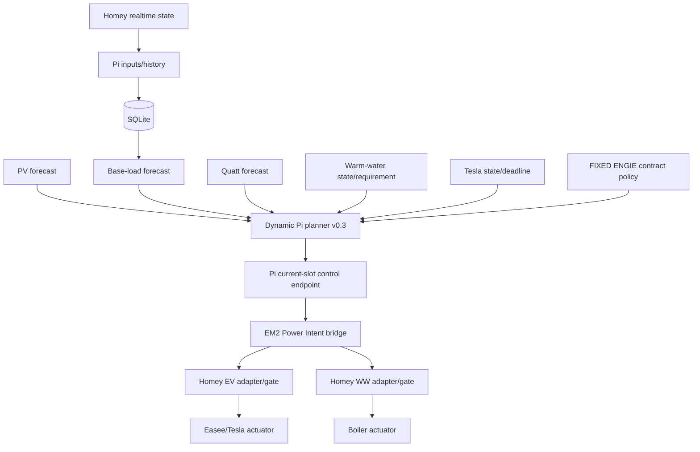

# CURRENT EMS STATE

> **Canonical current-state document** for the Raspberry Pi / Homey EMS.
>
> This file describes the intended current operational architecture and logic. Architecture-sensitive runtime, planner, systemd, contract-policy and Homey/Pi responsibility changes must update this document in the same release range.

**Status date:** 2026-09-11  
**Repository:** `OnsKasteeltje/homey-energy-manual`  
**Primary runtime host:** Raspberry Pi `ems-pi`

## 1. Source of truth

- GitHub `main` is the version-controlled source for Pi runtime code, deployment definitions and architecture documentation.
- Deployed runtime: `/home/jeroen/ems/runtime/`.
- Pi checkout: `/home/jeroen/ems/repo/homey-energy-manual`.
- SQLite `/home/jeroen/ems/data/ems-history.sqlite` is the single operational historical database.
- JSON under `/home/jeroen/ems/data/` and `docs/data/` is derived input/output/publication data, not a parallel historical database.
- Homey remains the smart-home execution and local safety layer.
- The Pi performs forecasting, history processing and planning.
- Contract policy is machine-enforced by `planner/contract-policy.json`.
- Control ownership is machine-declared by `planner/control-authority.json`.

## 2. Operational architecture



### Control-authority boundary

The hardened dynamic Pi planner `EMS_PI_DYNAMIC_SHADOW_PLAN_V0.3` remains computationally read-only: `readOnly = true` and `control_writes = false`. It never writes directly to devices.

Production planning authority is granted separately by `planner/control-authority.json`:

- `plannerOwner = PI`;
- `executor = HOMEY`;
- `executionEnabled = true`;
- `legacyHomeyPlannerAuthority = false`;
- `manualCutoverAuthorized = true`.

This means the Pi is the **sole planning authority** for EV and warm-water actuator intents, while Homey remains the executor/safety layer. The read-only planner output is translated to the existing guarded `EM2_POWER_INTENT_V0.2` actuator bus. Existing Homey adapters, validation gates, live-enable switches, device-health checks and physical writers remain in place.

The operator explicitly requested this cutover on 2026-09-11 after the hardened planner structural gate passed. Multi-day replay evidence is no longer a prerequisite for this manually authorized cutover, but replay/measurement validation remains required for subsequent tuning and confidence assessment.

## 3. Historical data and base load

The recurring history chain imports Homey measurements into SQLite. Relevant channels include P1/grid, three PV inverters, Tesla, boiler, Quatt, washer and dryer activity.

`planner/base-load/build_clean_base_history.py` reconstructs household load from P1 + PV and removes Tesla, boiler and Quatt. Flexible/high residual loads are filtered before the base-load learning model is built.

Current base-load forecast model: `EMS_PI_BASE_LOAD_FORECAST_V0.2`.

- Data before 2025-04-01 is excluded because Quatt installation is a structural break.
- Forecast resolution is 15 minutes.
- The model uses quarter/weekday/day-type seasonal medians with fallbacks.
- Seasonal window is currently ±28 days.

## 4. Warm water

Warm water is flexible but comfort/deadline requirements have priority over optimisation.

Current planning principles:

- determine current WW state and remaining requirement;
- preserve the daily comfort target and hard 19:00 deadline;
- prefer PV/export-reduction periods;
- respect minimum-run constraints;
- do not reheat unnecessarily after `goalReachedToday`;
- reserve WW comfort energy before optional EV opportunity use;
- permit PV-shoulder placement where this preserves stronger central PV for a physically connected EV without endangering WW feasibility.

Homey remains the sole physical boiler writer through the existing WW adapter/gate/actuator chain. Under Pi planning authority, the requested current-slot WW state originates only from the dynamic Pi plan.

The seasonal BOILER-vs-CV advisor remains a separate read-only/manual-switch function and is not a competing real-time planner.

## 5. Tesla EV

Tesla charging remains split into opportunity and deadline behavior.

### Opportunity

- Stable minimum charging is 3×6 A (~4.14 kW).
- 3×7 A is an actuator kick-start, not an economic threshold.
- Opportunity windows require at least 30 minutes and at least 50% PV coverage at stable 6 A.
- Better PV windows are preferred while useful weaker windows may still be used when stronger future capacity is insufficient.
- EV opportunity never consumes PV reserved for required WW comfort.

### Deadline

An explicit Tesla deadline/SOC/remaining-energy requirement is a hard planner constraint. The hardened planner may use PV first and allow grid/PV mixed charging where necessary to preserve the deadline.

The existing Homey EV adapter/gate/actuator remains responsible for phase/current translation, 6/7 A start/run semantics, charger health, freshness, session resume/start and fail-closed writes. Under Pi planning authority the numeric EV target originates only from the Pi current-slot command.

## 6. Hardened dynamic planner

Current authoritative planner builder:

`planner/dynamic-plan/build_hardened_dynamic_shadow_plan.py`

Output schema:

`EMS_PI_DYNAMIC_SHADOW_PLAN_V0.3`

The planner requires:

- exactly 96 aligned quarter-hour slots;
- central contract-policy enforcement;
- FIXED `ENGIE_3Y_2026_2029` contract;
- dynamic-price exclusion from production decisions while FIXED;
- fail-closed input freshness;
- `validUntil` expiry;
- `plannerOwner = PI`;
- WW comfort feasibility;
- Tesla deadline feasibility when active.

The underlying planner stays read-only. Physical execution authority is externalised to `control-authority.json` rather than enabling direct Pi device writes.

## 7. Current-slot control endpoint

`status-api/server.py` exposes:

- `/health` — operational health and control-authority status;
- `/control/current` — the single validated current-slot command consumed by the Homey executor bridge.

`/control/current` returns a command only when all of the following are valid:

- control policy schema and PI/HOMEY ownership;
- `executionEnabled = true`;
- `legacyHomeyPlannerAuthority = false`;
- FIXED ENGIE contract identity;
- hardened plan schema;
- Pi planner ownership/read-only boundary;
- fresh inputs;
- unexpired plan `validUntil`;
- a matching current 15-minute slot.

Otherwise the endpoint returns fail-closed status and zero/off targets. The endpoint does not itself perform a device write.

## 8. Energy contract policy

Production remains tied to the fixed three-year ENGIE contract:

- `productionContractMode = FIXED`;
- `productionContractId = ENGIE_3Y_2026_2029`;
- `productionSupplier = ENGIE`;
- dynamic pricing is **disabled for production**;
- dynamic market prices may only be used for `SHADOW`, `ANALYSIS` or `REPLAY`;
- automatic fixed→dynamic fallback is forbidden;
- automatic contract-mode switching is forbidden;
- missing/inconsistent configuration must fail closed.

Ordering invariant:

**contract mode → permitted economic model → permitted price source → planner decision**

A future dynamic-contract switch requires an explicit configuration/architecture change and validation.

## 9. Systemd planner chain

`ems-pv-forecast.service` is `Type=oneshot`; `inactive (dead)` after a successful run is normal.

Current order:

1. `fetch_pv_forecast.py`
2. `build_clean_base_history.py`
3. `build_base_load_forecast.py`
4. `fetch_ww_input.py`
5. `build_ww_plan.py`
6. `import_ww_forecast.py`
7. `build_shadow_load_plan.py`
8. `build_hardened_dynamic_shadow_plan.py`
9. `build_website_shadow.py`
10. `build_dynamic_website_shadow.py`
11. `publish_planner_shadow.py`
12. `publish_dynamic_planner_shadow.py`

Every step must succeed before the next runs.

## 10. Homey responsibility after cutover

Homey remains enabled for:

- realtime state acquisition;
- Core/state aggregation required by adapters and revision guards;
- EV deadline input capture;
- device-health checks;
- EV and WW power adapters;
- validation gates;
- live-enable/kill switches;
- anti-flapping/session behavior;
- physical Easee/Tesla and boiler writes;
- safety-only flows that do not create competing optimisation/planning authority.

Legacy Homey planner/decision flows that calculate competing EV/WW schedules or planner decisions must be disabled after the Pi control endpoint and Pi→Power-Intent bridge are verified. They may remain stored in Homey for rollback/reference but must not be enabled as planning authority.

## 11. Website and observability

The existing Pi and dynamic planner website artifacts remain observability/publication outputs. Website JSON is not a control input. The authoritative live input is the locally validated Pi current-slot endpoint.

Historical/replay/PV-capture validation remains observational and is used to evaluate quality after cutover.

## 12. Fail-closed and rollback policy

Fail closed:

- stale/invalid Pi plan → EV target 0 W and WW target OFF at the bridge boundary where state/revision guards permit;
- invalid contract policy → no Pi command;
- unknown planner schema → no Pi command;
- missing current slot → no Pi command;
- downstream Homey adapter/gate mismatch → existing actuator fail-closed behavior applies.

Rollback is deliberate, never dual-control. To roll back, first disable the Pi Power-Intent bridge/control authority, then explicitly re-enable the selected Homey planner authority. Pi and Homey planners must never simultaneously own actuator planning.

## 13. Battery boundary

The future battery architecture remains Victron AC-coupled. Victron/DESS is intended to remain the primary real-time battery optimiser. Pi/Homey may provide forecasts/policy but must not compete with DESS for battery dispatch.

## 14. Architecture enforcement

`scripts/ems_architecture_gate.sh` validates critical contract/document invariants and ensures architecture-sensitive changes include this canonical document in the same release range.

The deployment script invokes the gate before copying runtime/systemd files and stores the last successfully deployed Git commit in:

`/home/jeroen/ems/data/deployed-git-commit`

A failed architecture gate is a hard deployment stop.

## 15. Sync and deployment

Repository sync alone does not prove runtime/systemd sync. Production-sensitive changes use the normal deployment path:

```bash
cd /home/jeroen/ems/repo/homey-energy-manual
git pull --ff-only
sudo ./scripts/deploy_ems_pi.sh
```

After deployment, changed long-running services such as `ems-status-api.service` must be restarted explicitly because the deployment script intentionally does not restart services.
