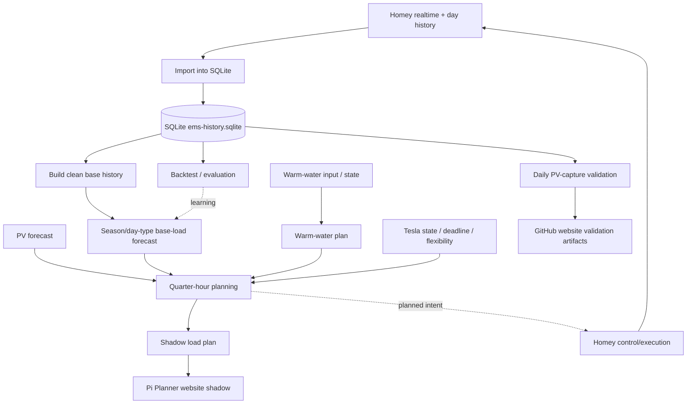

# CURRENT EMS STATE

> **Canonical current-state document** for the Raspberry Pi / Homey EMS.
>
> This file describes the intended **current operational architecture and logic**. When a change to Pi runtime, GitHub deployment, planner logic, Tesla control, warm-water control, datastore, systemd orchestration, contract/economic policy, or the Homey/Pi responsibility split is accepted, **this document must be updated in the same change**.
>
> Dated baseline documents are historical snapshots and are not authoritative for current state.

**Status date:** 2026-09-09  
**Repository:** `OnsKasteeltje/homey-energy-manual`  
**Primary runtime host:** Raspberry Pi `ems-pi`

## 1. Source-of-truth policy

- GitHub `main` is the version-controlled source for Pi runtime code, deployment definitions and current architecture documentation.
- The deployed Pi runtime lives under `/home/jeroen/ems/runtime/`.
- The Pi repository checkout lives under `/home/jeroen/ems/repo/homey-energy-manual`.
- SQLite `/home/jeroen/ems/data/ems-history.sqlite` is the **single operational historical database**.
- JSON files under `/home/jeroen/ems/data/` and `docs/data/` are derived inputs/outputs, caches or website publication artifacts; they are not parallel historical databases.
- Old immutable GitHub day archives are bootstrap/import sources only and must not become a permanent planner datastore.
- Homey remains the smart-home execution layer; the Pi performs forecasting, planning, history processing and shadow planning.
- Machine-enforced contract policy is version-controlled in `src/pi/ems-runtime/planner/contract-policy.json`; human-readable architecture remains canonical in this document.

## 2. End-to-end process



## 3. Historical data and base load

### SQLite

Measurements are stored idempotently in SQLite. Relevant historical channels include P1/grid, three PV inverters, Tesla, boiler, Quatt, washer and dryer activity.

The recurring day-history chain is defined by `ems-day-history.service` / `ems-day-history.timer` and imports Homey day history into SQLite every five minutes.

### Clean base history

`planner/base-load/build_clean_base_history.py`:

- reads historical measurements **only from SQLite**;
- uses P1 as time anchors;
- reconstructs household load from P1 + PV;
- removes Tesla, boiler and Quatt power;
- excludes/marks flexible appliance activity used by the forecast filter;
- uses source-resolution-aware nearest matching so coarse historical Homey Insights buckets remain usable;
- writes the derived artifact `clean-base-history.json`.

The clean-history build runs immediately before the base-load forecast so the forecast does not operate on a stale derived history file.

## 4. Base-load forecast

Current model: `EMS_PI_BASE_LOAD_FORECAST_V0.2`.

The forecast is quarter-hour based and deliberately explainable. Historical samples before **2025-04-01** are not used by the current model because installation of the Quatt represents a structural household-load change.

For each target quarter the hierarchy is:

1. same quarter + same weekday + seasonal window;
2. same quarter + same day type (weekday/weekend) + seasonal window;
3. same quarter + seasonal window;
4. generic historical median for that quarter;
5. global median fallback.

The seasonal window is currently ±28 calendar days. Multiple comparable historical days are preferred over one exact date from the previous year. This allows seasonal effects while reducing sensitivity to holidays, absences and individual anomalous days.

The model remains in a learning/shadow phase while history depth grows. The initial walk-forward backtest showed essentially equal quarter-level MAE versus the old generic-quarter model, but lower mean absolute daily-energy error. Further tuning should therefore be evidence-driven rather than fitted to the current small history set.

## 5. Warm water (WW)

Warm water is a flexible load, but comfort/safety requirements take precedence over energy optimisation and over EV opportunity charging.

Current planning principles:

- determine current WW/boiler state and requirement;
- satisfy the required daily heating/comfort target and deadline;
- preferentially place flexible heating in periods with useful PV/export-reduction opportunity;
- treat WW priority as a **reservation of required comfort energy**, not as a requirement to consume one monolithic boiler block before other flexible loads may use PV;
- when a qualifying PV/export window is broader than the required WW runtime **and the Tesla is physically connected to the charger at planning time**, use the shoulders of that window where minimum boiler-run constraints allow it, so the strongest central PV/export capacity can remain available for the higher-power EV load;
- a weekly or expected-home Tesla forecast is informational only and must **not** cause WW to move to the shoulders;
- when the Tesla is not physically connected, WW keeps the strongest qualifying PV subrun rather than creating extra grid import merely to preserve an unused PV peak;
- separate WW runs must respect the minimum runtime; when a safe shoulder split cannot satisfy that constraint, use a strongest contiguous WW subrun instead;
- do not schedule unnecessary repeat heating once the daily goal has been reached;
- include planned WW consumption in the combined quarter-hour load plan so it is not double-counted as base load;
- Homey remains responsible for the actual device actuation and runtime safety logic.

The Pi chain uses:

- `warm-water/fetch_ww_input.py`
- `warm-water/build_ww_plan.py`

The resulting WW plan feeds the combined shadow load plan. The combined planner must treat this WW plan as higher-priority reserved comfort demand before evaluating EV opportunity headroom.

The seasonal WW source advisor on the Pi evaluates BOILER versus CV economically over a rolling 14-day window using measured history and contract-effective marginal costs. It remains `PURE_SHADOW`, read-only and manual-switch-only until explicitly migrated further.

## 6. Tesla EV

Tesla charging is treated as a controllable flexible load and is removed from historical base load.

Two planning/control intents remain distinct:

### Opportunity charging

Opportunity charging uses PV/export remaining **after required WW comfort reservation**. It is no longer gated by an instantaneous 7 A start threshold.

Current shadow-planning rules:

- EV opportunity planning is enabled only when the Tesla is **physically connected now** according to the current live energy state; the weekly expected-home forecast remains informational and may not by itself schedule opportunity charging;
- stable minimum charging is modelled at **3×6 A**, approximately 4.14 kW using the current 690 W/A planning conversion;
- **3×7 A is only a short actuator kickstart** to establish charging reliably. It is not an economic or PV-opportunity threshold and need not persist for a full planner slot; Homey/Easee may reduce to 6 A after the kickstart;
- an EV opportunity window must contain at least **30 minutes** of contiguous positive residual PV export while the Tesla is connected;
- over the complete qualified window, residual PV must cover at least **50% of the energy required by stable 6 A charging**;
- qualified windows are classified as `PURE_PV` at at least 100% 6 A PV coverage, `SECONDARY` at 75–100%, and `FALLBACK_MIXED` at 50–75%;
- the planner applies `BEST_PV_WINDOWS_FIRST`: earlier weaker windows are not automatically consumed merely because they exceed the 50% floor;
- an earlier weaker window is deferred when later **higher-class** windows have enough 6 A PV-capture capacity to replace the PV opportunity of that earlier window;
- when later better windows do **not** have enough replacement capacity, the weaker earlier window remains eligible so useful autumn/winter PV is not discarded;
- this future-better-capacity guard is intentionally based on forecast PV-capture capacity because opportunity charging does not yet have a separate day-energy/SOC budget in this Pi shadow planner;
- inside a selected mixed window, the planner may deliberately plan `PV_MIXED_OPPORTUNITY`: 6 A charging may continue even when instantaneous PV export is below 4.14 kW, with limited grid import filling the difference;
- when residual PV supports more than 6 A, planned current may rise in whole-amp steps up to the configured maximum;
- opportunity charging must never consume PV capacity already reserved for required WW comfort.

This window qualification replaces the old `PV_SURPLUS_START7_RUN6_MAX16` planning rule. Real-time control still must avoid excessive start/stop/current flapping and respect charger, vehicle and household electrical limits.

### Deadline charging

When the user supplies a required SOC/energy target and departure/deadline, meeting that requirement takes priority over opportunistic optimisation. The planner should use PV opportunity while sufficient time slack remains, but once the remaining required charge can no longer safely fit inside the remaining opportunity windows, the missing charging time becomes mandatory and grid/PV mixed charging is permitted as required to meet the deadline.

Deadline planning therefore remains logically separate from opportunity qualification: opportunity may optimize *when* to use PV, but it may never cause an explicit EV deadline to be missed.

The current `build_shadow_load_plan.py` implementation contains the dynamic opportunity-window policy but still reports `deadlinePlanningIncluded = false`; integration of the existing deadline requirement into this Pi shadow builder remains a separate migration step. Existing Homey/Easee deadline control authority is not removed by this change.

After a deadline requirement is satisfied/expired, control returns to normal opportunity policy.

Homey/Easee performs physical charging control; the Pi planner supplies planning context/intent rather than creating a second competing real-time charger controller.

## 7. Combined quarter-hour planner

The combined planning chain uses PV forecast, base-load forecast, WW plan and Tesla flexibility to estimate household import/export and allocate controllable loads.

Primary principles:

1. preserve hard safety/device limits;
2. reserve and satisfy required WW/household comfort loads and their deadlines;
3. satisfy explicit EV deadline requirements;
4. optimize the placement of flexible WW and EV demand across the PV/export curve rather than interpreting priority as strict chronological block consumption;
5. preserve the central PV peak for EV only when the Tesla is physically connected; expected-home/week forecasts alone must not alter WW placement;
6. evaluate EV opportunity only against **residual export after WW reservation**;
7. qualify EV opportunity windows at currently at least 30 minutes and at least 50% PV coverage at stable 6 A;
8. prefer later higher-quality PV windows over earlier mixed-import windows whenever their forecast 6 A PV-capture capacity can replace the earlier opportunity;
9. use weaker mixed windows only when better future windows are insufficient, preventing avoidable import while preserving otherwise stranded autumn/winter PV;
10. minimise unnecessary grid import/export without allowing optimisation to violate requirements;
11. keep planning deterministic and explainable;
12. keep control writes separate from shadow evaluation until a behavior is validated.

The intended bell-curve behaviour is therefore conditional: when the Tesla is actually connected, WW comfort may occupy suitable shoulder periods while the stronger central export period remains available for the higher minimum-power EV load. Without a connected Tesla, WW simply uses the strongest suitable PV period. This is an optimisation beneath the WW comfort guarantee, not a reversal of WW priority.

Current relevant builder:

`planner/quarter-hour-plan/build_shadow_load_plan.py`

Website representation:

`planner/quarter-hour-plan/build_website_shadow.py`

## 8. Energy contract and economic policy

The production EMS is currently tied to the user's fixed three-year ENGIE contract. The machine-readable policy is `planner/contract-policy.json` and currently requires:

- `productionContractMode = FIXED`;
- `productionContractId = ENGIE_3Y_2026_2029`;
- `productionSupplier = ENGIE`;
- dynamic pricing is **disabled for production**;
- dynamic market-price data may be used only for `SHADOW`, `ANALYSIS` or `REPLAY` while FIXED is active;
- automatic fallback from fixed-contract economics to dynamic pricing is forbidden;
- automatic switching between FIXED and DYNAMIC contract modes is forbidden;
- missing, inconsistent or invalid fixed-contract configuration must **fail closed** with `CONTRACT_CONFIG_ERROR` rather than silently choose another pricing model.

Architectural ordering rule:

**contract mode → permitted economic model → permitted price source → planner objective/decision**

Price-source availability must never decide the contract mode. In particular, merely having fresh EnergyZero or other dynamic prices available must not alter a production decision while `productionContractMode == FIXED`.

Required regression invariant:

> While production contract mode is FIXED, arbitrary changes to dynamic market-price input must not change any production planner decision.

A future move to a dynamic contract is therefore an explicit configuration and architecture change. It requires validation of the dynamic price source, supplier economics, planner behavior and fail-safe path before `productionContractMode` may be changed to `DYNAMIC`.

Any planner or optimizer that makes an economic production decision must consume or enforce the central contract policy before selecting tariff/price inputs. No component may implement an independent implicit contract-mode fallback.

## 9. Planner systemd chain

`ems-pv-forecast.service` is a `Type=oneshot` service. `inactive (dead)` after a successful run is therefore normal.

Current intended order:

1. `fetch_pv_forecast.py`
2. `build_clean_base_history.py`
3. `build_base_load_forecast.py`
4. `fetch_ww_input.py`
5. `build_ww_plan.py`
6. `build_shadow_load_plan.py`
7. `build_website_shadow.py`

Every step must complete successfully before the next starts.

A separate daily read-only validation chain is defined by `ems-pv-capture-validation.service` and `ems-pv-capture-validation.timer`. The timer is scheduled for 00:20 local system time. The service:

1. runs `planner/dynamic-plan/validate_pv_capture.py` against measured SQLite history, targeting the previous local day by default;
2. writes `/home/jeroen/ems/data/pv-capture-validation.json` and maintains `/home/jeroen/ems/data/pv-capture-history.json` with up to 90 days of validation history;
3. runs `publisher/publish_pv_capture_validation.py` to publish the derived validation artifacts to `docs/data/` for website/analysis use.

This validation chain is observational only. It must not perform Homey/device writes, alter planner decisions, or create a second real-time control loop.

**Deployment consistency rule:** the installed systemd unit on the Pi must be compared with the version-controlled unit when changing this chain. Any locally present publication step must either be version-controlled or explicitly documented; silent local divergence is not acceptable.

## 10. Pi Planner / website

The Pi Planner is currently a **shadow** representation. It displays the 24-hour forecast and planned WW/Tesla windows without making the Pi an uncontrolled second actuator.

The forecast combines:

- predicted base load;
- PV production forecast;
- expected grid import/export;
- flexible-load plans.

Website JSON is a publication artifact, not the historical source of truth.

The daily PV-capture validation JSON published under `docs/data/` is likewise a derived read-only evaluation artifact. It may be visualised on the website, but it is not an input that may directly actuate devices.

## 11. Monitoring and validation

Changes should follow the project pattern:

**read/inspect → minimal change → update architecture → shadow/test → validate → architecture gate → deploy → monitor**.

Available base-load diagnostics include:

- `compare_base_load_forecasts.py` — current-vs-generic A/B comparison;
- `backtest_base_load_forecasts.py` — strict walk-forward historical evaluation.

Daily PV self-consumption evaluation is performed by `planner/dynamic-plan/validate_pv_capture.py`. It is measurement-based and control-independent. It reconstructs PV production, grid import/export, household consumption and Tesla/boiler flexible load from aligned SQLite measurements and reports:

- measured PV production and grid import/export;
- direct PV self-use;
- PV self-consumption rate;
- flexible PV capture in kWh and as a share of the estimated pre-flex export opportunity;
- Tesla and boiler contributions to flexible PV capture;
- measured residual export as `batteryRelevantResidualExportKWh`.

The validation uses a transparent counterfactual: estimated pre-flex export equals measured export plus flexible PV energy actually absorbed by Tesla/boiler. It does **not** claim to replay or prove historical planner recommendations. Planner recommendation replay/snapshot validation, if introduced later, is a separate capability.

A validation day is classified `GOOD` only when at least 20 hours of usable measured intervals are integrated; otherwise it is `PARTIAL`.

Residual measured export after flexible-load use is the relevant empirical starting point for future battery-opportunity/ROI analysis. The battery purchase decision remains separate and uncommitted.

Model changes should be retained only when supported by sufficient history and validation, not because one current-day graph looks preferable.

## 12. Future battery boundary

The tentative battery architecture is Victron AC-coupled. The battery system is not yet a committed operational part of the EMS.

When introduced, Victron/DESS should remain the primary real-time battery optimiser. Pi/Homey should provide load/forecast context and policy constraints rather than run a competing battery optimiser.

Battery ROI analysis should use residual PV export after flexible-load optimisation as an important baseline. The daily PV-capture validator's `batteryRelevantResidualExportKWh` is intended to provide that measured baseline once sufficient representative history is available.

## 13. Documentation rule — mandatory

This document is the canonical answer to **“what is the EMS/Pi doing now?”**.

For every accepted change affecting any of the following, update this file in the same GitHub change or immediately adjacent commit:

- Pi runtime architecture or paths;
- SQLite/datastore policy or schema relevant to EMS operation;
- systemd services/timers and execution order;
- planner inputs, priorities, algorithms or outputs;
- energy-contract mode, tariff/economic policy or price-source selection;
- WW logic;
- Tesla logic;
- Homey/Pi responsibility boundary;
- production/shadow status;
- website planner interpretation;
- battery-control boundary.

Dated architecture/baseline `.md` files remain historical evidence. They do **not** override this document.

## 14. Architecture enforcement gate

The documentation rule is technically enforced by `scripts/ems_architecture_gate.sh`.

The gate has two responsibilities:

1. validate critical machine and documentation invariants, including the active FIXED/ENGIE contract policy, dynamic-pricing production prohibition, fail-closed behavior and presence of the corresponding canonical architecture rules;
2. when supplied with a base commit, compare the complete release range and refuse a release when architecture-sensitive files changed without a matching update to this document.

Architecture-sensitive paths currently include Pi runtime source, systemd deployment definitions, the Pi deployment script and the architecture gate itself.

GitHub Actions runs the same gate for relevant pull requests and pushes to `main` through `.github/workflows/ems-architecture-gate.yml`.

The Pi deployment script invokes the gate explicitly through `bash` (`bash "$REPO/scripts/ems_architecture_gate.sh" ...`) and runs it **before backup/copy/deployment**. This explicit shell invocation avoids depending on the executable bit of the gate script while preserving a hard deployment stop on any gate failure. It stores the commit of each successful deployment in:

`/home/jeroen/ems/data/deployed-git-commit`

Future deployments compare the candidate release against that last actually deployed commit, so multiple Git commits are evaluated as one release range. This avoids both false passes and false failures caused by checking only `HEAD^`.

The first deployment after introduction of this marker performs invariant validation and initializes the marker; release-range enforcement applies from the next deployment onward.

A failed architecture gate is a hard deployment stop. Bypassing the gate is not part of the normal EMS deployment process.

## 15. Sync check

A clean Pi repository is synchronized with GitHub when:

```bash
cd /home/jeroen/ems/repo/homey-energy-manual
git fetch origin main
git status -sb
```

shows neither `ahead` nor `behind` and no local modifications.

Repository synchronization alone does not prove that copied files under `/home/jeroen/ems/runtime/` or `/etc/systemd/system/` match the repository. Deployment-sensitive changes must also validate the installed runtime/unit explicitly.
