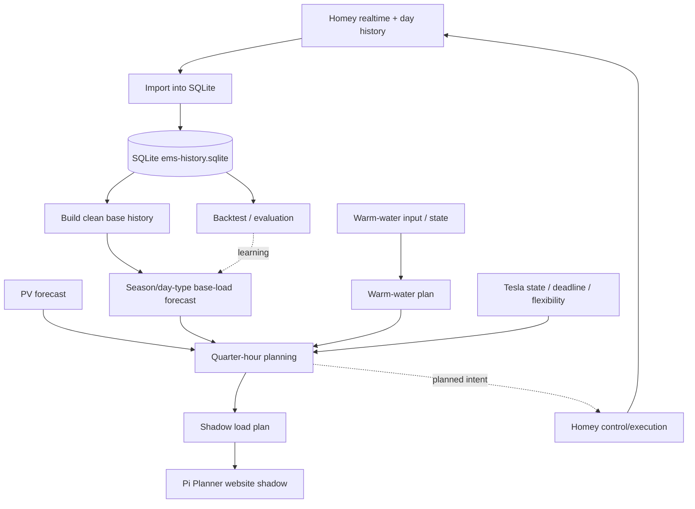

# CURRENT EMS STATE

> **Canonical current-state document** for the Raspberry Pi / Homey EMS.
>
> This file describes the intended **current operational architecture and logic**. When a change to Pi runtime, GitHub deployment, planner logic, Tesla control, warm-water control, datastore, systemd orchestration, or the Homey/Pi responsibility split is accepted, **this document must be updated in the same change**.
>
> Dated baseline documents are historical snapshots and are not authoritative for current state.

**Status date:** 2026-09-06  
**Repository:** `OnsKasteeltje/homey-energy-manual`  
**Primary runtime host:** Raspberry Pi `ems-pi`

## 1. Source-of-truth policy

- GitHub `main` is the version-controlled source for Pi runtime code, deployment definitions and current architecture documentation.
- The deployed Pi runtime lives under `/home/jeroen/ems/runtime/`.
- The Pi repository checkout lives under `/home/jeroen/ems/repo/homey-energy-manual`.
- SQLite `/home/jeroen/ems/data/ems-history.sqlite` is the **single operational historical database**.
- JSON files under `/home/jeroen/ems/data/` and `docs/data/` are derived inputs/outputs, caches or website publication artifacts; they are not parallel historical databases.
- Old immutable GitHub day archives are bootstrap/import sources only and must not become a permanent planner datastore.
- Homey remains the smart-home execution layer; the Pi performs forecasting, planning, history processing and shadow planning.

## 2. End-to-end process



## 3. Historical data and base load

### SQLite

Measurements are stored idempotently in SQLite. Relevant historical channels include P1/grid, three PV inverters, Tesla, boiler, Quatt, washer and dryer activity.

The recurring day-history chain is defined by `ems-day-history.service` / `ems-day-history.timer` and imports Homey day history into SQLite every five minutes.

### Clean base history

`planner/base-load/build_clean_base_history.py`:

- reads historical measurements **only from SQLite**;
- uses P1 as time anchors;
- reconstructs household load from P1 + PV;
- removes Tesla, boiler and Quatt power;
- excludes/marks flexible appliance activity used by the forecast filter;
- uses source-resolution-aware nearest matching so coarse historical Homey Insights buckets remain usable;
- writes the derived artifact `clean-base-history.json`.

The clean-history build runs immediately before the base-load forecast so the forecast does not operate on a stale derived history file.

## 4. Base-load forecast

Current model: `EMS_PI_BASE_LOAD_FORECAST_V0.2`.

The forecast is quarter-hour based and deliberately explainable. Historical samples before **2025-04-01** are not used by the current model because installation of the Quatt represents a structural household-load change.

For each target quarter the hierarchy is:

1. same quarter + same weekday + seasonal window;
2. same quarter + same day type (weekday/weekend) + seasonal window;
3. same quarter + seasonal window;
4. generic historical median for that quarter;
5. global median fallback.

The seasonal window is currently ±28 calendar days. Multiple comparable historical days are preferred over one exact date from the previous year. This allows seasonal effects while reducing sensitivity to holidays, absences and individual anomalous days.

The model remains in a learning/shadow phase while history depth grows. The initial walk-forward backtest showed essentially equal quarter-level MAE versus the old generic-quarter model, but lower mean absolute daily-energy error. Further tuning should therefore be evidence-driven rather than fitted to the current small history set.

## 5. Warm water (WW)

Warm water is a flexible load, but comfort/safety requirements take precedence over energy optimisation.

Current planning principles:

- determine current WW/boiler state and requirement;
- satisfy the required daily heating/comfort target and deadline;
- preferentially place flexible heating in periods with useful PV/export-reduction opportunity;
- do not schedule unnecessary repeat heating once the daily goal has been reached;
- include planned WW consumption in the combined quarter-hour load plan so it is not double-counted as base load;
- Homey remains responsible for the actual device actuation and runtime safety logic.

The Pi chain uses:

- `warm-water/fetch_ww_input.py`
- `warm-water/build_ww_plan.py`

The resulting WW plan feeds the combined shadow load plan.

## 6. Tesla EV

Tesla charging is treated as a controllable flexible load and is removed from historical base load.

Two planning/control intents remain distinct:

### Opportunity charging

Use available PV/export opportunity where practical. Real-time control must avoid excessive start/stop/current flapping and respect charger, vehicle and household electrical limits.

### Deadline charging

When the user supplies a required SOC/energy target and departure/deadline, meeting that requirement takes priority over opportunistic optimisation. The planner may schedule charging outside PV opportunity when required to meet the deadline.

After a deadline requirement is satisfied/expired, control returns to normal opportunity policy.

Homey/Easee performs physical charging control; the Pi planner supplies planning context/intent rather than creating a second competing real-time charger controller.

## 7. Combined quarter-hour planner

The combined planning chain uses PV forecast, base-load forecast, WW plan and Tesla flexibility to estimate household import/export and allocate controllable loads.

Primary principles:

1. preserve hard safety/device limits;
2. satisfy required household/comfort loads;
3. satisfy explicit EV deadline requirements;
4. move flexible WW/EV demand toward otherwise exported PV where possible;
5. minimise unnecessary grid import/export without allowing optimisation to violate requirements;
6. keep planning deterministic and explainable;
7. keep control writes separate from shadow evaluation until a behavior is validated.

Current relevant builder:

`planner/quarter-hour-plan/build_shadow_load_plan.py`

Website representation:

`planner/quarter-hour-plan/build_website_shadow.py`

## 8. Planner systemd chain

`ems-pv-forecast.service` is a `Type=oneshot` service. `inactive (dead)` after a successful run is therefore normal.

Current intended order:

1. `fetch_pv_forecast.py`
2. `build_clean_base_history.py`
3. `build_base_load_forecast.py`
4. `fetch_ww_input.py`
5. `build_ww_plan.py`
6. `build_shadow_load_plan.py`
7. `build_website_shadow.py`

Every step must complete successfully before the next starts.

**Deployment consistency rule:** the installed systemd unit on the Pi must be compared with the version-controlled unit when changing this chain. Any locally present publication step must either be version-controlled or explicitly documented; silent local divergence is not acceptable.

## 9. Pi Planner / website

The Pi Planner is currently a **shadow** representation. It displays the 24-hour forecast and planned WW/Tesla windows without making the Pi an uncontrolled second actuator.

The forecast combines:

- predicted base load;
- PV production forecast;
- expected grid import/export;
- flexible-load plans.

Website JSON is a publication artifact, not the historical source of truth.

## 10. Monitoring and validation

Changes should follow the project pattern:

**read/inspect → minimal change → shadow/test → validate → deploy → monitor**.

Available base-load diagnostics include:

- `compare_base_load_forecasts.py` — current-vs-generic A/B comparison;
- `backtest_base_load_forecasts.py` — strict walk-forward historical evaluation.

Model changes should be retained only when supported by sufficient history and validation, not because one current-day graph looks preferable.

## 11. Future battery boundary

The tentative battery architecture is Victron AC-coupled. The battery system is not yet a committed operational part of the EMS.

When introduced, Victron/DESS should remain the primary real-time battery optimiser. Pi/Homey should provide load/forecast context and policy constraints rather than run a competing battery optimiser.

Battery ROI analysis should use residual PV export after flexible-load optimisation as an important baseline.

## 12. Documentation rule — mandatory

This document is the canonical answer to **“what is the EMS/Pi doing now?”**.

For every accepted change affecting any of the following, update this file in the same GitHub change or immediately adjacent commit:

- Pi runtime architecture or paths;
- SQLite/datastore policy or schema relevant to EMS operation;
- systemd services/timers and execution order;
- planner inputs, priorities, algorithms or outputs;
- WW logic;
- Tesla logic;
- Homey/Pi responsibility boundary;
- production/shadow status;
- website planner interpretation;
- battery-control boundary.

Dated architecture/baseline `.md` files remain historical evidence. They do **not** override this document.

## 13. Sync check

A clean Pi repository is synchronized with GitHub when:

```bash
cd /home/jeroen/ems/repo/homey-energy-manual
git fetch origin main
git status -sb
```

shows neither `ahead` nor `behind` and no local modifications.

Repository synchronization alone does not prove that copied files under `/home/jeroen/ems/runtime/` or `/etc/systemd/system/` match the repository. Deployment-sensitive changes must also validate the installed runtime/unit explicitly.
