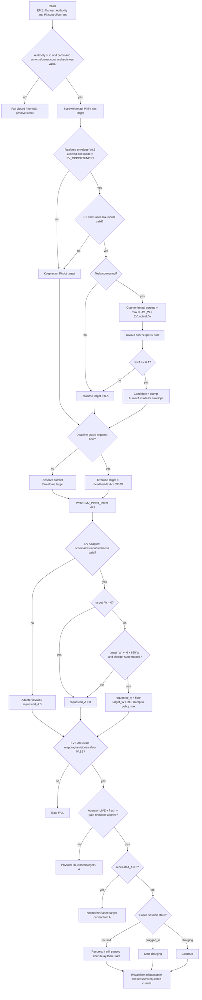
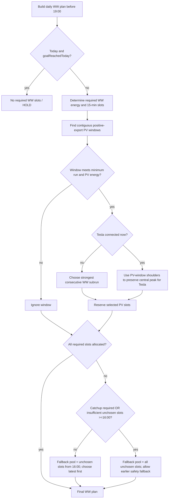
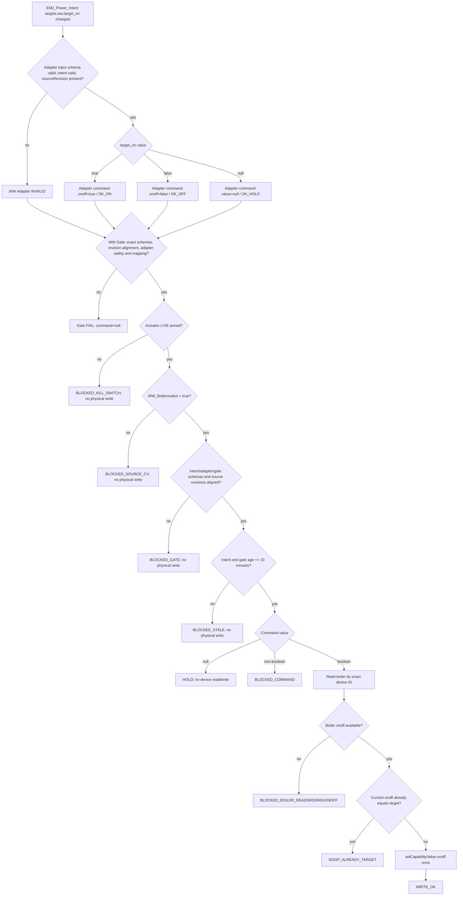

# EMS production control process logic

Status: live production baseline 2026-09-13.

This document complements the component-chain architecture. It shows the actual decision logic implemented across Pi planning and Homey execution/safety. The diagrams intentionally use decision diamonds and explicit fail/HOLD/NOOP paths rather than only listing components.

## EV / Tesla control logic

### EV decision details

- The realtime opportunity controller is bounded by the Pi envelope; Homey is not a second planner.
- Counterfactual surplus is `max(0, -P1_W + EV_actual_W)` because P1 is net after the currently charging EV.
- START6/RUN6 mapping uses 690 W/A for 3 x 230 V and floors the upstream watt target to current.
- The executor-side deadline guard runs after realtime opportunity logic and can override it when the deadline becomes required.
- EV Device Health is observability-only; schema/revision/electrical mapping/freshness checks remain hard.
- The EV actuator is the sole automatic physical Easee writer and performs fail-closed zero-current normalization.

## WW / boiler planning logic

Source of planning logic: `src/pi/ems-runtime/planner/warm-water/build_ww_plan.py`.

Planning constants in the current source include a 1.9 kW boiler, hard 19:00 deadline, normal fallback from 16:00, minimum run of two 15-minute slots, and WW comfort reserved before EV opportunity.

## WW / boiler execution logic

## Production invariants

- Planner != device writer.
- Power Intent != device writer.
- Adapter != device writer.
- Gate != device writer.
- Exactly one actuator per domain performs automatic physical writes.
- Invalid or stale control data fails closed.
- Current contract mode is FIXED / `ENGIE_3Y_2026_2029`; dynamic-price data may not silently change production control mode.
