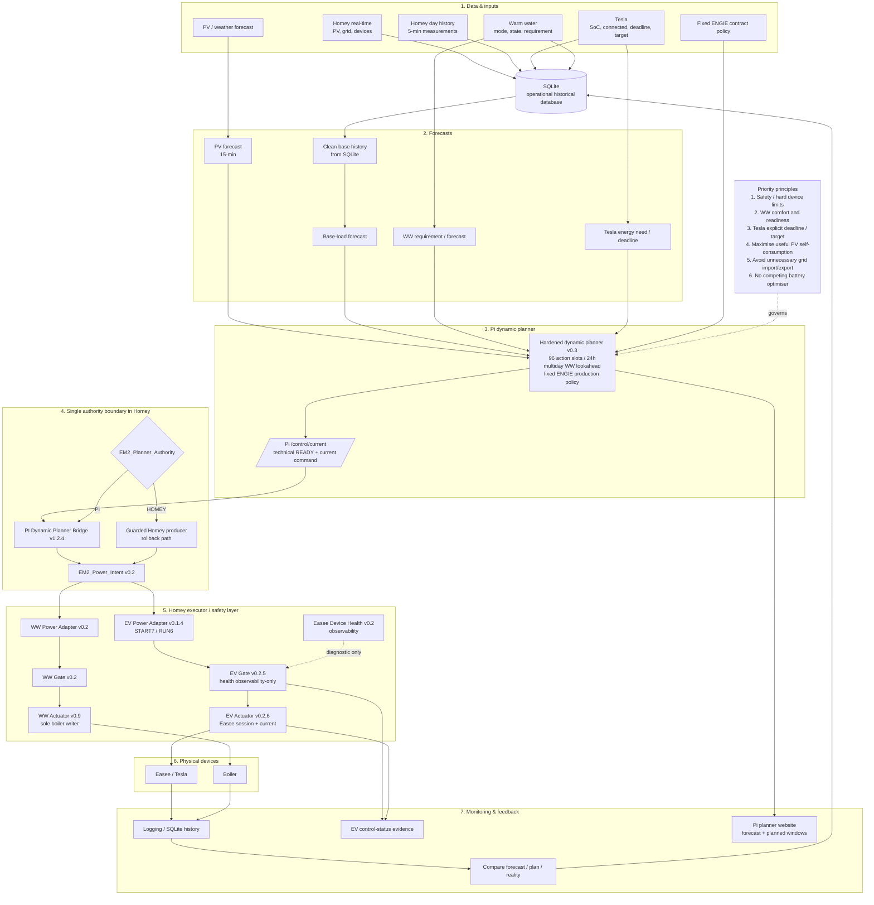

# EMS process — Warm Water, Tesla and Planner

Status: current production architecture reference  
Date: 2026-09-12

This diagram captures the current Pi/Homey EMS process for warm water (WW), Tesla EV charging and the quarter-hour planner after the controlled Pi cutover.

## Operational principles

- **Pi is the active planner authority** while `EM2_Planner_Authority = PI`.
- **Homey is executor and local safety layer.** The Pi planner does not write devices directly.
- **There is one authority selector.** `EM2_Planner_Authority` is the sole HOMEY↔PI planner gate; `control-authority.json` is configuration/diagnostic context, not a second cutover gate.
- **`/control/current` is readiness + command.** It validates the Pi plan and fixed-contract boundary and returns only the current slot command.
- **SQLite is the operational historical database on the Pi.** JSON/GitHub publication files are derived state or evidence.
- **WW:** comfort/readiness requirements win. The planner prefers useful PV and avoids unnecessary repeat heating after the daily goal.
- **Tesla:** deadline/target requirements are hard constraints. Opportunity charging uses residual PV. The active actuator uses START7/RUN6 semantics.
- **Easee health:** the current capability-timestamp health heuristic is observability-only at EV Gate v0.2.5 and does not independently veto a coherent positive command.
- **Execution is fail-safe.** EV/WW adapters and gates require coherent schemas/revisions and the actuators remain the only physical writers.
- **Future battery:** Victron DESS remains the primary real-time battery optimiser; Pi/Homey must not create a competing real-time battery optimiser.

## Validated live command paths — 2026-09-12

Tesla:

`Pi 4830 W / 7 A → PI bridge → Power Intent → EV adapter → Gate PASS → EV actuator → Easee ~4.9 kW`, followed by Pi return to `0 A` and physical pause.

Result: **ON/OFF PASS.**

Warm water:

`Pi WW ON → PI bridge → Power Intent → WW adapter → Gate PASS → WW actuator → boiler ~2.03 kW`, followed by restore to normal Pi target and physical `0 W`.

Result: **ON/OFF PASS.**

## Data flow summary

`Homey/history → SQLite → forecasts/requirements → Pi dynamic planner → /control/current → Homey authority selector + PI bridge → canonical Power Intent → adapters/gates → physical actuators → logging/website/evidence → feedback`
