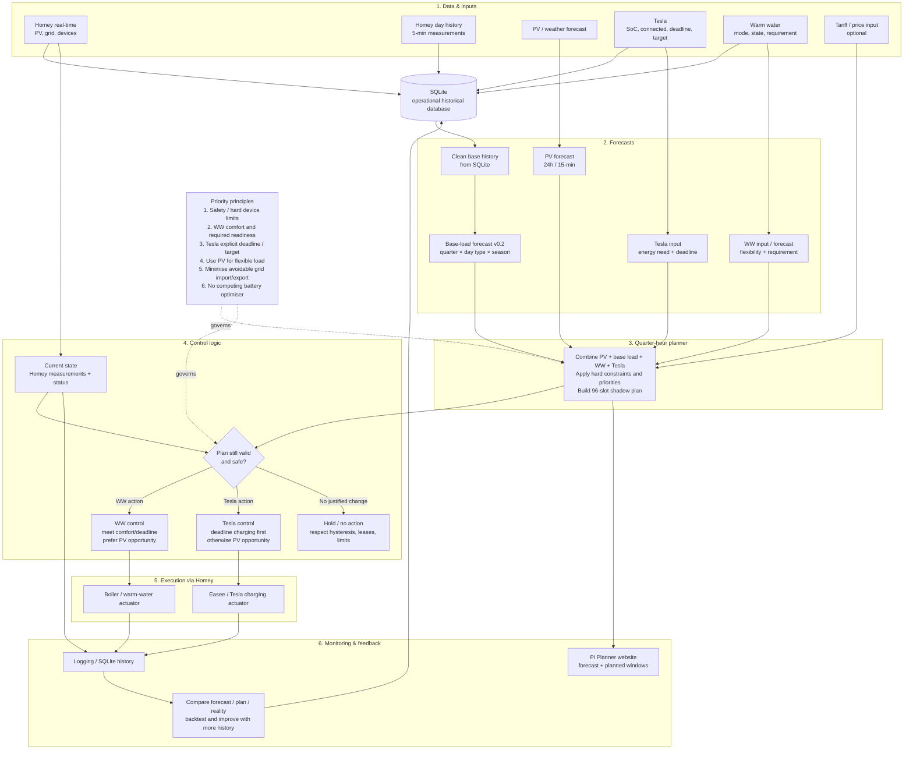

# EMS process — Warm Water, Tesla and Planner

Status: project architecture reference  
Date: 2026-09-06

This diagram captures the current Pi/Homey EMS process for warm water (WW), Tesla EV charging and the quarter-hour planner. It is intended as the maintainable source-of-truth diagram for the project.

## Operational principles

- **SQLite is the only operational historical database on the Pi.** GitHub/JSON history is bootstrap or publication output, not a live planner database.
- **Planner and control are separated.** The planner proposes quarter-hour intent; Homey/runtime control validates the current situation before actuating devices.
- **WW:** hard comfort/readiness requirements win. Once the daily goal is reached, unnecessary reheating should be avoided; surplus-PV heating is an opportunity, not a comfort violation.
- **Tesla:** an explicit departure deadline/target SoC is a hard planning requirement. Outside deadline charging, PV-opportunity charging is preferred and anti-flapping/hysteresis remains active.
- **Base load:** controllable loads and Quatt are removed before forecasting, preventing double counting when WW or Tesla are added back by the planner.
- **Forecast learning:** base-load forecast v0.2 uses quarter-hour + day type + seasonal analogues with graceful fallback. It remains measurable/backtestable while history accumulates.
- **Execution is fail-safe and idempotent.** A plan does not itself force a device write; current state, safety limits and leases/hysteresis are checked first.
- **Future battery:** Victron DESS remains the primary battery optimiser; the Pi planner should expose future household/flexible-load intent, not compete with DESS in real time.

## Data flow summary

`Homey/history → SQLite → clean base history → base-load + PV + WW + Tesla forecasts → 96-slot planner → runtime validation → Homey actuation → logging/website → feedback`
