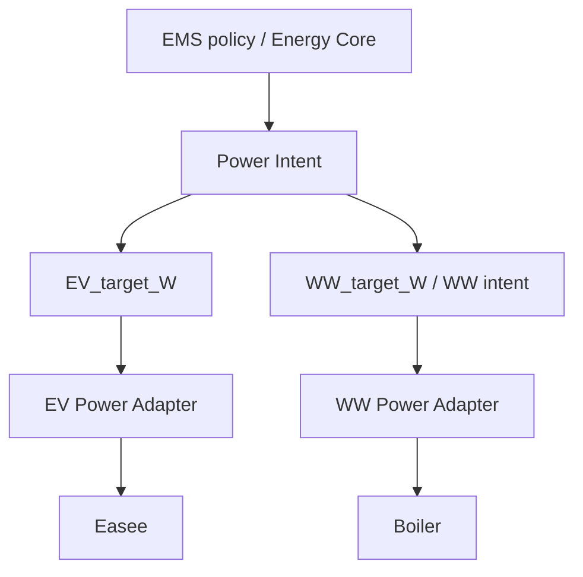
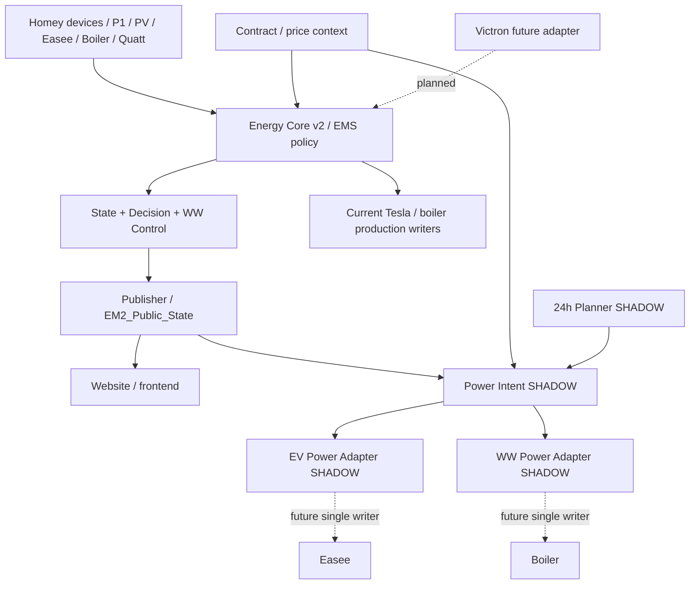

# Softwarearchitectuur Overzicht

## Doel

Het Home Energy Management System (HEMS) scheidt meten, state, policy, actuator-neutrale vermogensintentie, apparaatvertaling, publiceren en fysiek aansturen. De actuele implementatie is leidend; SHADOW- en planned-functionaliteit wordt expliciet als zodanig gemarkeerd.

## Hoofdketen

De doelarchitectuur voor flexibele verbruikers is expliciet:

De architectuurgrens is daarmee: **EMS policy bepaalt wat energetisch gewenst is; Power Intent maakt dit actuator-neutraal; apparaatadapters bepalen hoe het doel elektrisch en veilig uitvoerbaar wordt; alleen de expliciete single writer mag uiteindelijk het fysieke device wijzigen.**

De bredere systeemketen blijft:

## Architectuurlagen

1. **Fysieke veiligheid** — 3×25 A aansluiting, lokale apparaatbeveiligingen en Easee Equalizer staan boven software-optimalisatie.
2. **Meet- en statelaag** — Core gebruikt maximaal één volledige device-snapshot per tick en publiceert canonieke Logic-state.
3. **Contextlaag** — contract, prijs, PV/freshness en configuratie worden als losse context aangeboden.
4. **EMS policy / Decision-laag** — MUST-verplichtingen gaan vóór economische opportunities. Deze laag bepaalt de gewenste energetische actie, niet de apparaat-specifieke opdracht.
5. **Power Intent** — projecteert de gekozen policy naar actuator-neutrale doelen. Voor EV is dit numeriek `EV_target_W`; voor warm water is de huidige runtime-interface nog binair (`target_on`) en evolueert deze naar het architectuurcontract `WW_target_W` waar numerieke vermogenssturing zinvol is.
6. **Device adapters** — EV Power Adapter en WW Power Adapter vertalen uitsluitend het upstream intent naar fysiek uitvoerbare, begrensde apparaatcommando's. Zij introduceren geen EMS-policy.
7. **Writer lifecycle** — requested, commanded en confirmed state blijven gescheiden. Dedupe, idempotency, run-lease, retries en write-throttling horen hier. Per actuator is maximaal één fysieke writer actief.
8. **Publisher / website** — `EM2_Public_State` is het publieke read-model en tegelijk revision-boundary voor downstream logic.

## Power Intent en adaptercontract

De software volgt voor elke flexibele actuator hetzelfde patroon:

`EMS policy -> Power Intent -> target -> Device Adapter -> Single Writer -> Actuator`

### EV

`EMS policy -> Power Intent -> EV_target_W -> EV Power Adapter -> Easee`

Power Intent bepaalt het toegewezen laadvermogen in watt. De EV Power Adapter bepaalt vervolgens de elektrisch uitvoerbare laadopdracht, inclusief 3-fasevertaling, minimumstroom, maximumstroom, quantization/clamping, freshness en fail-closed gedrag. De adapter mag het upstream toegewezen vermogensbudget nooit verhogen.

### Warm water

`EMS policy -> Power Intent -> WW_target_W / WW intent -> WW Power Adapter -> Boiler`

De WW Power Adapter is de apparaatgrens voor warmwatersturing. De huidige Power Intent v0.2 projecteert warm water nog binair (`target_on=true/false/null`). `WW_target_W` is het doelcontract voor een numerieke variant; totdat die producer daadwerkelijk numeriek is, mag documentatie of adapterlogica geen fictief watt-target aannemen. De adapter blijft policy-vrij en SHADOW zolang de bestaande boilerwriter productie-eigenaar is.

## Single-writer cut-over

De nieuwe adapterketen mag pas fysiek schrijven na een gecontroleerde atomic cut-over. Voor iedere actuator geldt:

- SHADOW-adapter valideert eerst dezelfde revisions en intent als productie;
- mapping, safety, freshness en dedupe moeten runtime bewezen zijn;
- bestaande productiewriter wordt atomair uitgeschakeld wanneer de nieuwe writer wordt geactiveerd;
- nooit mogen legacy writer en nieuwe adapterwriter gelijktijdig fysieke writes uitvoeren;
- rollback moet de vorige bewezen writer kunnen herstellen zonder state-reparatie.

## Belangrijkste operationele grenzen

- P1 is autoritatief voor netimport/export en flex-exportbudget.
- Een ongeldige afgeleide huis/PV-balans blokkeert niet automatisch verse P1-flex.
- Tesla-productie heeft momenteel één automatische Easee-writer; de EV Adapter is SHADOW.
- Slimme WW-control/WW Adapter is SHADOW; fysieke boilerwrites lopen nog via gecontroleerde bestaande flows.
- Fingerprint-detectie observeert en attribueert; zij stuurt geen actuators rechtstreeks aan.
- Victron/batterij is nog niet runtime-geïntegreerd.

## Documentatieregel

Alle onderliggende component- en flowdocumenten worden pas in dit masterdocument opgenomen nadat ze tegen actuele code/configuratie zijn gecontroleerd. Gegenereerde output is afgeleid en wordt niet handmatig gewijzigd. De architectuurdiagrammen moeten de actuele writer-boundary expliciet tonen: SHADOW-routes mogen niet als actieve fysieke writer worden afgebeeld.
