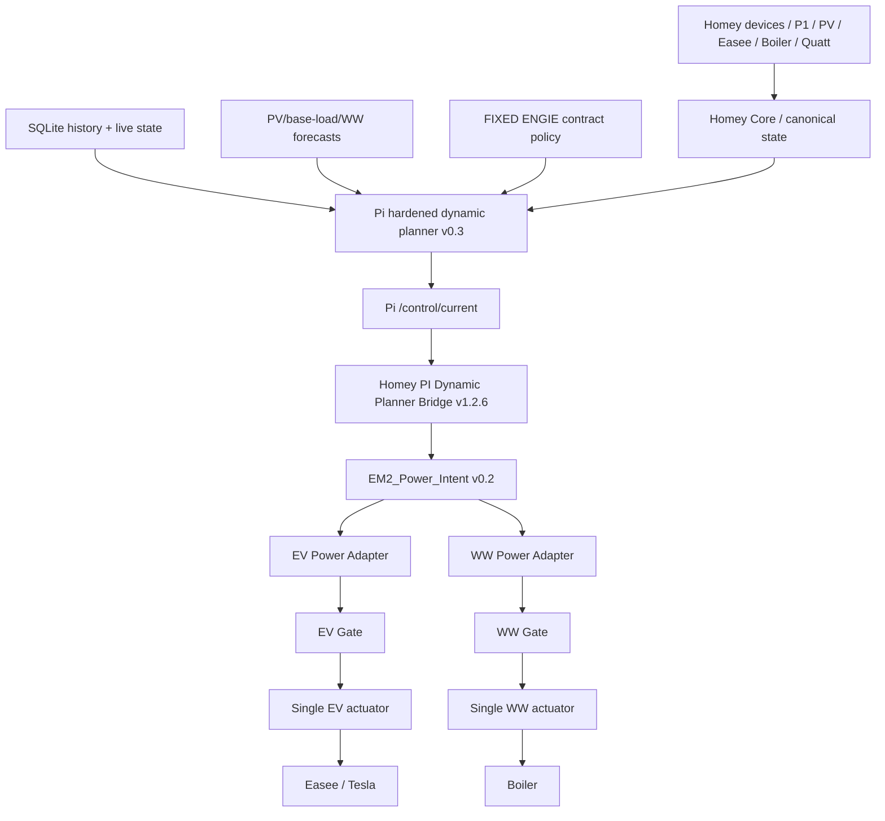

# Softwarearchitectuur Overzicht

## Doel

Het Home Energy Management System (HEMS) scheidt meten, state, forecast, planning, actuator-neutrale vermogensintentie, apparaatvertaling, safety gating, publiceren en fysiek aansturen. Dit document beschrijft de actuele productiearchitectuur per 13 september 2026. De actuele implementatie is leidend; SHADOW-, rollback- en planned-functionaliteit wordt expliciet als zodanig gemarkeerd.

De canonieke actuele-statebeschrijving staat in `docs/architecture/CURRENT-EMS-STATE.md`.

## Hoofdketen productie

De architectuurgrens is:

**Pi bepaalt de productieplanning zolang `EM2_Planner_Authority = PI`; Homey blijft executor en lokale safety-laag. Power Intent blijft actuator-neutraal; adapters en gates bepalen uitvoerbaarheid; per fysieke actuator is maximaal één automatische writer actief.**

## Runtime authority

`EM2_Planner_Authority` is de enige runtime selector tussen Pi- en Homey-plannerauthority.

- `PI` → `EM v2 | 20 Power Intent | PI Dynamic Planner Bridge v1.2.6 DEADLINE-GUARD [READY]` mag de actuele Pi-command projecteren naar `EM2_Power_Intent`.
- `HOMEY` → de Pi-bridge blijft inert en `EM v2 | 20 Power Intent | P1 v0.2.6 AUTHORITY-GUARD [HOMEY ACTIVE]` vormt het rollbackpad.
- De twee producers mogen niet gelijktijdig authority claimen.
- `planner/control-authority.json` is configuratie/diagnostiek en vormt geen tweede runtime gate.

## Contract policy

De productie-EMS is gekoppeld aan het vaste driejarige ENGIE-contract.

Productie-invarianten:

- `productionContractMode = FIXED`;
- `productionContractId = ENGIE_3Y_2026_2029`;
- `productionSupplier = ENGIE`;
- dynamische prijzen zijn niet toegestaan als productie-sturingsbron zolang FIXED actief is;
- dynamische prijzen mogen alleen voor shadow, analyse of replay worden gebruikt;
- automatische contractomschakeling of fallback naar DYNAMIC is verboden;
- ontbrekende of inconsistente contractconfiguratie faalt gesloten.

## Architectuurlagen

1. **Fysieke veiligheid** — 3×25 A aansluiting, lokale apparaatbeveiligingen en Easee Equalizer staan boven software-optimalisatie.
2. **Meet- en statelaag** — Homey Core bouwt canonieke state en control context; Pi ontvangt de benodigde state voor planning.
3. **Historie en forecast** — Pi gebruikt SQLite-history, PV-forecast, base-load forecast en warmwaterinput.
4. **Planning** — Pi hardened dynamic planner v0.3 bouwt de kwartierplanning en bewaakt FIXED-contract-, freshness- en comfortinvarianten.
5. **Control endpoint** — `/control/current` levert uitsluitend het actuele kwartiercommand met schema `EMS_PI_CONTROL_COMMAND_V0.1` en geldigheid begrensd door slot-end en planner `validUntil`.
6. **Power Intent** — Homey bridge projecteert het Pi-command naar `EM2_POWER_INTENT_V0.2`; bij HOMEY-authority neemt de guarded Homey producer over.
7. **Device adapters en gates** — EV/WW adapters vertalen uitsluitend upstream intent; gates controleren schema, revision, freshness en mapping fail-closed.
8. **Single writer** — EV- en WW-actuatorflows zijn de enige fysieke writers voor hun actuator.
9. **Publisher / website** — afgeleide publicaties zijn observability/read-model en geen tweede control plane.

## Tesla

De productie-EV-keten is:

`Pi planner -> /control/current -> PI Bridge -> EM2_Power_Intent -> EV Adapter -> EV Gate -> EV Actuator -> Easee`

Actuele Homey-componenten:

- adapter: `EM v2 | 60 Adapter | EV Power v0.1.5 DEADLINE-CAP OPPORTUNITY16 START6 RUN6`;
- gate: `EM v2 | 80 Validation | EV Power Adapter Gate v0.2.6 START6`;
- actuator: `EM v2 | 60 Actuator | EV Power v0.2.7 START6 RUN6 LIVE + EASEE SESSION`;
- mapping: `FLOOR_3P230_START6_RUN6_FAIL_CLOSED`.

Een gepauzeerde sessie kan gevalideerd direct starten op 3×6 A. Deadline/MUST mag netenergie gebruiken indien nodig, maar geforceerd deadline-laden mag niet vóór `latest_start_at` worden geïntroduceerd. De Homey bridge bevat daarnaast een executor-side harde deadline guard als laatste safetylaag.

## Warm water

De productie-WW-keten is:

`Pi planner -> /control/current -> PI Bridge -> EM2_Power_Intent -> WW Adapter -> WW Gate -> Warm Water Actuator v0.9 -> Boiler`

Actuele Homey writer:

`EM v2 | 60 Control | Warm Water Actuator v0.9 TARGETED-READ LIVE`

Deze flow is enabled, niet broken en de sole WW physical writer. Zij schrijft alleen na LIVE-arm, boilerbronmodus, juiste schema's, revision alignment, gate PASS en freshness. `HOLD` raakt het device niet. Device access gebeurt pas na de guards en via exact boiler-ID.

De WW-gate is `EM v2 | 80 Validation | WW Power Adapter Gate v0.2 TARGETED-READ` en vereist een exacte schema/revision/mapping match.

## Single-writer boundary

Voor elke actuator geldt permanent:

- planner en Power Intent schrijven geen devices;
- adapters en gates schrijven geen devices;
- alleen de expliciete actuatorflow mag fysiek schrijven;
- rollback mag nooit een tweede writer parallel activeren;
- test/TEMP-flows met fysieke device-acties horen disabled of verwijderd te zijn.

## Pi runtime

GitHub `main` is bronwaarheid voor Pi runtime source, deploymentdefinities en architectuurdocumentatie. De deployed runtime staat onder `/home/jeroen/ems/runtime/` en moet na relevante wijzigingen tegen `main` worden gecontroleerd.

De forecastketen draait via `ems-forecast-chain.service` (`Type=oneshot`). `inactive (dead)` na een succesvolle run is normaal.

De Pi planner publiceert een 24-uurs actiezicht van 96 kwartieren en ondersteunt aanvullende lookahead voor WW-feasibility. De control endpoint levert uitsluitend het actuele slot.

## Batterijgrens

Victron/batterij is nog niet runtime-geïntegreerd. Na commissioning blijft Victron/DESS de primaire realtime batterijoptimizer; Pi/Homey mogen forecasts, load intent en policyconstraints leveren, maar geen concurrerende realtime batterijoptimizer vormen.

## Documentatieregel

Architectuurgevoelige wijzigingen moeten in dezelfde release-range worden weerspiegeld in:

- `docs/architecture/CURRENT-EMS-STATE.md`;
- relevante documenten onder `docs/software-architecture/`;
- deployment/systemd-documentatie waar van toepassing.

De actuele implementatie wint bij een conflict. Vastgestelde documentatiedrift moet worden gecorrigeerd vóór een volgende architectuurwijziging als afgerond wordt beschouwd.
