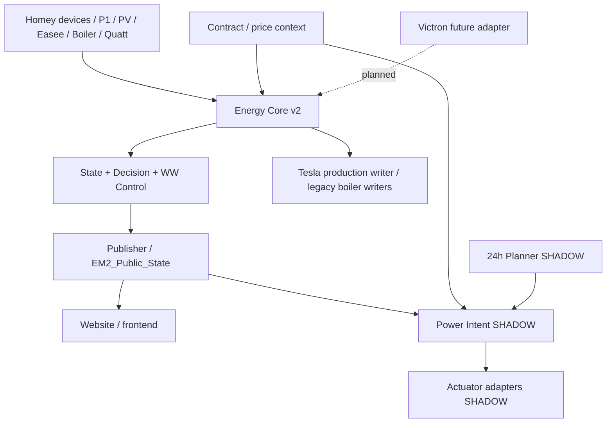

# Softwarearchitectuur Overzicht

## Doel

Het Home Energy Management System (HEMS) scheidt meten, state, beslissen, publiceren en fysiek aansturen. De actuele implementatie is leidend; SHADOW- en planned-functionaliteit wordt expliciet als zodanig gemarkeerd.

## Hoofdketen

## Architectuurlagen

1. **Fysieke veiligheid** — 3×25 A aansluiting, lokale apparaatbeveiligingen en Easee Equalizer staan boven software-optimalisatie.
2. **Meet- en statelaag** — Core gebruikt maximaal één volledige device-snapshot per tick en publiceert canonieke Logic-state.
3. **Contextlaag** — contract, prijs, PV/freshness en configuratie worden als losse context aangeboden.
4. **Decision-laag** — MUST-verplichtingen gaan vóór economische opportunities.
5. **Power Intent / adapters** — numerieke vermogensintenties en elektrische vertaling zijn SHADOW totdat één-writer-cut-over expliciet is gevalideerd.
6. **Publisher / website** — `EM2_Public_State` is het publieke read-model en tegelijk revision-boundary voor downstream logic.

## Belangrijkste operationele grenzen

- P1 is autoritatief voor netimport/export en flex-exportbudget.
- Een ongeldige afgeleide huis/PV-balans blokkeert niet automatisch verse P1-flex.
- Tesla-productie heeft één automatische Easee-writer.
- Slimme WW-control is SHADOW; fysieke boilerwrites lopen nog via gecontroleerde legacy flows.
- Fingerprint-detectie observeert en attribueert; zij stuurt geen actuators rechtstreeks aan.
- Victron/batterij is nog niet runtime-geïntegreerd.

## Documentatieregel

Alle onderliggende component- en flowdocumenten worden pas in dit masterdocument opgenomen nadat ze tegen actuele code/configuratie zijn gecontroleerd. Gegenereerde output is afgeleid en wordt niet handmatig gewijzigd.
