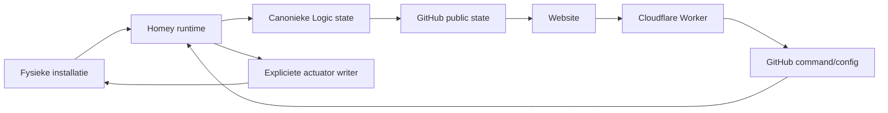

# Systeemcontext

## Systeemgrens

Het HEMS is een software-orkestratielaag rond Homey. Het systeem leest energie- en apparaatstatus, berekent state/budget/intents, publiceert een publiek read-model en stuurt alleen via expliciet aangewezen writers fysieke apparaten aan.

## Externe systemen en apparaten

| Systeem/apparaat | Rol | Interface / bron | Actuele controlestatus |
|---|---|---|---|
| P1 meter | netmeting | Homey device capability | read-only, autoritatief voor netbudget |
| PV-omvormers | productiecontext | Homey device capabilities | read-only |
| Easee Charger | EV-meting/actuator | Homey Easee app | actieve Tesla writer |
| Easee Equalizer | lokale netbeveiliging | Easee/Homey | hardware/software safety boven EMS |
| Tesla | laadbehoefte/doel | Logic + Easee lifecycle | productiecontroller actief |
| Boiler | warmwater-flexload | Homey device + Logic | legacy fysieke writers; slimme control SHADOW |
| Quatt | comfort-baseload | Homey device | observe-only |
| Quooker | comfortload/fingerprint | switch + P1/L3 | detector observe-only |
| Wasmachine/droger | load-attributie | direct status + P1 heuristiek | observe-only |
| GitHub | publicatiestore/config command | Contents API | actief |
| Cloudflare Worker | beveiligde website-write ingress | HTTPS/PIN | actief voor expliciete settings/deadline routes |
| Website/MkDocs | presentatie/bediening | gepubliceerde JSON + Worker | actief |
| Victron/Cerbo GX | toekomstige batterij/ESS | beoogd Modbus TCP | planned, niet runtime-geïntegreerd |

## Vertrouwens- en writegrenzen

De website schrijft nooit rechtstreeks naar een actuator. Een gebruikersactie loopt via een beveiligde command/configuratie-ingress, wordt in Homey naar canonieke state vertaald en komt pas daarna in de control-keten terecht.

## Beschikbaarheidsmodel

Het systeem degradeert per signaaltype. Stale P1 sluit flex-export fail-closed. Stale/asynchrone PV kan afgeleide huisbalans en `Overig` ongeldig maken zonder directe apparaatmetingen of geldige P1-control te vernietigen. Publicatieproblemen zetten een retry-flag maar veranderen niet zelfstandig fysieke device-state.

## Safety ownership

Installatieveiligheid en lokale hardwarebeveiliging blijven buiten de HEMS-policylaag. Software-optimalisatie mag nooit veiligheidslimieten omzeilen en elke nieuwe fysieke writer vereist expliciet single-writer ownership, idempotency en rollbackgedrag.
