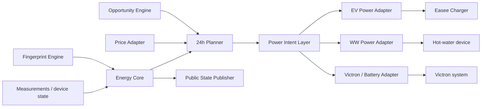

# Building Block View

## Doel

Deze view beschrijft de statische verantwoordelijkheidsverdeling binnen HEMS. Het model volgt C4-principes pragmatisch: alleen componentgrenzen die relevant zijn voor ownership, contracts en write-routes worden expliciet gemaakt.

## Hoofdstructuur

## Ownership rules

- Energy Core normaliseert actuele meet- en systeemstate.
- Planner en Power Intent bezitten EMS-beslislogica en produceren target-W intenties.
- Device adapters bezitten uitsluitend contractvalidatie, vertaling, veiligheidsgrenzen, idempotency en de fysieke write-route.
- Per fysiek device bestaat maximaal één ACTIVE writer.
- Publisher/website is observability en bevat geen control policy.

## Grenzen

SHADOW componenten mogen berekende output publiceren maar niet fysiek schrijven. Een componentgrens wordt pas als ACTIVE beschouwd nadat de relevante runtime- en RC-validatie is vastgelegd.
