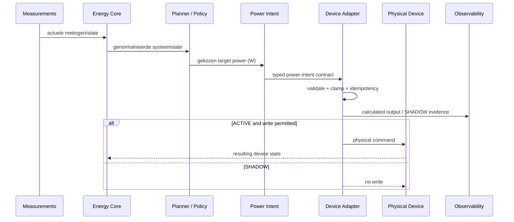

# Runtime View

## Doel

Deze view legt de generieke runtime-keten vast. Gedetailleerde componentflows worden uit de afzonderlijke process models gegenereerd en blijven leidend voor operationele logica.

## Runtime-regels

- De planner bepaalt intent; adapters herinterpreteren geen opportunity-, prijs-, prioriteits- of deadlinebeleid.
- SHADOW en ACTIVE gebruiken dezelfde berekeningsroute; alleen de fysieke write-gate verschilt.
- Fysieke writes zijn idempotent en single-writer beschermd.
- Runtime-observability publiceert input, intent, berekende adapteroutput, write-status en relevante reject/fail-closed reden.
- Component-specifieke flows zijn detailviews van deze keten en moeten met de actuele implementatie overeenkomen.
