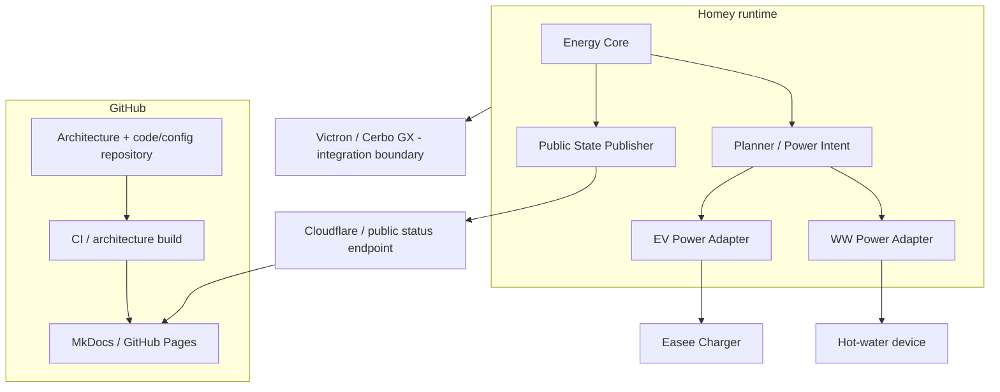

## Deployment View

### Doel

Deze view beschrijft waar de belangrijkste softwareverantwoordelijkheden runtime landen en welke externe systemen aan de HEMS-control plane grenzen.

### Deploymentregels

- Homey is de runtime control plane voor de huidige EMS-logica.
- GitHub is de versioned source-of-truth en CI/publication plane, niet de fysieke device-control plane.
- Cloud/publicatiecomponenten mogen observability/state publiceren maar geen alternatieve device-write route vormen.
- Victron blijft als integratiegrens expliciet gemodelleerd zolang de software-integratie niet ACTIVE is.
- Secrets, credentials en device identifiers horen niet in architectuurpublicaties.
