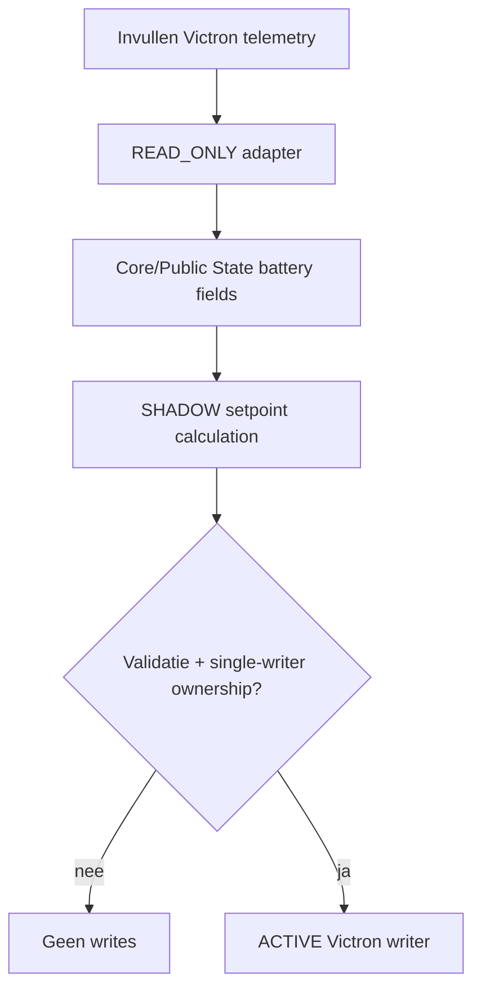

# Victron Adapter

## 1. Doel

De Victron Adapter wordt de grens tussen HEMS-intents en de toekomstige Victron ESS/batterijlaag. Op 25 augustus 2026 bestaat nog geen actieve Homey/Victron runtime-adapter; batterijwaarden in Energy State zijn daarom niet geïntegreerd.

## 2. Scope

Beoogde integratie: Cerbo GX / Victron ESS via een netwerkinterface, bij voorkeur Modbus TCP, met read-first introductie en pas later expliciet gevalideerde control-writes. De Victron-laag mag Tesla/WW-policy niet dupliceren.

## 3. Inputs

Gepland: batterij-SOC, batterijvermogen, ESS-status, grid/setpoint-context en HEMS Power Intent/planner-output.

## 4. Outputs

Gepland: genormaliseerde batterij-state naar Core/Public State en, pas na cut-over, begrensde Victron setpoints/commands. Huidig: geen runtime-output en geen fysieke writes.

## 5. State model

Voorziene states: `NOT_INTEGRATED`, `READ_ONLY`, `SHADOW_COMMAND`, `ACTIVE`. De actuele toestand is `NOT_INTEGRATED`.

## 6. Beslislogica

Victron is ondergeschikt aan installatieveiligheid, netlimieten en harde Tesla/WW-doelen. De batterij mag later resterende export/importoptimalisatie afhandelen, maar niet een MUST-doel verhongeren of lokale ESS/hardwarebeveiligingen omzeilen.

## 7. Procesflow

## 8. Foutafhandeling

Ontbrekende/stale Victron-data moet batterijondersteuning op 0 zetten en mag P1/Tesla/WW-control niet ongeldig maken. Communicatiefouten mogen nooit tot een onbeperkt of blind herhaald setpoint leiden.

## 9. Idempotency

Toekomstige writes moeten worden gededupliceerd op command/revision en alleen bij betekenisvolle setpointwijziging worden uitgevoerd. Herstart moet een veilige actuele state reconstrueren vóór een nieuwe write.

## 10. SHADOW/ACTIVE-status

`planned / NOT_INTEGRATED`. De 24h Planner bevat wel een Victron-scenario, maar dat is simulatie en geen runtime-control.

## 11. Validatie

Voor activering vereist: connectiviteit, readback, sign-conventies laden/ontladen, SOC-validiteit, stale-data test, reboot recovery, duplicate-command test, netlimiettest en rollback naar read-only.

## 12. Bekende beperkingen

Er is nog geen gecodeerde adapter of gevalideerde runtime-interface in deze repository/Homey-architectuur. Concrete Modbus-registers en ESS-setpointsemantiek worden pas normatief wanneer de echte implementatie bestaat en tegen de hardware is getest.

## 13. Bronbestanden

Zie YAML-frontmatter. Deze module beschrijft bewust de geplande grens, niet een reeds actieve integratie.
