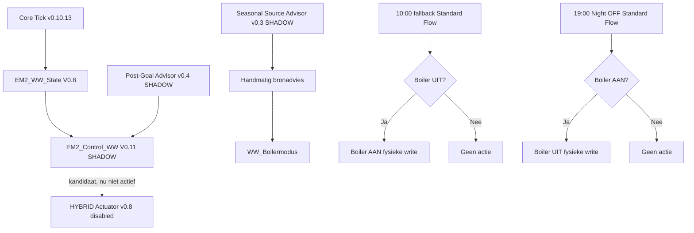
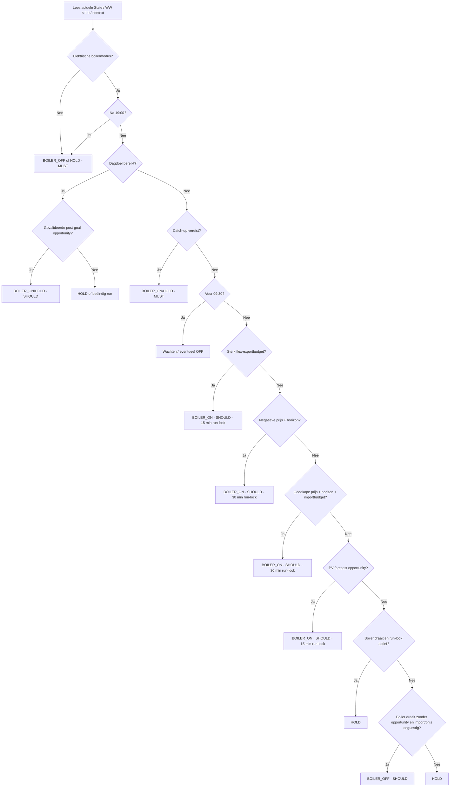
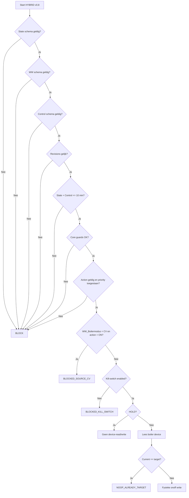
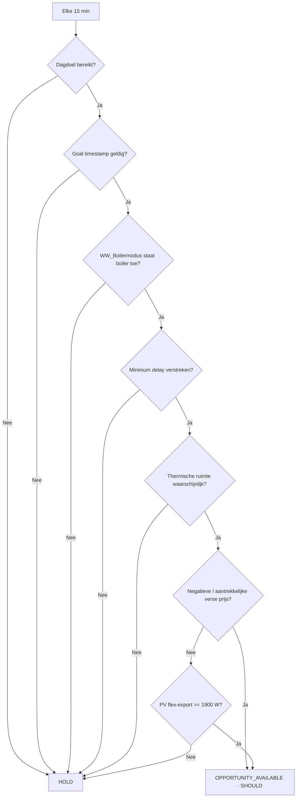
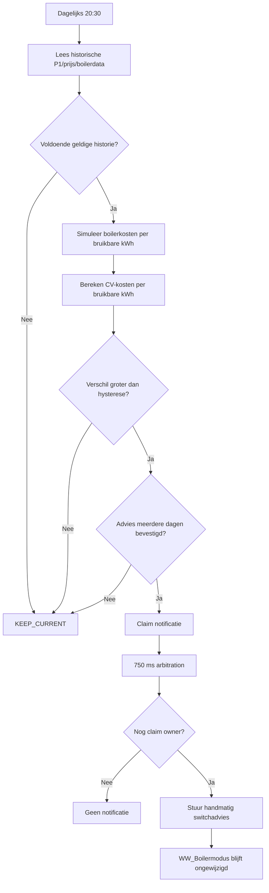

# Warm Water Process Flows

## 1. Actuele productieketen

```process-model
{
  "id": "boiler-flow-1",
  "kind": "mermaid-source",
  "declaration": "flowchart TD",
  "lines": [
    "    A[Core Tick v0.10.13] --> B[EM2_WW_State V0.8]",
    "    B --> C[EM2_Control_WW V0.11 SHADOW]",
    "    D[Post-Goal Advisor v0.4 SHADOW] --> C",
    "    E[Seasonal Source Advisor v0.3 SHADOW] --> F[Handmatig bronadvies]",
    "    F --> G[WW_Boilermodus]",
    "",
    "    H[10:00 fallback Standard Flow] --> I{Boiler UIT?}",
    "    I -->|Ja| J[Boiler AAN fysieke write]",
    "    I -->|Nee| K[Geen actie]",
    "",
    "    L[19:00 Night OFF Standard Flow] --> M{Boiler AAN?}",
    "    M -->|Ja| N[Boiler UIT fysieke write]",
    "    M -->|Nee| O[Geen actie]",
    "",
    "    C -. kandidaat, nu niet actief .-> P[HYBRID Actuator v0.8 disabled]"
  ]
}
```

<!-- GENERATED_MERMAID:boiler-flow-1 START -->

<!-- GENERATED_MERMAID:boiler-flow-1 END -->

## 2. Core WW decision flow

```process-model
{
  "id": "boiler-flow-2",
  "kind": "mermaid-source",
  "declaration": "flowchart TD",
  "lines": [
    "    A[Lees actuele State / WW state / context] --> B{Elektrische boilermodus?}",
    "    B -->|Nee| C[BOILER_OFF of HOLD · MUST]",
    "    B -->|Ja| D{Na 19:00?}",
    "    D -->|Ja| C",
    "    D -->|Nee| E{Dagdoel bereikt?}",
    "    E -->|Ja| F{Gevalideerde post-goal opportunity?}",
    "    F -->|Ja| G[BOILER_ON/HOLD · SHOULD]",
    "    F -->|Nee| H[HOLD of beëindig run]",
    "    E -->|Nee| I{Catch-up vereist?}",
    "    I -->|Ja| J[BOILER_ON/HOLD · MUST]",
    "    I -->|Nee| K{Voor 09:30?}",
    "    K -->|Ja| L[Wachten / eventueel OFF]",
    "    K -->|Nee| M{Sterk flex-exportbudget?}",
    "    M -->|Ja| N[BOILER_ON · SHOULD · 15 min run-lock]",
    "    M -->|Nee| O{Negatieve prijs + horizon?}",
    "    O -->|Ja| P[BOILER_ON · SHOULD · 30 min run-lock]",
    "    O -->|Nee| Q{Goedkope prijs + horizon + importbudget?}",
    "    Q -->|Ja| R[BOILER_ON · SHOULD · 30 min run-lock]",
    "    Q -->|Nee| S{PV forecast opportunity?}",
    "    S -->|Ja| T[BOILER_ON · SHOULD · 15 min run-lock]",
    "    S -->|Nee| U{Boiler draait en run-lock actief?}",
    "    U -->|Ja| V[HOLD]",
    "    U -->|Nee| W{Boiler draait zonder opportunity en import/prijs ongunstig?}",
    "    W -->|Ja| X[BOILER_OFF · SHOULD]",
    "    W -->|Nee| Y[HOLD]"
  ]
}
```

<!-- GENERATED_MERMAID:boiler-flow-2 START -->

<!-- GENERATED_MERMAID:boiler-flow-2 END -->

## 3. HYBRID kandidaat write-guard

```process-model
{
  "id": "boiler-flow-3",
  "kind": "mermaid-source",
  "declaration": "flowchart TD",
  "lines": [
    "    A[Start HYBRID v0.8] --> B{State schema geldig?}",
    "    B -->|Nee| Z1[BLOCK]",
    "    B -->|Ja| C{WW schema geldig?}",
    "    C -->|Nee| Z1",
    "    C -->|Ja| D{Control schema geldig?}",
    "    D -->|Nee| Z1",
    "    D -->|Ja| E{Revisions gelijk?}",
    "    E -->|Nee| Z1",
    "    E -->|Ja| F{State + Control <= 10 min?}",
    "    F -->|Nee| Z1",
    "    F -->|Ja| G{Core guards OK?}",
    "    G -->|Nee| Z1",
    "    G -->|Ja| H{Action geldig en priority toegestaan?}",
    "    H -->|Nee| Z1",
    "    H -->|Ja| I{WW_Boilermodus = CV en action = ON?}",
    "    I -->|Ja| Z2[BLOCKED_SOURCE_CV]",
    "    I -->|Nee| J{Kill-switch enabled?}",
    "    J -->|Nee| Z3[BLOCKED_KILL_SWITCH]",
    "    J -->|Ja| K{HOLD?}",
    "    K -->|Ja| Z4[Geen device-read/write]",
    "    K -->|Nee| L[Lees boiler device]",
    "    L --> M{Current == target?}",
    "    M -->|Ja| Z5[NOOP_ALREADY_TARGET]",
    "    M -->|Nee| N[Fysieke onoff write]"
  ]
}
```

<!-- GENERATED_MERMAID:boiler-flow-3 START -->

<!-- GENERATED_MERMAID:boiler-flow-3 END -->

## 4. Post-goal SHADOW flow

```process-model
{
  "id": "boiler-flow-4",
  "kind": "mermaid-source",
  "declaration": "flowchart TD",
  "lines": [
    "    A[Elke 15 min] --> B{Dagdoel bereikt?}",
    "    B -->|Nee| Z[HOLD]",
    "    B -->|Ja| C{Goal timestamp geldig?}",
    "    C -->|Nee| Z",
    "    C -->|Ja| D{WW_Boilermodus staat boiler toe?}",
    "    D -->|Nee| Z",
    "    D -->|Ja| E{Minimum delay verstreken?}",
    "    E -->|Nee| Z",
    "    E -->|Ja| F{Thermische ruimte waarschijnlijk?}",
    "    F -->|Nee| Z",
    "    F -->|Ja| G{Negatieve / aantrekkelijke verse prijs?}",
    "    G -->|Ja| H[OPPORTUNITY_AVAILABLE · SHOULD]",
    "    G -->|Nee| I{PV flex-export >= 1900 W?}",
    "    I -->|Ja| H",
    "    I -->|Nee| Z"
  ]
}
```

<!-- GENERATED_MERMAID:boiler-flow-4 START -->

<!-- GENERATED_MERMAID:boiler-flow-4 END -->

## 5. Seasonal Source Advisor

```process-model
{
  "id": "boiler-flow-5",
  "kind": "mermaid-source",
  "declaration": "flowchart TD",
  "lines": [
    "    A[Dagelijks 20:30] --> B[Lees historische P1/prijs/boilerdata]",
    "    B --> C{Voldoende geldige historie?}",
    "    C -->|Nee| D[KEEP_CURRENT]",
    "    C -->|Ja| E[Simuleer boilerkosten per bruikbare kWh]",
    "    E --> F[Bereken CV-kosten per bruikbare kWh]",
    "    F --> G{Verschil groter dan hysterese?}",
    "    G -->|Nee| D",
    "    G -->|Ja| H{Advies meerdere dagen bevestigd?}",
    "    H -->|Nee| D",
    "    H -->|Ja| I[Claim notificatie]",
    "    I --> J[750 ms arbitration]",
    "    J --> K{Nog claim owner?}",
    "    K -->|Nee| L[Geen notificatie]",
    "    K -->|Ja| M[Stuur handmatig switchadvies]",
    "    M --> N[WW_Boilermodus blijft ongewijzigd]"
  ]
}
```

<!-- GENERATED_MERMAID:boiler-flow-5 START -->

<!-- GENERATED_MERMAID:boiler-flow-5 END -->

## 6. Architectuurstatus

De stippellijn naar HYBRID is essentieel: dat pad bestaat in code maar is niet actief. De solide productiewrites zijn momenteel uitsluitend de 10:00 AAN- en 19:00 UIT-flows. Daardoor moet een toekomstig cut-over expliciet de write-eigendom wijzigen in plaats van alleen de HYBRID-flow aan te zetten.
