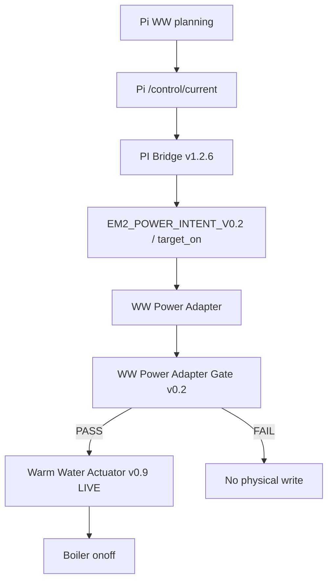
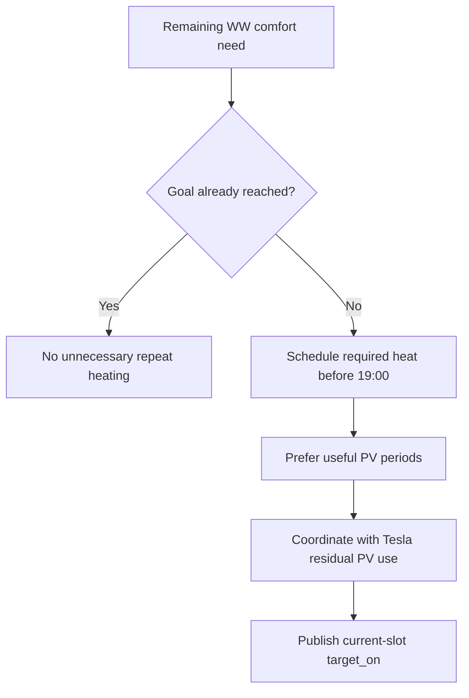
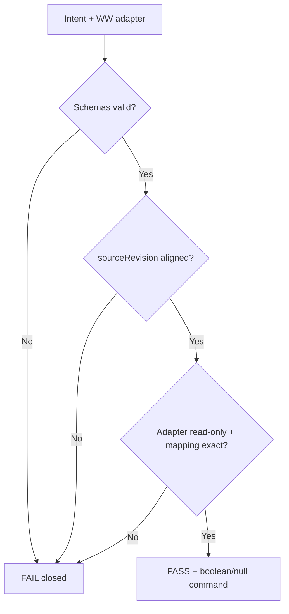
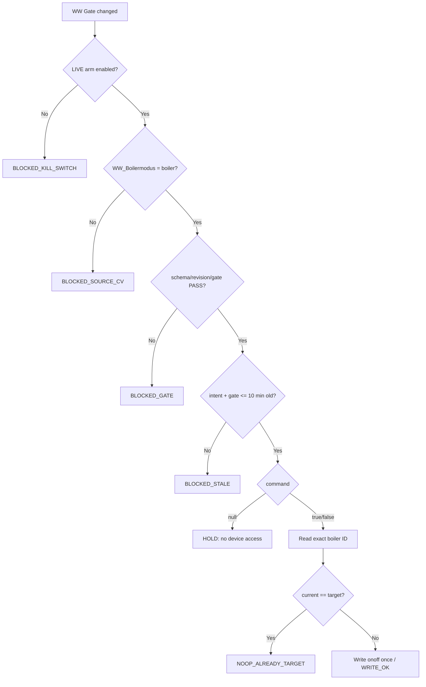

# Warm Water Process Flows

## Productieketen

```process-model
{
  "id": "boiler-flow-production",
  "kind": "mermaid-source",
  "declaration": "flowchart TD",
  "lines": [
    "    A[Pi WW planning] --> B[Pi /control/current]",
    "    B --> C[PI Bridge v1.2.6]",
    "    C --> D[EM2_POWER_INTENT_V0.2 / target_on]",
    "    D --> E[WW Power Adapter]",
    "    E --> F[WW Power Adapter Gate v0.2]",
    "    F -->|PASS| G[Warm Water Actuator v0.9 LIVE]",
    "    F -->|FAIL| H[No physical write]",
    "    G --> I[Boiler onoff]"
  ]
}
```

<!-- GENERATED_MERMAID:boiler-flow-production START -->

<!-- GENERATED_MERMAID:boiler-flow-production END -->

## Pi WW planning

```process-model
{
  "id": "boiler-flow-planning",
  "kind": "mermaid-source",
  "declaration": "flowchart TD",
  "lines": [
    "    A[Remaining WW comfort need] --> B{Goal already reached?}",
    "    B -->|Yes| C[No unnecessary repeat heating]",
    "    B -->|No| D[Schedule required heat before 19:00]",
    "    D --> E[Prefer useful PV periods]",
    "    E --> F[Coordinate with Tesla residual PV use]",
    "    F --> G[Publish current-slot target_on]"
  ]
}
```

<!-- GENERATED_MERMAID:boiler-flow-planning START -->

<!-- GENERATED_MERMAID:boiler-flow-planning END -->

WW comfort/deadline is een harde constraint boven optimalisatie. Het productiecontract voor WW blijft binair `target_on=true/false/null`.

## WW gate

```process-model
{
  "id": "boiler-flow-gate",
  "kind": "mermaid-source",
  "declaration": "flowchart TD",
  "lines": [
    "    A[Intent + WW adapter] --> B{Schemas valid?}",
    "    B -->|No| X[FAIL closed]",
    "    B -->|Yes| C{sourceRevision aligned?}",
    "    C -->|No| X",
    "    C -->|Yes| D{Adapter read-only + mapping exact?}",
    "    D -->|No| X",
    "    D -->|Yes| E[PASS + boolean/null command]"
  ]
}
```

<!-- GENERATED_MERMAID:boiler-flow-gate START -->

<!-- GENERATED_MERMAID:boiler-flow-gate END -->

## Live actuator v0.9

```process-model
{
  "id": "boiler-flow-actuator",
  "kind": "mermaid-source",
  "declaration": "flowchart TD",
  "lines": [
    "    A[WW Gate changed] --> B{LIVE arm enabled?}",
    "    B -->|No| X[BLOCKED_KILL_SWITCH]",
    "    B -->|Yes| C{WW_Boilermodus = boiler?}",
    "    C -->|No| Y[BLOCKED_SOURCE_CV]",
    "    C -->|Yes| D{schema/revision/gate PASS?}",
    "    D -->|No| Z[BLOCKED_GATE]",
    "    D -->|Yes| E{intent + gate <= 10 min old?}",
    "    E -->|No| W[BLOCKED_STALE]",
    "    E -->|Yes| F{command}",
    "    F -->|null| G[HOLD: no device access]",
    "    F -->|true/false| H[Read exact boiler ID]",
    "    H --> I{current == target?}",
    "    I -->|Yes| J[NOOP_ALREADY_TARGET]",
    "    I -->|No| K[Write onoff once / WRITE_OK]"
  ]
}
```

<!-- GENERATED_MERMAID:boiler-flow-actuator START -->

<!-- GENERATED_MERMAID:boiler-flow-actuator END -->

## Boundary

`Warm Water Actuator v0.9 TARGETED-READ LIVE` is de sole WW physical writer in de slimme productiecontrolketen. Het eerdere diagram waarin alleen 10:00/19:00 legacy flows fysiek schreven en HYBRID v0.8 disabled was, is vervallen.
