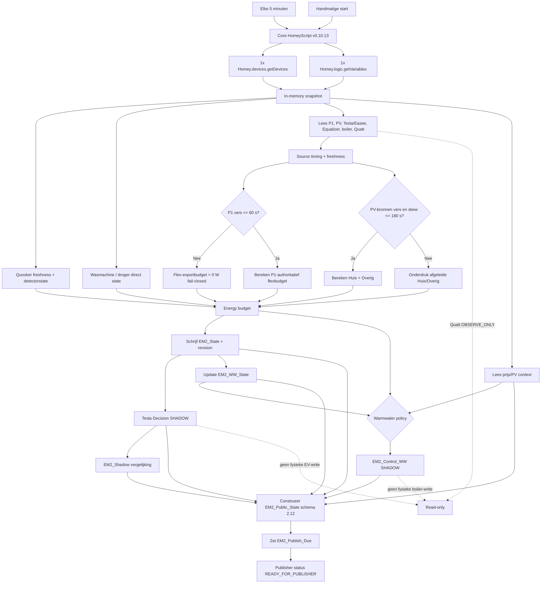
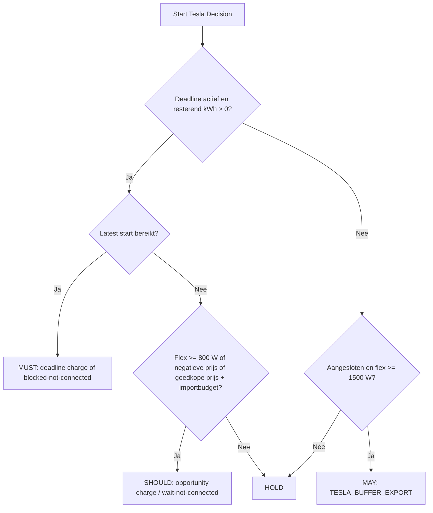
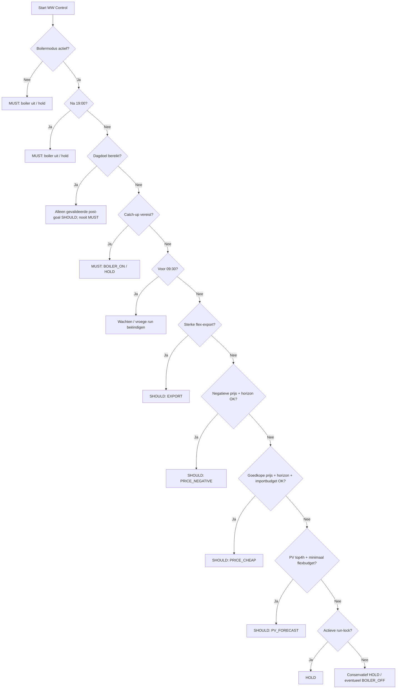

# Core procesflow

Dit diagram is opgesteld op basis van de live Homey Advanced Flow `EM v2 | 00 Core Tick | v0.10.13 (EV electrical context)` en niet op basis van een gewenste doelarchitectuur.

## Beslisregels uit de implementatie

### Tesla

### Warm water

De volledige warmwaterbeslisboom is uitgebreider, maar de actuele implementatie hanteert deze prioriteitsvolgorde:

## Architectuurgarantie

Dit flowbestand moet opnieuw tegen de live Homey-flow worden gecontroleerd zodra `EM v2 | 00 Core Tick` van versie verandert of wanneer de centrale HomeyScript-code inhoudelijk wordt aangepast.
