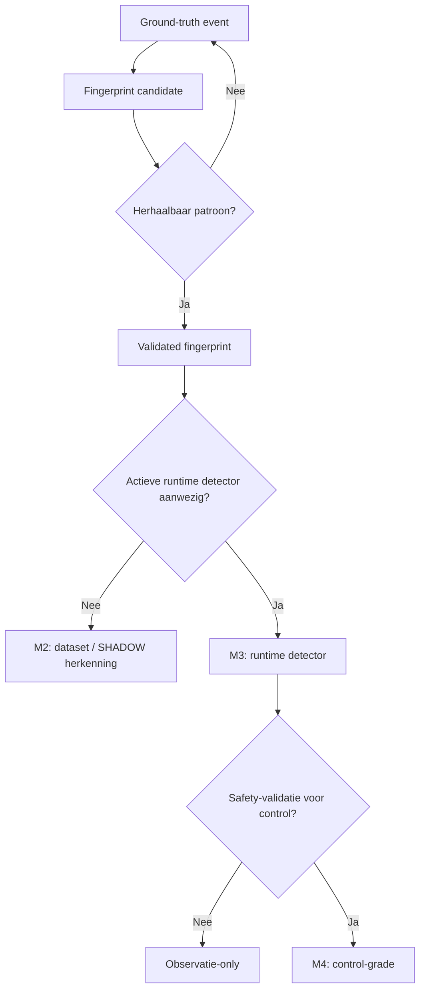
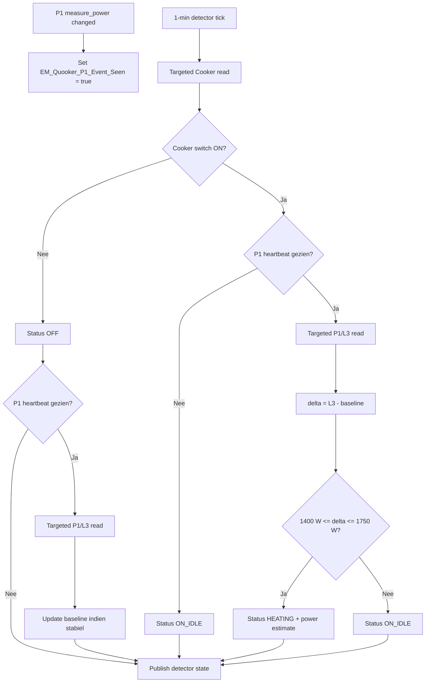
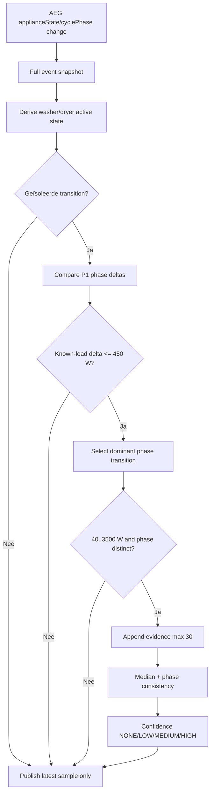
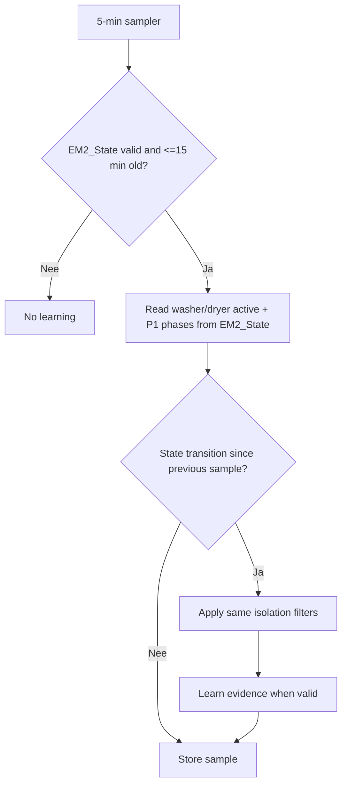
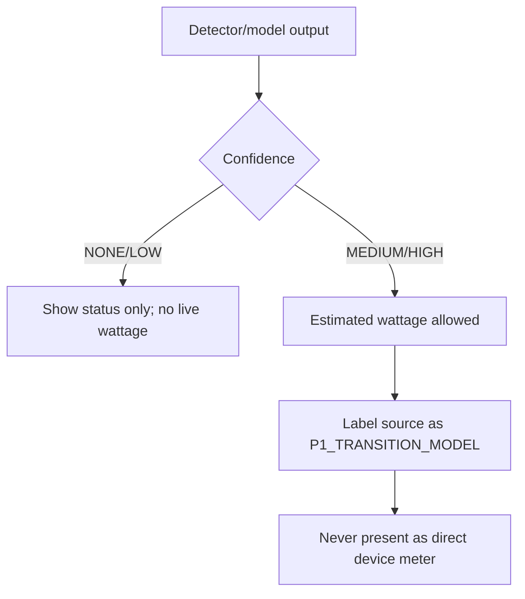
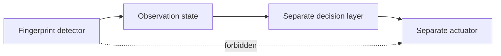

# Fingerprint Engine procesflows

## 1. Generieke maturity-flow

## 2. Quooker event-assisted detector

## 3. Laundry event-first analyse

## 4. Laundry 5-min fallback

## 5. Confidence-gated presentation

## 6. Control boundary

Een fingerprint-detector schrijft nooit rechtstreeks naar een fysiek apparaat.
