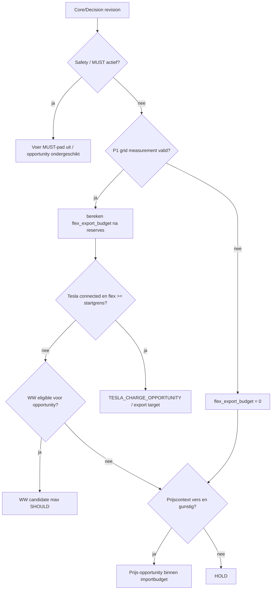
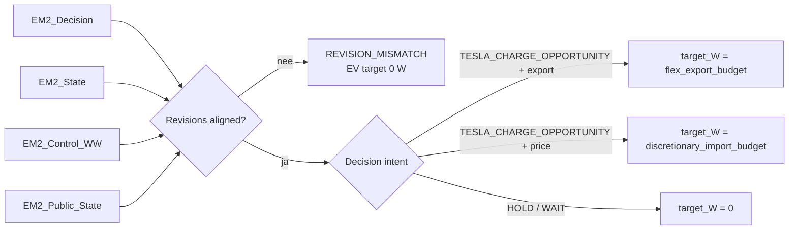

# Opportunity Engine Flow

## Actuele beslisflow

Onderstaand `process-model` is de bronwaarheid voor het diagram. Het Mermaid-blok wordt gegenereerd en niet handmatig aangepast.

```process-model
{
  "id": "opportunity-decision",
  "direction": "TD",
  "nodes": [
    {"id":"A","label":"Core/Decision revision"},
    {"id":"B","label":"Safety / MUST actief?","type":"decision"},
    {"id":"C","label":"Voer MUST-pad uit / opportunity ondergeschikt"},
    {"id":"D","label":"P1 grid measurement valid?","type":"decision"},
    {"id":"E","label":"flex_export_budget = 0"},
    {"id":"F","label":"bereken flex_export_budget na reserves"},
    {"id":"G","label":"Tesla connected en flex >= startgrens?","type":"decision"},
    {"id":"H","label":"TESLA_CHARGE_OPPORTUNITY / export target"},
    {"id":"I","label":"WW eligible voor opportunity?","type":"decision"},
    {"id":"J","label":"WW candidate max SHOULD"},
    {"id":"K","label":"Prijscontext vers en gunstig?","type":"decision"},
    {"id":"L","label":"Prijs-opportunity binnen importbudget"},
    {"id":"M","label":"HOLD"}
  ],
  "edges": [
    {"from":"A","to":"B"},{"from":"B","to":"C","label":"ja"},{"from":"B","to":"D","label":"nee"},
    {"from":"D","to":"E","label":"nee"},{"from":"D","to":"F","label":"ja"},{"from":"F","to":"G"},
    {"from":"G","to":"H","label":"ja"},{"from":"G","to":"I","label":"nee"},{"from":"I","to":"J","label":"ja"},
    {"from":"I","to":"K","label":"nee"},{"from":"K","to":"L","label":"ja"},{"from":"K","to":"M","label":"nee"},{"from":"E","to":"K"}
  ]
}
```

<!-- GENERATED_MERMAID:opportunity-decision START -->

<!-- GENERATED_MERMAID:opportunity-decision END -->

## Power Intent-projectie

```process-model
{
  "id": "opportunity-power-intent",
  "direction": "LR",
  "nodes": [
    {"id":"D","label":"EM2_Decision"},{"id":"S","label":"EM2_State"},{"id":"W","label":"EM2_Control_WW"},{"id":"P","label":"EM2_Public_State"},
    {"id":"R","label":"Revisions aligned?","type":"decision"},{"id":"Z","label":"REVISION_MISMATCH\\nEV target 0 W"},
    {"id":"I","label":"Decision intent","type":"decision"},{"id":"X","label":"target_W = flex_export_budget"},
    {"id":"Y","label":"target_W = discretionary_import_budget"},{"id":"H","label":"target_W = 0"}
  ],
  "edges": [
    {"from":"D","to":"R"},{"from":"S","to":"R"},{"from":"W","to":"R"},{"from":"P","to":"R"},
    {"from":"R","to":"Z","label":"nee"},{"from":"R","to":"I","label":"ja"},
    {"from":"I","to":"X","label":"TESLA_CHARGE_OPPORTUNITY + export"},
    {"from":"I","to":"Y","label":"TESLA_CHARGE_OPPORTUNITY + price"},{"from":"I","to":"H","label":"HOLD / WAIT"}
  ]
}
```

<!-- GENERATED_MERMAID:opportunity-power-intent START -->

<!-- GENERATED_MERMAID:opportunity-power-intent END -->

## Grenzen

Deze flow beschrijft policy/intents. Alleen expliciet aangewezen productiecontrollers mogen fysieke writes uitvoeren. De generieke Power Intent/adapterketen blijft SHADOW totdat single-writer-cut-over is gevalideerd.
