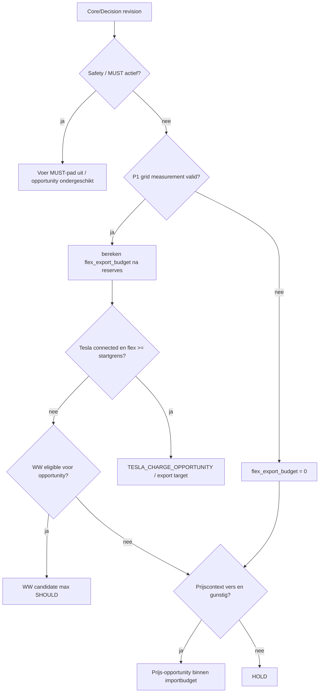
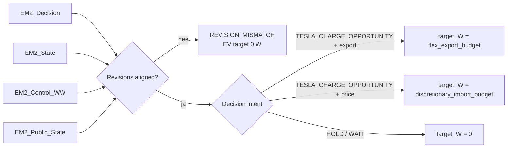

# Opportunity Engine Flow

## Actuele beslisflow

## Power Intent-projectie

## Grenzen

Deze flow beschrijft policy/intents. Alleen expliciet aangewezen productiecontrollers mogen fysieke writes uitvoeren. De generieke Power Intent/adapterketen blijft SHADOW totdat single-writer-cut-over is gevalideerd.
