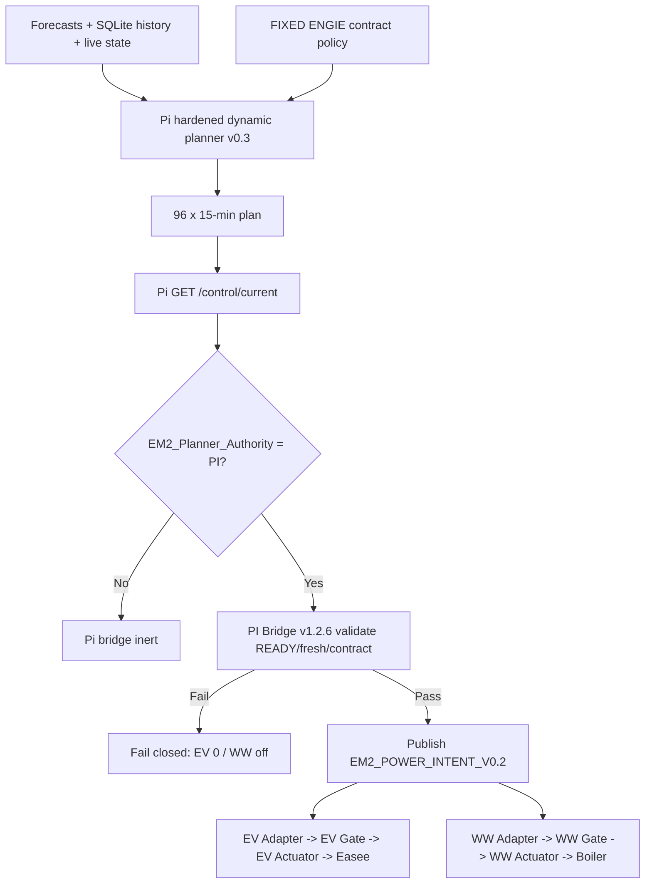
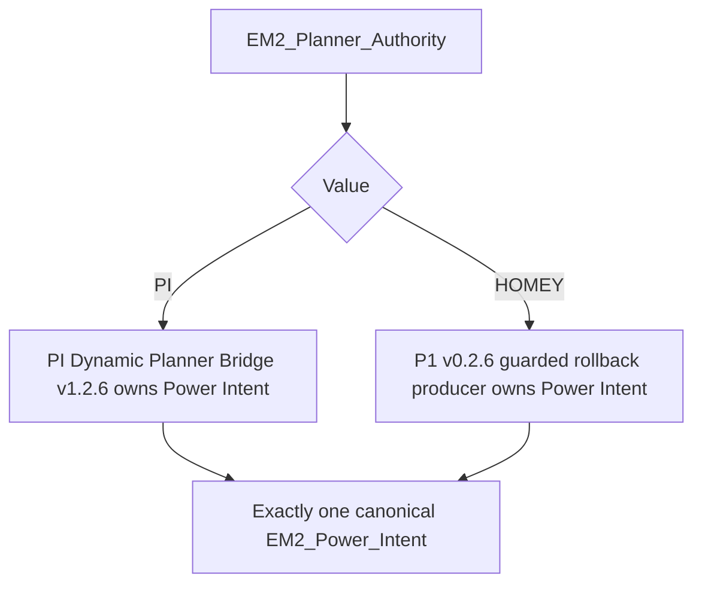
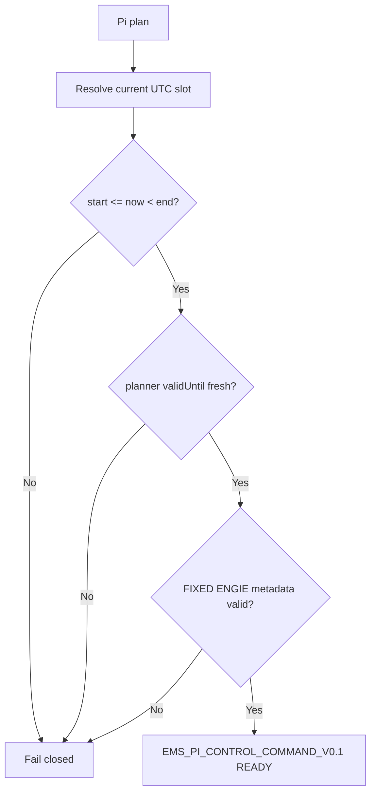
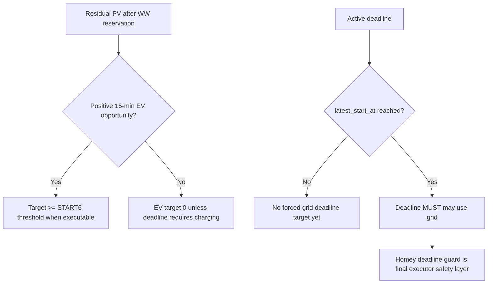
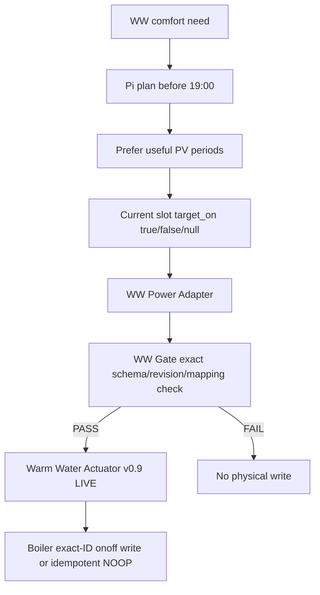

# Planner and Power Intent Flows

## Productie end-to-end

```process-model
{
  "id": "planner-power-intent-flow-current",
  "kind": "mermaid-source",
  "declaration": "flowchart TD",
  "lines": [
    "    A[Forecasts + SQLite history + live state] --> B[Pi hardened dynamic planner v0.3]",
    "    C[FIXED ENGIE contract policy] --> B",
    "    B --> D[96 x 15-min plan]",
    "    D --> E[Pi GET /control/current]",
    "    E --> F{EM2_Planner_Authority = PI?}",
    "    F -->|No| G[Pi bridge inert]",
    "    F -->|Yes| H[PI Bridge v1.2.6 validate READY/fresh/contract]",
    "    H -->|Fail| I[Fail closed: EV 0 / WW off]",
    "    H -->|Pass| J[Publish EM2_POWER_INTENT_V0.2]",
    "    J --> K[EV Adapter -> EV Gate -> EV Actuator -> Easee]",
    "    J --> L[WW Adapter -> WW Gate -> WW Actuator -> Boiler]"
  ]
}
```

<!-- GENERATED_MERMAID:planner-power-intent-flow-current START -->

<!-- GENERATED_MERMAID:planner-power-intent-flow-current END -->

## Authority selector

```process-model
{
  "id": "planner-power-intent-authority",
  "kind": "mermaid-source",
  "declaration": "flowchart TD",
  "lines": [
    "    A[EM2_Planner_Authority] --> B{Value}",
    "    B -->|PI| C[PI Dynamic Planner Bridge v1.2.6 owns Power Intent]",
    "    B -->|HOMEY| D[P1 v0.2.6 guarded rollback producer owns Power Intent]",
    "    C --> E[Exactly one canonical EM2_Power_Intent]",
    "    D --> E"
  ]
}
```

<!-- GENERATED_MERMAID:planner-power-intent-authority START -->

<!-- GENERATED_MERMAID:planner-power-intent-authority END -->

`planner/control-authority.json` is configuratie/diagnostiek en vormt geen tweede runtime gate.

## Current-slot command

```process-model
{
  "id": "planner-control-current",
  "kind": "mermaid-source",
  "declaration": "flowchart TD",
  "lines": [
    "    A[Pi plan] --> B[Resolve current UTC slot]",
    "    B --> C{start <= now < end?}",
    "    C -->|No| D[Fail closed]",
    "    C -->|Yes| E{planner validUntil fresh?}",
    "    E -->|No| D",
    "    E -->|Yes| F{FIXED ENGIE metadata valid?}",
    "    F -->|No| D",
    "    F -->|Yes| G[EMS_PI_CONTROL_COMMAND_V0.1 READY]"
  ]
}
```

<!-- GENERATED_MERMAID:planner-control-current START -->

<!-- GENERATED_MERMAID:planner-control-current END -->

Command validity is begrensd door zowel slot-end als planner `validUntil`.

## Tesla policy

```process-model
{
  "id": "planner-ev-policy-current",
  "kind": "mermaid-source",
  "declaration": "flowchart TD",
  "lines": [
    "    A[Residual PV after WW reservation] --> B{Positive 15-min EV opportunity?}",
    "    B -->|Yes| C[Target >= START6 threshold when executable]",
    "    B -->|No| D[EV target 0 unless deadline requires charging]",
    "    E[Active deadline] --> F{latest_start_at reached?}",
    "    F -->|No| G[No forced grid deadline target yet]",
    "    F -->|Yes| H[Deadline MUST may use grid]",
    "    H --> I[Homey deadline guard is final executor safety layer]"
  ]
}
```

<!-- GENERATED_MERMAID:planner-ev-policy-current START -->

<!-- GENERATED_MERMAID:planner-ev-policy-current END -->

START6/RUN6 betekent minimaal 3×6 A; nominaal 4140 W bij 3×230 V. Elk kwartier wordt opnieuw beoordeeld. Dynamische prijsdata is onder het huidige FIXED-contract geen productie-trigger.

## WW policy en execution

```process-model
{
  "id": "planner-ww-policy-current",
  "kind": "mermaid-source",
  "declaration": "flowchart TD",
  "lines": [
    "    A[WW comfort need] --> B[Pi plan before 19:00]",
    "    B --> C[Prefer useful PV periods]",
    "    C --> D[Current slot target_on true/false/null]",
    "    D --> E[WW Power Adapter]",
    "    E --> F[WW Gate exact schema/revision/mapping check]",
    "    F -->|PASS| G[Warm Water Actuator v0.9 LIVE]",
    "    F -->|FAIL| H[No physical write]",
    "    G --> I[Boiler exact-ID onoff write or idempotent NOOP]"
  ]
}
```

<!-- GENERATED_MERMAID:planner-ww-policy-current START -->

<!-- GENERATED_MERMAID:planner-ww-policy-current END -->

## Boundary

Planner, bridge, Power Intent, adapters en gates schrijven geen physical devices. Alleen de EV- en WW-actuators zijn fysieke writers. De eerdere SHADOW-only adapterdiagrammen en Homey 24h Planner v0.4 productievoorstelling zijn hiermee vervallen.