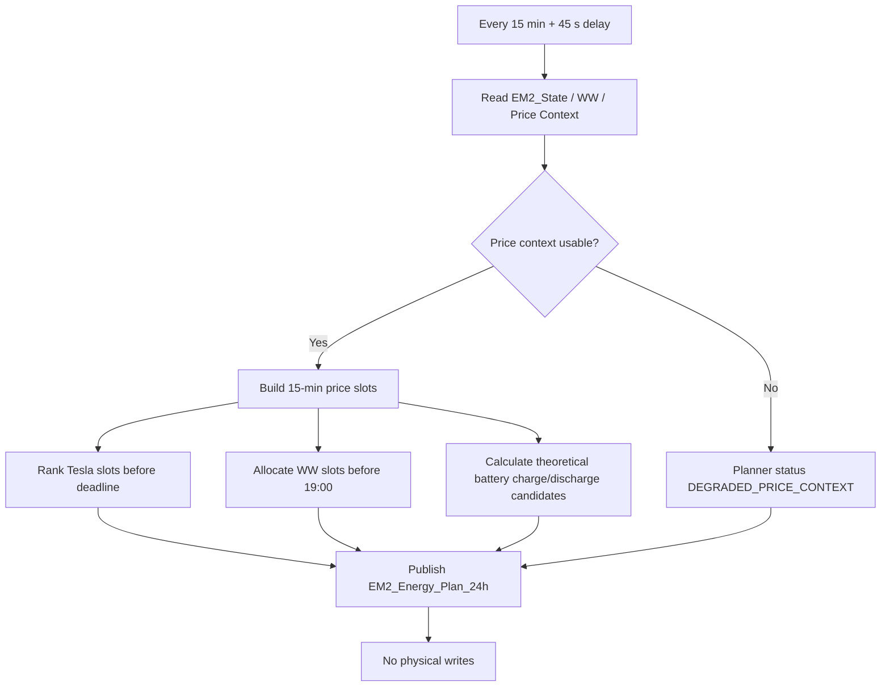
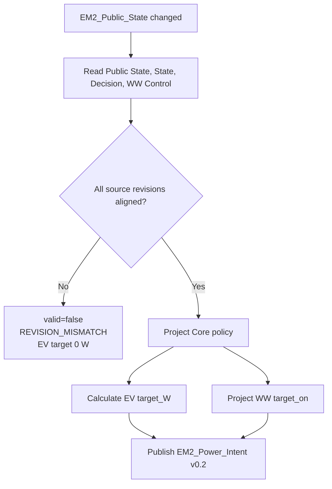
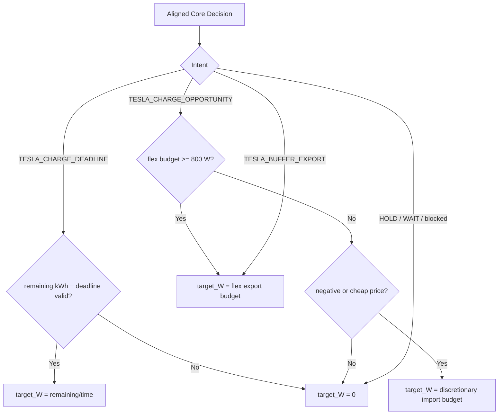
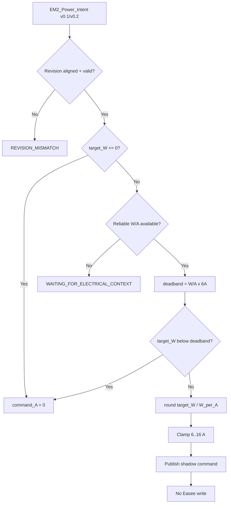
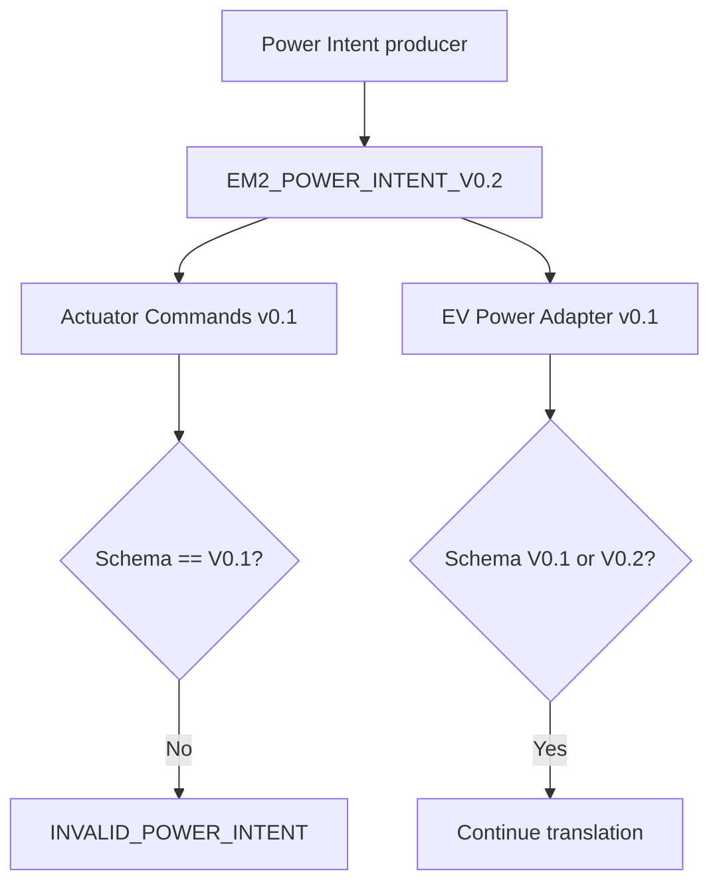
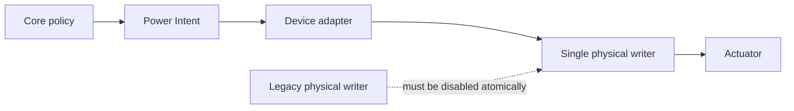

# Planner and Power Intent Flows

## 1. 24h Planner

## 2. Power Intent revision guard

## 3. EV target projection

## 4. EV Power Adapter

## 5. Generieke adapter schema mismatch

## 6. Beoogde cut-overgrens

De fysieke writer blijft buiten deze SHADOW-module totdat een expliciete cut-over is gevalideerd.