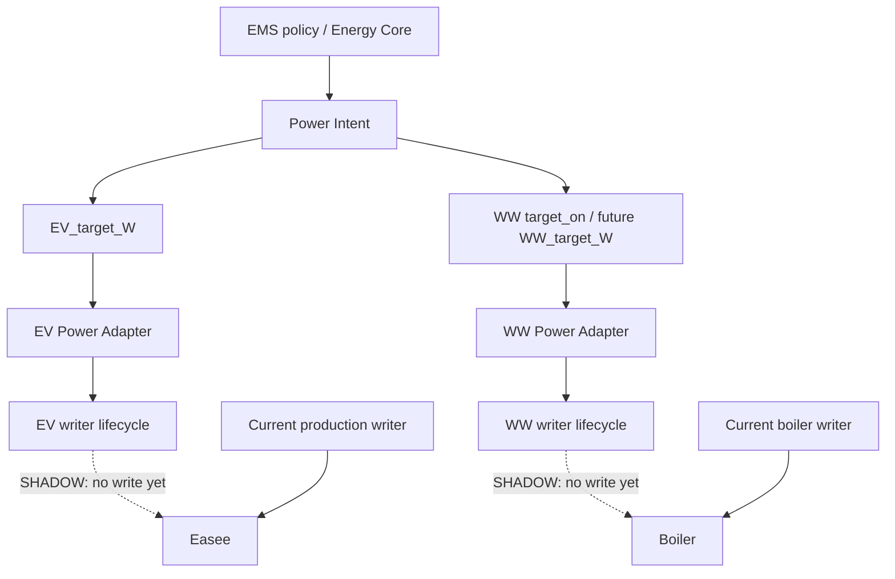
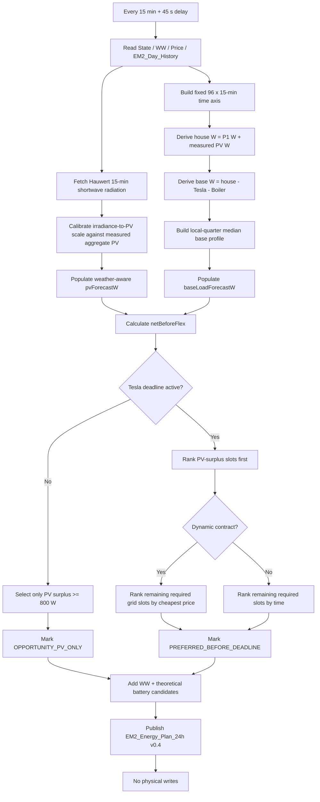
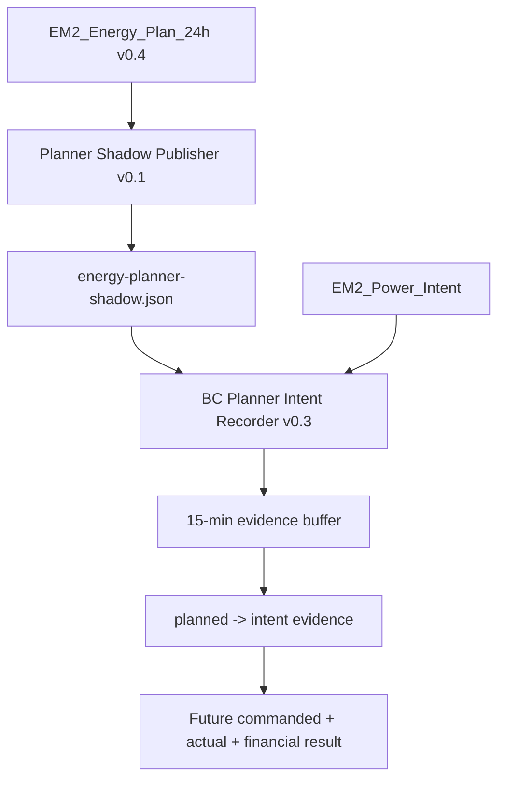
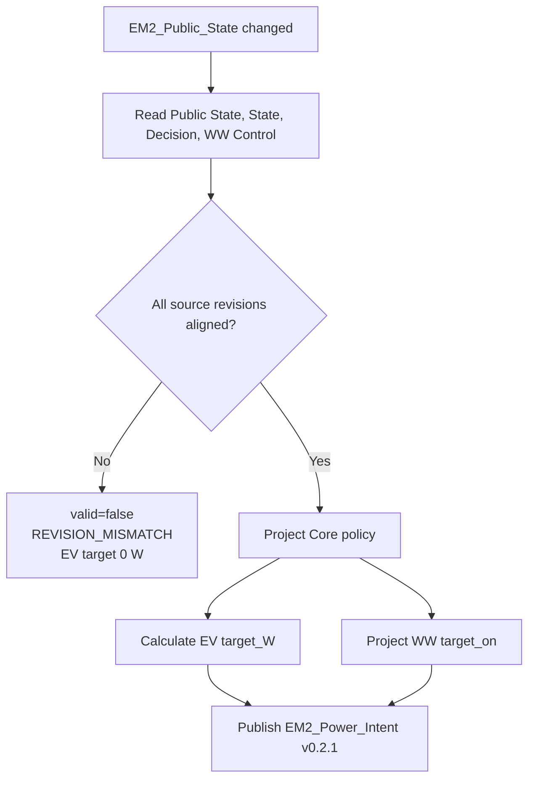
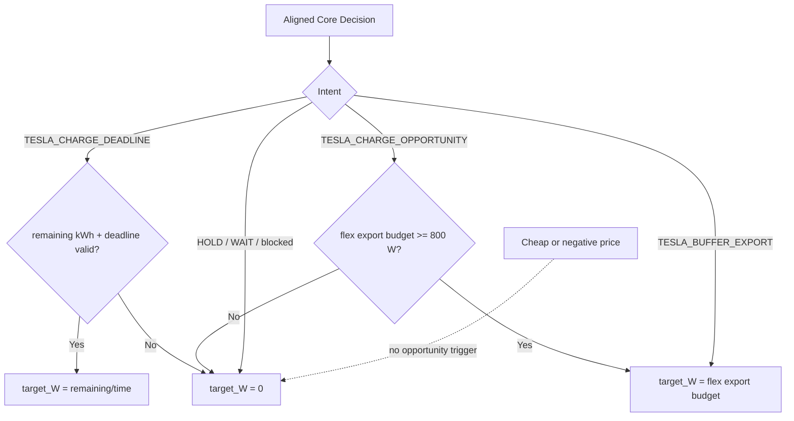
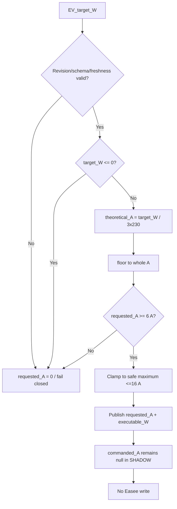
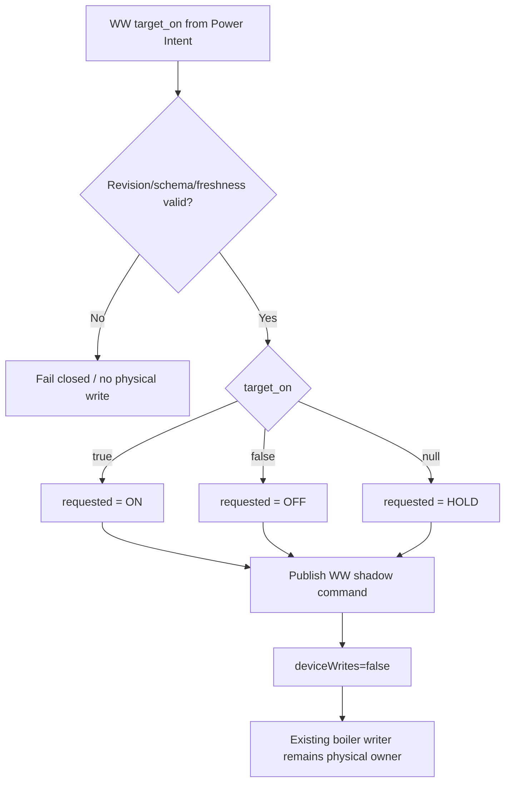
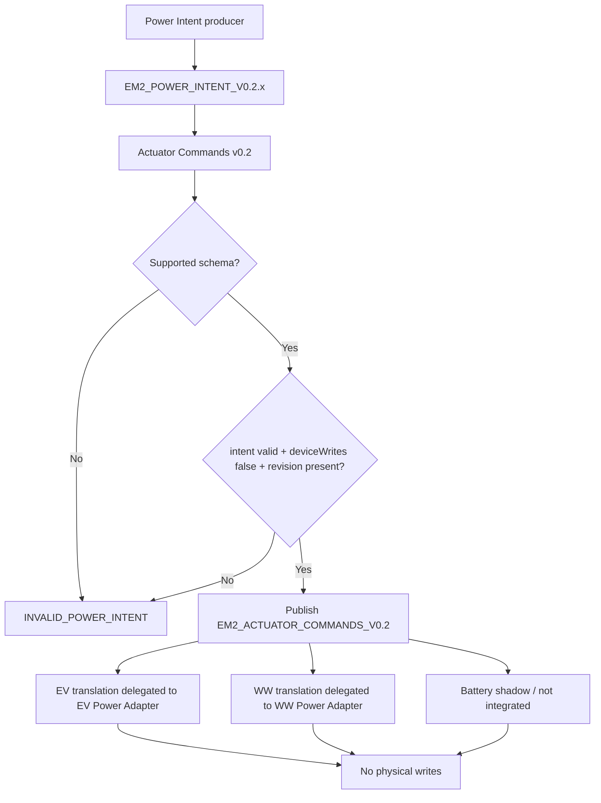
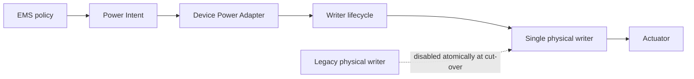

# Planner and Power Intent Flows

## End-to-end Power Intent and adapter architecture

```process-model
{
  "id": "planner-power-intent-flow-0",
  "kind": "mermaid-source",
  "declaration": "flowchart TD",
  "lines": [
    "    A[EMS policy / Energy Core] --> B[Power Intent]",
    "    B --> C[EV_target_W]",
    "    B --> D[WW target_on / future WW_target_W]",
    "    C --> E[EV Power Adapter]",
    "    D --> F[WW Power Adapter]",
    "    E --> G[EV writer lifecycle]",
    "    F --> H[WW writer lifecycle]",
    "    G -. SHADOW: no write yet .-> I[Easee]",
    "    H -. SHADOW: no write yet .-> J[Boiler]",
    "    K[Current production writer] --> I",
    "    L[Current boiler writer] --> J"
  ]
}
```

<!-- GENERATED_MERMAID:planner-power-intent-flow-0 START -->

<!-- GENERATED_MERMAID:planner-power-intent-flow-0 END -->

De adapterroutes zijn SHADOW. De bestaande productie-writers blijven fysieke eigenaar totdat een atomic single-writer cut-over is gevalideerd.

## 24h Planner v0.4 energy-balance forecast

```process-model
{
  "id": "planner-power-intent-flow-1",
  "kind": "mermaid-source",
  "declaration": "flowchart TD",
  "lines": [
    "    A[Every 15 min + 45 s delay] --> B[Read State / WW / Price / EM2_Day_History]",
    "    B --> C[Build fixed 96 x 15-min time axis]",
    "    C --> D[Derive house W = P1 W + measured PV W]",
    "    D --> E[Derive base W = house - Tesla - Boiler]",
    "    E --> F[Build local-quarter median base profile]",
    "    B --> G[Fetch Hauwert 15-min shortwave radiation]",
    "    G --> H[Calibrate irradiance-to-PV scale against measured aggregate PV]",
    "    H --> I[Populate weather-aware pvForecastW]",
    "    F --> J[Populate baseLoadForecastW]",
    "    I --> K[Calculate netBeforeFlex]",
    "    J --> K",
    "    K --> L{Tesla deadline active?}",
    "    L -->|No| M[Select only PV surplus >= 800 W]",
    "    M --> N[Mark OPPORTUNITY_PV_ONLY]",
    "    L -->|Yes| O[Rank PV-surplus slots first]",
    "    O --> P{Dynamic contract?}",
    "    P -->|Yes| Q[Rank remaining required grid slots by cheapest price]",
    "    P -->|No| R[Rank remaining required slots by time]",
    "    Q --> S[Mark PREFERRED_BEFORE_DEADLINE]",
    "    R --> S",
    "    N --> T[Add WW + theoretical battery candidates]",
    "    S --> T",
    "    T --> U[Publish EM2_Energy_Plan_24h v0.4]",
    "    U --> V[No physical writes]"
  ]
}
```

<!-- GENERATED_MERMAID:planner-power-intent-flow-1 START -->

<!-- GENERATED_MERMAID:planner-power-intent-flow-1 END -->

De tijdas is altijd 96 kwartieren, ook bij FIXED. PV-forecast gebruikt Hauwert 15-minuten `shortwave_radiation` en wordt waar mogelijk gekalibreerd tegen gemeten totale PV. Tesla opportunity is strikt PV-only; goedkope of negatieve prijs mag zonder deadline geen laadslot creëren. Bij deadline/MUST krijgt PV voorrang en wordt alleen de resterende noodzakelijke netenergie bij DYNAMIC op prijs geoptimaliseerd. `gridHeadroomW` blijft ongemodelleerd totdat fasebewuste 3×25 A headroom beschikbaar is.

## Planner publication and BC evidence loop

```process-model
{
  "id": "planner-power-intent-flow-evidence",
  "kind": "mermaid-source",
  "declaration": "flowchart TD",
  "lines": [
    "    A[EM2_Energy_Plan_24h v0.4] --> B[Planner Shadow Publisher v0.1]",
    "    B --> C[energy-planner-shadow.json]",
    "    C --> D[BC Planner Intent Recorder v0.3]",
    "    E[EM2_Power_Intent] --> D",
    "    D --> F[15-min evidence buffer]",
    "    F --> G[planned -> intent evidence]",
    "    G --> H[Future commanded + actual + financial result]"
  ]
}
```

<!-- GENERATED_MERMAID:planner-power-intent-flow-evidence START -->

<!-- GENERATED_MERMAID:planner-power-intent-flow-evidence END -->

De BC-recorder blijft read-only en legt planner/intentevidence vast voor latere `planned -> intent -> commanded -> actual -> financial result`-analyse.

## Power Intent revision guard

```process-model
{
  "id": "planner-power-intent-flow-2",
  "kind": "mermaid-source",
  "declaration": "flowchart TD",
  "lines": [
    "    A[EM2_Public_State changed] --> B[Read Public State, State, Decision, WW Control]",
    "    B --> C{All source revisions aligned?}",
    "    C -->|No| D[valid=false\\nREVISION_MISMATCH\\nEV target 0 W]",
    "    C -->|Yes| E[Project Core policy]",
    "    E --> F[Calculate EV target_W]",
    "    E --> G[Project WW target_on]",
    "    F --> H[Publish EM2_Power_Intent v0.2.1]",
    "    G --> H"
  ]
}
```

<!-- GENERATED_MERMAID:planner-power-intent-flow-2 START -->

<!-- GENERATED_MERMAID:planner-power-intent-flow-2 END -->

## EV target projection

```process-model
{
  "id": "planner-power-intent-flow-3",
  "kind": "mermaid-source",
  "declaration": "flowchart TD",
  "lines": [
    "    A[Aligned Core Decision] --> B{Intent}",
    "    B -->|TESLA_CHARGE_DEADLINE| C{remaining kWh + deadline valid?}",
    "    C -->|Yes| D[target_W = remaining/time]",
    "    C -->|No| E[target_W = 0]",
    "    B -->|TESLA_CHARGE_OPPORTUNITY| F{flex export budget >= 800 W?}",
    "    F -->|Yes| G[target_W = flex export budget]",
    "    F -->|No| E",
    "    B -->|TESLA_BUFFER_EXPORT| G",
    "    B -->|HOLD / WAIT / blocked| E",
    "    H[Cheap or negative price] -. no opportunity trigger .-> E"
  ]
}
```

<!-- GENERATED_MERMAID:planner-power-intent-flow-3 START -->

<!-- GENERATED_MERMAID:planner-power-intent-flow-3 END -->

Power Intent v0.2.1 fail-closedt opportunity zonder PV/exportbudget naar 0 W. Prijscontext kan geen Tesla-opportunity meer creëren; prijsoptimalisatie hoort bij deadline/MUST-planning.

## EV Power Adapter

```process-model
{
  "id": "planner-power-intent-flow-4",
  "kind": "mermaid-source",
  "declaration": "flowchart TD",
  "lines": [
    "    A[EV_target_W] --> B{Revision/schema/freshness valid?}",
    "    B -->|No| C[requested_A = 0 / fail closed]",
    "    B -->|Yes| D{target_W <= 0?}",
    "    D -->|Yes| C",
    "    D -->|No| E[theoretical_A = target_W / 3x230]",
    "    E --> F[floor to whole A]",
    "    F --> G{requested_A >= 6 A?}",
    "    G -->|No| C",
    "    G -->|Yes| H[Clamp to safe maximum <=16 A]",
    "    H --> I[Publish requested_A + executable_W]",
    "    I --> J[commanded_A remains null in SHADOW]",
    "    J --> K[No Easee write]"
  ]
}
```

<!-- GENERATED_MERMAID:planner-power-intent-flow-4 START -->

<!-- GENERATED_MERMAID:planner-power-intent-flow-4 END -->

## WW Power Adapter

```process-model
{
  "id": "planner-power-intent-flow-ww-adapter",
  "kind": "mermaid-source",
  "declaration": "flowchart TD",
  "lines": [
    "    A[WW target_on from Power Intent] --> B{Revision/schema/freshness valid?}",
    "    B -->|No| C[Fail closed / no physical write]",
    "    B -->|Yes| D{target_on}",
    "    D -->|true| E[requested = ON]",
    "    D -->|false| F[requested = OFF]",
    "    D -->|null| G[requested = HOLD]",
    "    E --> H[Publish WW shadow command]",
    "    F --> H",
    "    G --> H",
    "    H --> I[deviceWrites=false]",
    "    I --> J[Existing boiler writer remains physical owner]"
  ]
}
```

<!-- GENERATED_MERMAID:planner-power-intent-flow-ww-adapter START -->

<!-- GENERATED_MERMAID:planner-power-intent-flow-ww-adapter END -->

`WW_target_W` is het toekomstige numerieke contract. De huidige producer levert nog `target_on`.

## Generieke Actuator Commands v0.2

```process-model
{
  "id": "planner-power-intent-flow-5",
  "kind": "mermaid-source",
  "declaration": "flowchart TD",
  "lines": [
    "    A[Power Intent producer] --> B[EM2_POWER_INTENT_V0.2.x]",
    "    B --> C[Actuator Commands v0.2]",
    "    C --> D{Supported schema?}",
    "    D -->|No| E[INVALID_POWER_INTENT]",
    "    D -->|Yes| F{intent valid + deviceWrites false + revision present?}",
    "    F -->|No| E",
    "    F -->|Yes| G[Publish EM2_ACTUATOR_COMMANDS_V0.2]",
    "    G --> H[EV translation delegated to EV Power Adapter]",
    "    G --> I[WW translation delegated to WW Power Adapter]",
    "    G --> J[Battery shadow / not integrated]",
    "    H --> K[No physical writes]",
    "    I --> K",
    "    J --> K"
  ]
}
```

<!-- GENERATED_MERMAID:planner-power-intent-flow-5 START -->

<!-- GENERATED_MERMAID:planner-power-intent-flow-5 END -->

## Beoogde cut-overgrens

```process-model
{
  "id": "planner-power-intent-flow-6",
  "kind": "mermaid-source",
  "declaration": "flowchart LR",
  "lines": [
    "    A[EMS policy] --> B[Power Intent]",
    "    B --> C[Device Power Adapter]",
    "    C --> D[Writer lifecycle]",
    "    D --> E[Single physical writer]",
    "    E --> F[Actuator]",
    "    X[Legacy physical writer] -. disabled atomically at cut-over .-> E"
  ]
}
```

<!-- GENERATED_MERMAID:planner-power-intent-flow-6 START -->

<!-- GENERATED_MERMAID:planner-power-intent-flow-6 END -->

De fysieke writer blijft buiten deze SHADOW-module totdat een expliciete cut-over is gevalideerd.
