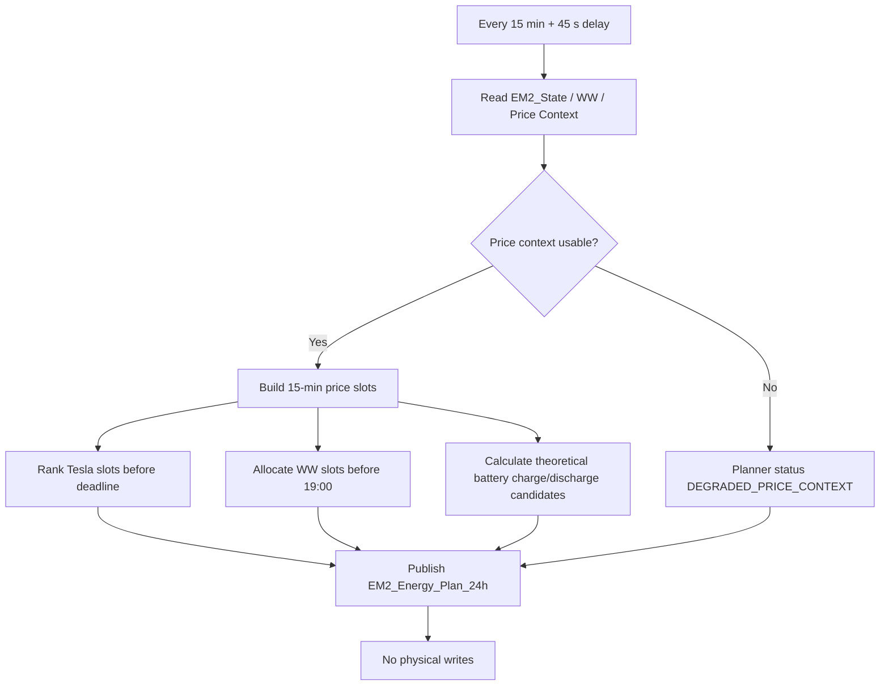
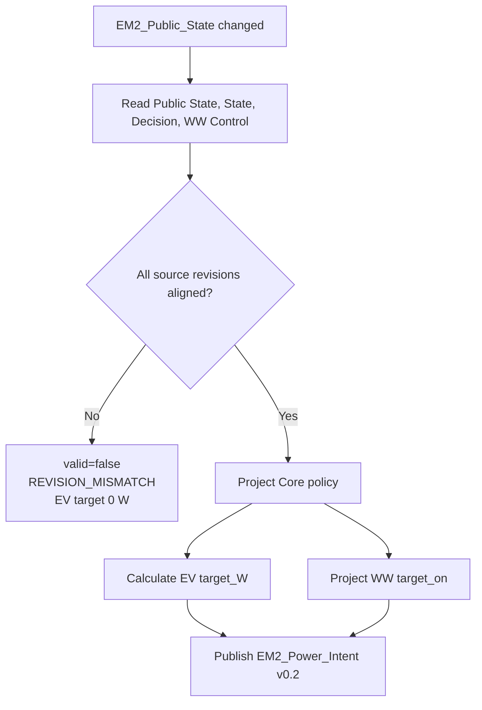
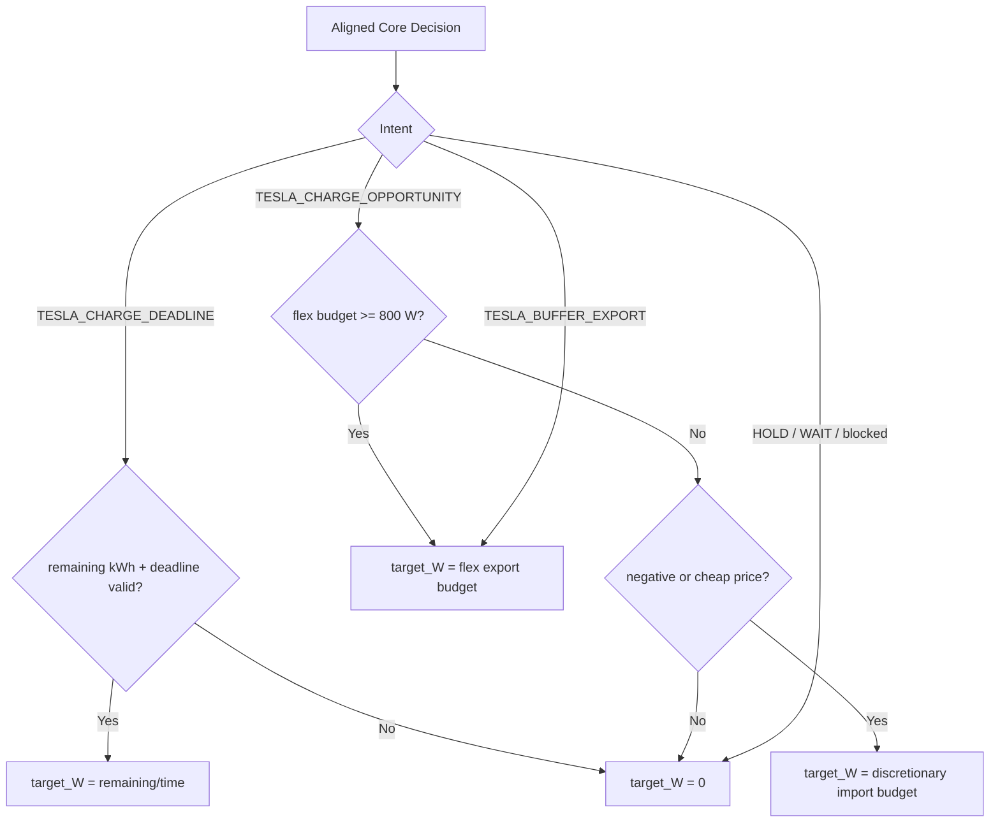
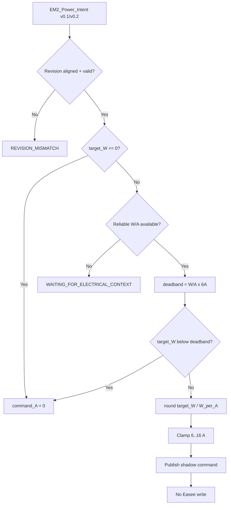
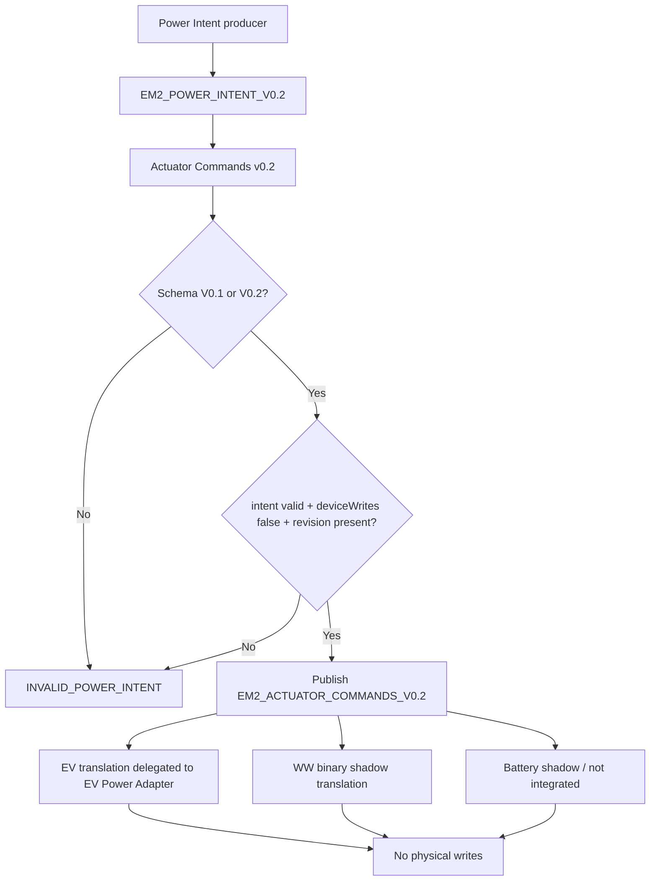
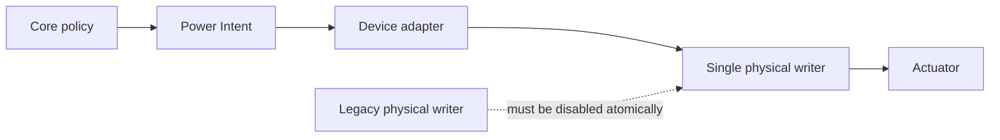

# Planner and Power Intent Flows

## 1. 24h Planner

```process-model
{
  "id": "planner-power-intent-flow-1",
  "kind": "mermaid-source",
  "declaration": "flowchart TD",
  "lines": [
    "    A[Every 15 min + 45 s delay] --> B[Read EM2_State / WW / Price Context]",
    "    B --> C{Price context usable?}",
    "    C -->|No| D[Planner status DEGRADED_PRICE_CONTEXT]",
    "    C -->|Yes| E[Build 15-min price slots]",
    "    E --> F[Rank Tesla slots before deadline]",
    "    E --> G[Allocate WW slots before 19:00]",
    "    E --> H[Calculate theoretical battery charge/discharge candidates]",
    "    F --> I[Publish EM2_Energy_Plan_24h]",
    "    G --> I",
    "    H --> I",
    "    D --> I",
    "    I --> J[No physical writes]"
  ]
}
```

<!-- GENERATED_MERMAID:planner-power-intent-flow-1 START -->

<!-- GENERATED_MERMAID:planner-power-intent-flow-1 END -->

## 2. Power Intent revision guard

```process-model
{
  "id": "planner-power-intent-flow-2",
  "kind": "mermaid-source",
  "declaration": "flowchart TD",
  "lines": [
    "    A[EM2_Public_State changed] --> B[Read Public State, State, Decision, WW Control]",
    "    B --> C{All source revisions aligned?}",
    "    C -->|No| D[valid=false\\nREVISION_MISMATCH\\nEV target 0 W]",
    "    C -->|Yes| E[Project Core policy]",
    "    E --> F[Calculate EV target_W]",
    "    E --> G[Project WW target_on]",
    "    F --> H[Publish EM2_Power_Intent v0.2]",
    "    G --> H"
  ]
}
```

<!-- GENERATED_MERMAID:planner-power-intent-flow-2 START -->

<!-- GENERATED_MERMAID:planner-power-intent-flow-2 END -->

## 3. EV target projection

```process-model
{
  "id": "planner-power-intent-flow-3",
  "kind": "mermaid-source",
  "declaration": "flowchart TD",
  "lines": [
    "    A[Aligned Core Decision] --> B{Intent}",
    "    B -->|TESLA_CHARGE_DEADLINE| C{remaining kWh + deadline valid?}",
    "    C -->|Yes| D[target_W = remaining/time]",
    "    C -->|No| E[target_W = 0]",
    "    B -->|TESLA_CHARGE_OPPORTUNITY| F{flex budget >= 800 W?}",
    "    F -->|Yes| G[target_W = flex export budget]",
    "    F -->|No| H{negative or cheap price?}",
    "    H -->|Yes| I[target_W = discretionary import budget]",
    "    H -->|No| E",
    "    B -->|TESLA_BUFFER_EXPORT| G",
    "    B -->|HOLD / WAIT / blocked| E"
  ]
}
```

<!-- GENERATED_MERMAID:planner-power-intent-flow-3 START -->

<!-- GENERATED_MERMAID:planner-power-intent-flow-3 END -->

## 4. EV Power Adapter

```process-model
{
  "id": "planner-power-intent-flow-4",
  "kind": "mermaid-source",
  "declaration": "flowchart TD",
  "lines": [
    "    A[EM2_Power_Intent v0.1/v0.2] --> B{Revision aligned + valid?}",
    "    B -->|No| C[REVISION_MISMATCH]",
    "    B -->|Yes| D{target_W <= 0?}",
    "    D -->|Yes| E[command_A = 0]",
    "    D -->|No| F{Reliable W/A available?}",
    "    F -->|No| G[WAITING_FOR_ELECTRICAL_CONTEXT]",
    "    F -->|Yes| H[deadband = W/A x 6A]",
    "    H --> I{target_W below deadband?}",
    "    I -->|Yes| E",
    "    I -->|No| J[round target_W / W_per_A]",
    "    J --> K[Clamp 6..16 A]",
    "    K --> L[Publish shadow command]",
    "    L --> M[No Easee write]"
  ]
}
```

<!-- GENERATED_MERMAID:planner-power-intent-flow-4 START -->

<!-- GENERATED_MERMAID:planner-power-intent-flow-4 END -->

## 5. Generieke Actuator Commands v0.2

```process-model
{
  "id": "planner-power-intent-flow-5",
  "kind": "mermaid-source",
  "declaration": "flowchart TD",
  "lines": [
    "    A[Power Intent producer] --> B[EM2_POWER_INTENT_V0.2]",
    "    B --> C[Actuator Commands v0.2]",
    "    C --> D{Schema V0.1 or V0.2?}",
    "    D -->|No| E[INVALID_POWER_INTENT]",
    "    D -->|Yes| F{intent valid + deviceWrites false + revision present?}",
    "    F -->|No| E",
    "    F -->|Yes| G[Publish EM2_ACTUATOR_COMMANDS_V0.2]",
    "    G --> H[EV translation delegated to EV Power Adapter]",
    "    G --> I[WW binary shadow translation]",
    "    G --> J[Battery shadow / not integrated]",
    "    H --> K[No physical writes]",
    "    I --> K",
    "    J --> K"
  ]
}
```

<!-- GENERATED_MERMAID:planner-power-intent-flow-5 START -->

<!-- GENERATED_MERMAID:planner-power-intent-flow-5 END -->

Dedupe gebruikt `sourceRevision + inputSchema`. Daarmee is de eerdere V0.1-only schema-mismatch opgelost zonder de SHADOW-boundary te wijzigen.

## 6. Beoogde cut-overgrens

```process-model
{
  "id": "planner-power-intent-flow-6",
  "kind": "mermaid-source",
  "declaration": "flowchart LR",
  "lines": [
    "    A[Core policy] --> B[Power Intent]",
    "    B --> C[Device adapter]",
    "    C --> D[Single physical writer]",
    "    D --> E[Actuator]",
    "",
    "    X[Legacy physical writer] -. must be disabled atomically .-> D"
  ]
}
```

<!-- GENERATED_MERMAID:planner-power-intent-flow-6 START -->

<!-- GENERATED_MERMAID:planner-power-intent-flow-6 END -->

De fysieke writer blijft buiten deze SHADOW-module totdat een expliciete cut-over is gevalideerd.
