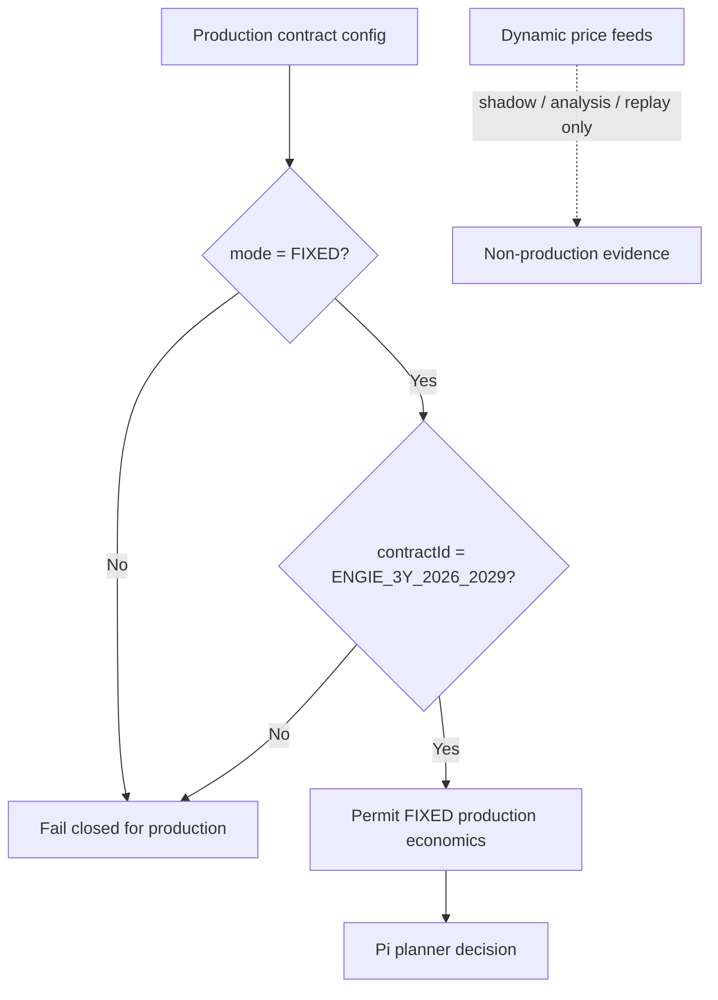
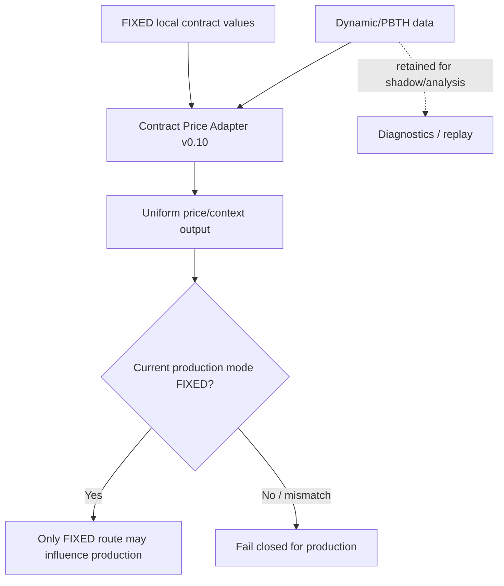
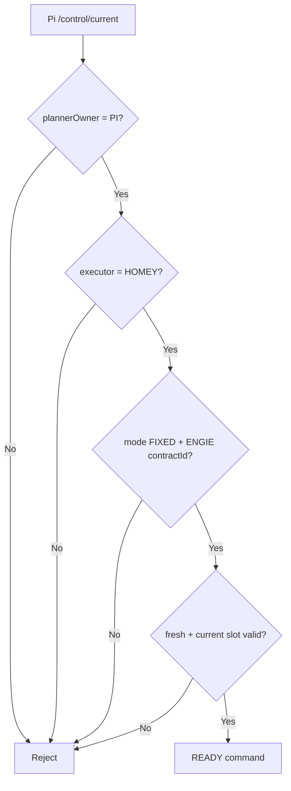

# Contract Price Adapter flows

## Production contract governance

```process-model
{
  "id": "price-adapter-production-policy",
  "kind": "mermaid-source",
  "declaration": "flowchart TD",
  "lines": [
    "  A[Production contract config] --> B{mode = FIXED?}",
    "  B -->|No| X[Fail closed for production]",
    "  B -->|Yes| C{contractId = ENGIE_3Y_2026_2029?}",
    "  C -->|No| X",
    "  C -->|Yes| D[Permit FIXED production economics]",
    "  D --> E[Pi planner decision]",
    "  F[Dynamic price feeds] -. shadow / analysis / replay only .-> G[Non-production evidence]"
  ]
}
```

<!-- GENERATED_MERMAID:price-adapter-production-policy START -->

<!-- GENERATED_MERMAID:price-adapter-production-policy END -->

Automatische fallback of automatische mode-switching naar DYNAMIC is niet toegestaan.

## Homey price context

```process-model
{
  "id": "price-adapter-homey-context",
  "kind": "mermaid-source",
  "declaration": "flowchart TD",
  "lines": [
    "  A[Contract Price Adapter v0.10] --> B[Uniform price/context output]",
    "  C[FIXED local contract values] --> A",
    "  D[Dynamic/PBTH data] --> A",
    "  B --> E{Current production mode FIXED?}",
    "  E -->|Yes| F[Only FIXED route may influence production]",
    "  E -->|No / mismatch| G[Fail closed for production]",
    "  D -. retained for shadow/analysis .-> H[Diagnostics / replay]"
  ]
}
```

<!-- GENERATED_MERMAID:price-adapter-homey-context START -->

<!-- GENERATED_MERMAID:price-adapter-homey-context END -->

## Pi command contract guard

```process-model
{
  "id": "price-adapter-pi-command-guard",
  "kind": "mermaid-source",
  "declaration": "flowchart TD",
  "lines": [
    "  A[Pi /control/current] --> B{plannerOwner = PI?}",
    "  B -->|No| X[Reject]",
    "  B -->|Yes| C{executor = HOMEY?}",
    "  C -->|No| X",
    "  C -->|Yes| D{mode FIXED + ENGIE contractId?}",
    "  D -->|No| X",
    "  D -->|Yes| E{fresh + current slot valid?}",
    "  E -->|No| X",
    "  E -->|Yes| F[READY command]"
  ]
}
```

<!-- GENERATED_MERMAID:price-adapter-pi-command-guard START -->

<!-- GENERATED_MERMAID:price-adapter-pi-command-guard END -->

De Homey PI Bridge v1.2.6 herhaalt de FIXED/ENGIE-validatie vóór projectie naar `EM2_POWER_INTENT_V0.2`.

## Tesla en WW impact

Onder het huidige FIXED-contract:

- Tesla opportunity komt uit residual PV, niet uit goedkope/negatieve dynamische prijs;
- Tesla deadline/MUST mag netenergie gebruiken wanneer noodzakelijk, maar dit is deadline-gedreven en niet prijsarbitrage;
- WW planning geeft comfort/deadline en bruikbare PV voorrang;
- dynamische prijsdata kan alleen shadow/analyse/replay beïnvloeden.

## Boundary

Prijscontext en contract-aware candidate logic schrijven geen physical devices. Het bestaan van DYNAMIC-support in adaptercode is geen toestemming om DYNAMIC als productiepolicy te gebruiken.
