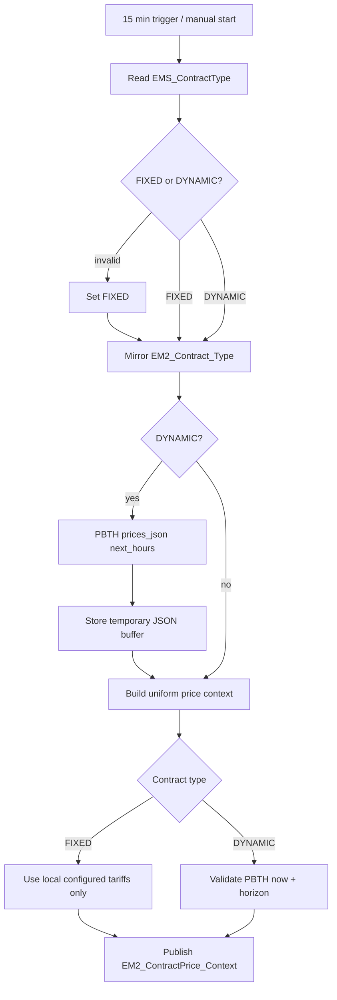
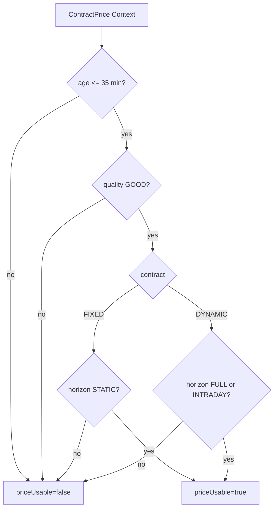
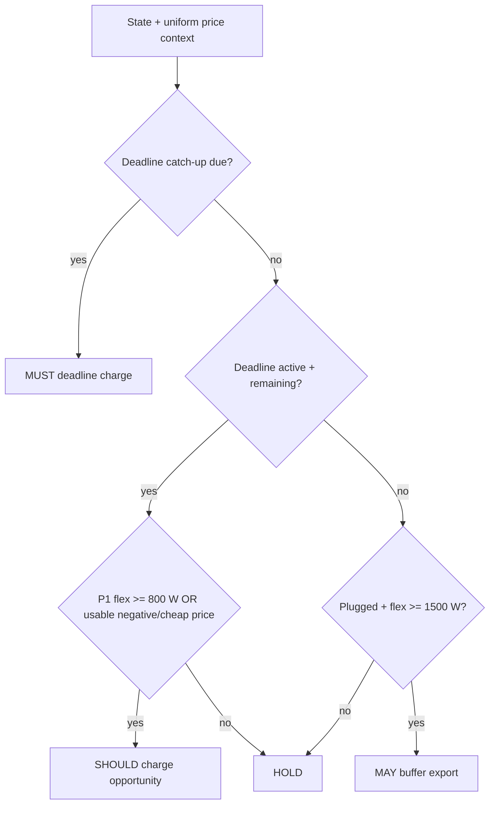
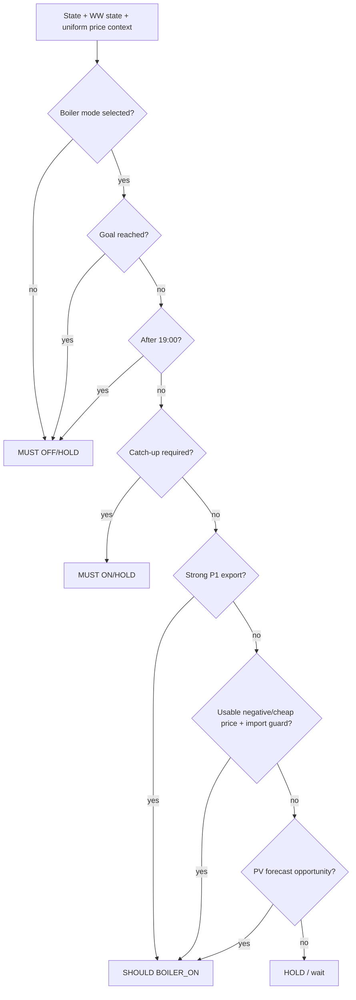
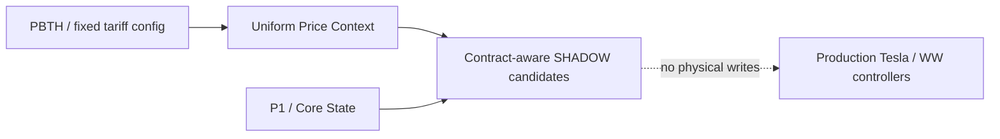

# Contract Price Adapter flows

## Adapter

```mermaid
flowchart TD
  A[15 min trigger / manual start] --> B[Read EMS_ContractType]
  B --> C{FIXED or DYNAMIC?}
  C -->|invalid| D[Set FIXED]
  D --> E[Mirror EM2_Contract_Type]
  C -->|FIXED| E
  C -->|DYNAMIC| E
  E --> F{DYNAMIC?}
  F -->|yes| G[PBTH prices_json next_hours]
  G --> H[Store temporary JSON buffer]
  H --> I[Build uniform price context]
  F -->|no| I
  I --> J{Contract type}
  J -->|FIXED| K[Use local configured tariffs only]
  J -->|DYNAMIC| L[Validate PBTH now + horizon]
  K --> M[Publish EM2_ContractPrice_Context]
  L --> M
```

## Price usability

```mermaid
flowchart TD
  A[ContractPrice Context] --> B{age <= 35 min?}
  B -->|no| X[priceUsable=false]
  B -->|yes| C{quality GOOD?}
  C -->|no| X
  C -->|yes| D{contract}
  D -->|FIXED| E{horizon STATIC?}
  D -->|DYNAMIC| F{horizon FULL or INTRADAY?}
  E -->|yes| G[priceUsable=true]
  E -->|no| X
  F -->|yes| G
  F -->|no| X
```

## Tesla candidate

```mermaid
flowchart TD
  A[State + uniform price context] --> B{Deadline catch-up due?}
  B -->|yes| C[MUST deadline charge]
  B -->|no| D{Deadline active + remaining?}
  D -->|yes| E{P1 flex >= 800 W OR usable negative/cheap price}
  E -->|yes| F[SHOULD charge opportunity]
  E -->|no| G[HOLD]
  D -->|no| H{Plugged + flex >= 1500 W?}
  H -->|yes| I[MAY buffer export]
  H -->|no| G
```

## Warm-water candidate

```mermaid
flowchart TD
  A[State + WW state + uniform price context] --> B{Boiler mode selected?}
  B -->|no| C[MUST OFF/HOLD]
  B -->|yes| D{Goal reached?}
  D -->|yes| C
  D -->|no| E{After 19:00?}
  E -->|yes| C
  E -->|no| F{Catch-up required?}
  F -->|yes| G[MUST ON/HOLD]
  F -->|no| H{Strong P1 export?}
  H -->|yes| I[SHOULD BOILER_ON]
  H -->|no| J{Usable negative/cheap price + import guard?}
  J -->|yes| I
  J -->|no| K{PV forecast opportunity?}
  K -->|yes| I
  K -->|no| L[HOLD / wait]
```

## Boundary

```mermaid
flowchart LR
  A[PBTH / fixed tariff config] --> B[Uniform Price Context]
  B --> C[Contract-aware SHADOW candidates]
  D[P1 / Core State] --> C
  C -. no physical writes .-> E[Production Tesla / WW controllers]
```
