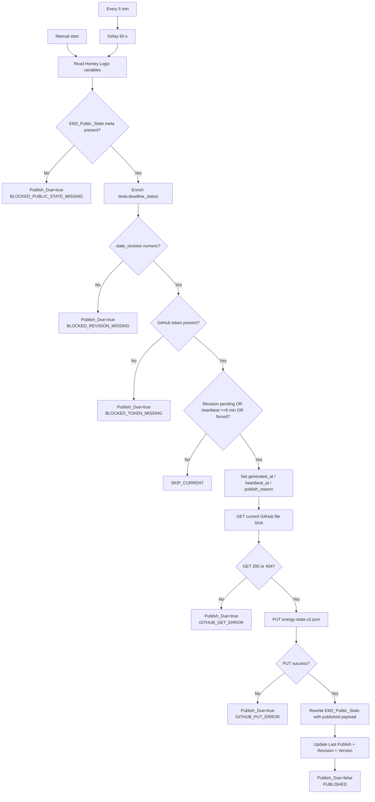
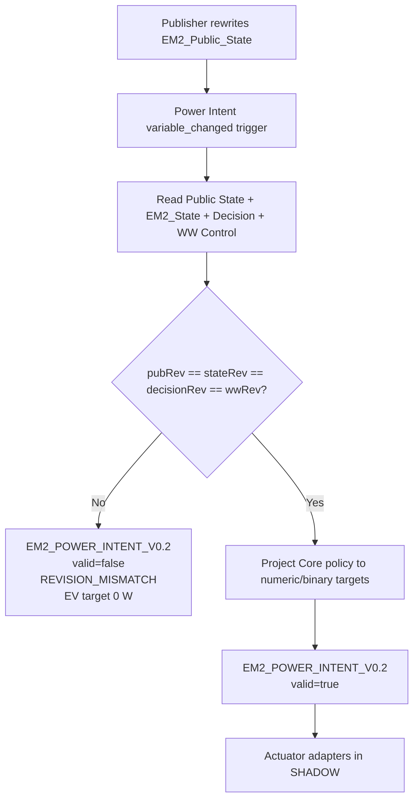
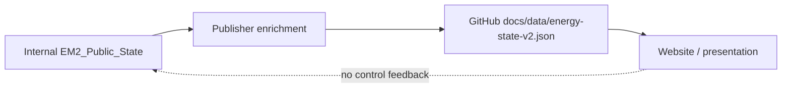
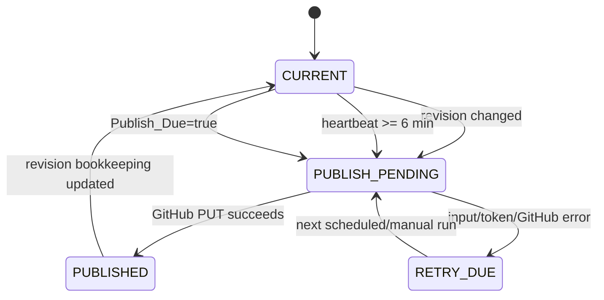

# Publisher and Public State Flow

## 1. Publisher runtime

## 2. Downstream revision boundary

## 3. Public website boundary

## 4. Recovery behavior

## 5. Gevalideerde bijzonderheid

De live Publisher noemt zichzelf in status en `EM2_Last_Publisher_Version` versie `V1.0.4`, maar vult in de gepubliceerde payload momenteel `meta.publisher_version=EM2_PUBLISHER_V1.0.3`. Het diagram volgt het daadwerkelijke gedrag; de afwijking staat als bekende beperking in de componentdocumentatie.
