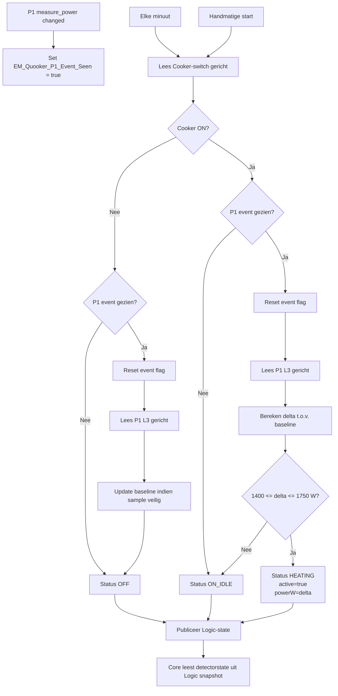
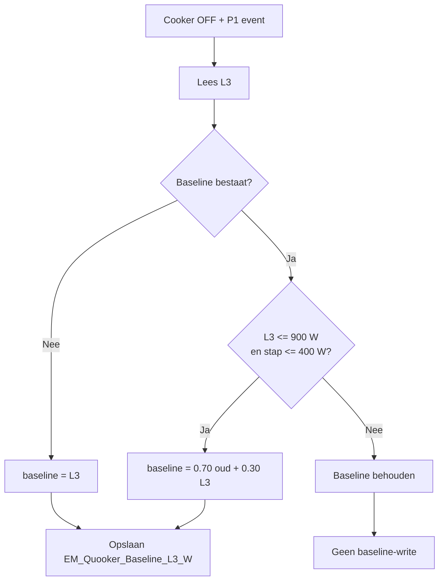
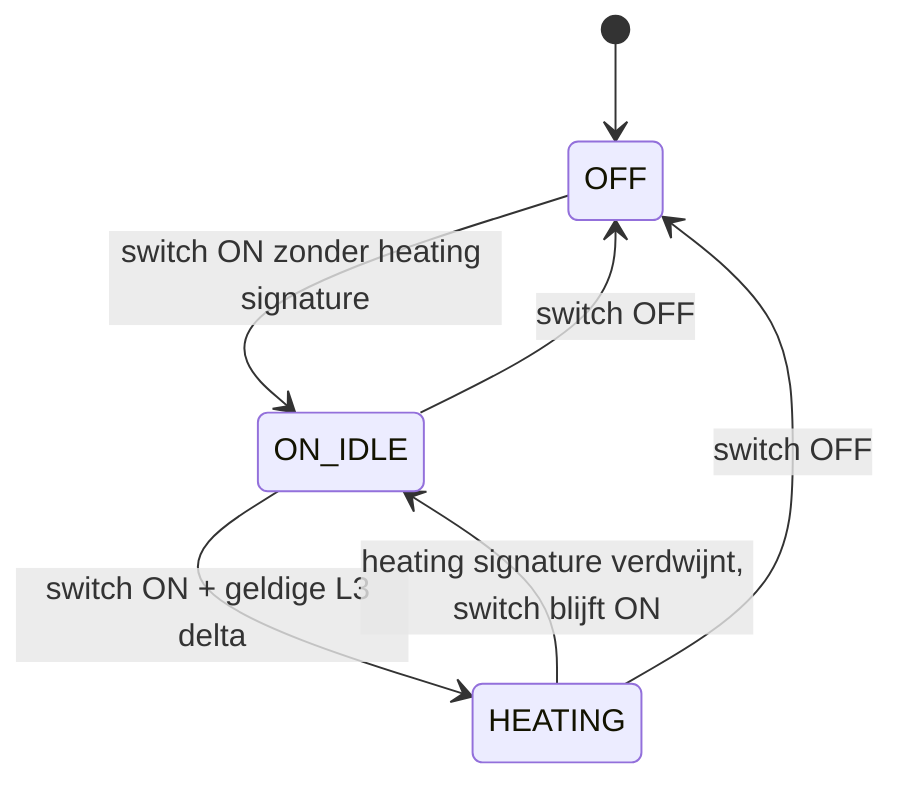
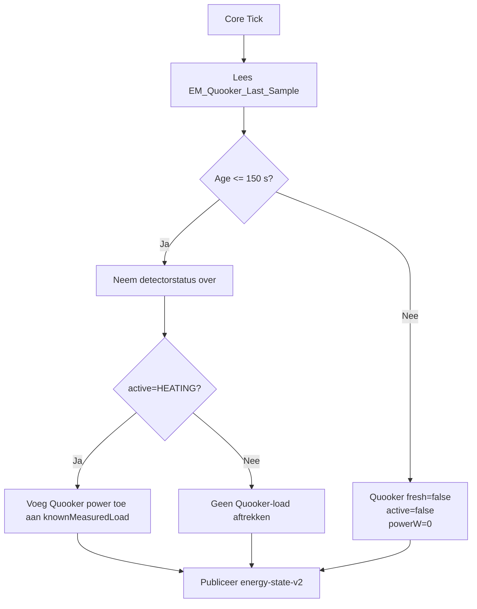

# Quooker Detector Flow

Deze procesflows zijn afgeleid van de live Homey-implementatie en tonen de huidige runtime-logica.

## 1. Event-assisted architectuur

```process-model
{
  "id": "quooker-flow-1",
  "kind": "mermaid-source",
  "declaration": "flowchart TD",
  "lines": [
    "    A[P1 measure_power changed] --> B[Set EM_Quooker_P1_Event_Seen = true]",
    "    C[Elke minuut] --> D[Lees Cooker-switch gericht]",
    "    E[Handmatige start] --> D",
    "    D --> F{Cooker ON?}",
    "    F -->|Nee| G{P1 event gezien?}",
    "    F -->|Ja| H{P1 event gezien?}",
    "    G -->|Nee| I[Status OFF]",
    "    G -->|Ja| J[Reset event flag]",
    "    J --> K[Lees P1 L3 gericht]",
    "    K --> L[Update baseline indien sample veilig]",
    "    L --> I",
    "    H -->|Nee| M[Status ON_IDLE]",
    "    H -->|Ja| N[Reset event flag]",
    "    N --> O[Lees P1 L3 gericht]",
    "    O --> P[Bereken delta t.o.v. baseline]",
    "    P --> Q{1400 <= delta <= 1750 W?}",
    "    Q -->|Ja| R[Status HEATING\\nactive=true\\npowerW=delta]",
    "    Q -->|Nee| M",
    "    I --> S[Publiceer Logic-state]",
    "    M --> S",
    "    R --> S",
    "    S --> T[Core leest detectorstate uit Logic snapshot]"
  ]
}
```

<!-- GENERATED_MERMAID:quooker-flow-1 START -->

<!-- GENERATED_MERMAID:quooker-flow-1 END -->

## 2. Baseline-update

```process-model
{
  "id": "quooker-flow-2",
  "kind": "mermaid-source",
  "declaration": "flowchart TD",
  "lines": [
    "    A[Cooker OFF + P1 event] --> B[Lees L3]",
    "    B --> C{Baseline bestaat?}",
    "    C -->|Nee| D[baseline = L3]",
    "    C -->|Ja| E{L3 <= 900 W\\nen stap <= 400 W?}",
    "    E -->|Nee| F[Baseline behouden]",
    "    E -->|Ja| G[baseline = 0.70 oud + 0.30 L3]",
    "    D --> H[Opslaan EM_Quooker_Baseline_L3_W]",
    "    G --> H",
    "    F --> I[Geen baseline-write]"
  ]
}
```

<!-- GENERATED_MERMAID:quooker-flow-2 START -->

<!-- GENERATED_MERMAID:quooker-flow-2 END -->

## 3. Statusmodel

```process-model
{
  "id": "quooker-flow-3",
  "kind": "mermaid-source",
  "declaration": "stateDiagram-v2",
  "lines": [
    "    [*] --> OFF",
    "    OFF --> ON_IDLE: switch ON zonder heating signature",
    "    ON_IDLE --> HEATING: switch ON + geldige L3 delta",
    "    HEATING --> ON_IDLE: heating signature verdwijnt, switch blijft ON",
    "    HEATING --> OFF: switch OFF",
    "    ON_IDLE --> OFF: switch OFF"
  ]
}
```

<!-- GENERATED_MERMAID:quooker-flow-3 START -->

<!-- GENERATED_MERMAID:quooker-flow-3 END -->

## 4. Core freshness

```process-model
{
  "id": "quooker-flow-4",
  "kind": "mermaid-source",
  "declaration": "flowchart TD",
  "lines": [
    "    A[Core Tick] --> B[Lees EM_Quooker_Last_Sample]",
    "    B --> C{Age <= 150 s?}",
    "    C -->|Nee| D[Quooker fresh=false\\nactive=false\\npowerW=0]",
    "    C -->|Ja| E[Neem detectorstatus over]",
    "    E --> F{active=HEATING?}",
    "    F -->|Ja| G[Voeg Quooker power toe aan knownMeasuredLoad]",
    "    F -->|Nee| H[Geen Quooker-load aftrekken]",
    "    G --> I[Publiceer energy-state-v2]",
    "    H --> I",
    "    D --> I"
  ]
}
```

<!-- GENERATED_MERMAID:quooker-flow-4 START -->

<!-- GENERATED_MERMAID:quooker-flow-4 END -->

## 5. Architectuurinvarianten

De live implementatie moet aan alle onderstaande voorwaarden blijven voldoen:

```text
Cooker switch authoritative for ON/OFF
P1/L3 only heating assist
no full getDevices snapshot
P1 targeted read only after heartbeat
no physical Quooker writes
Core rejects stale detector activity
baseline learning only while switch OFF
```
