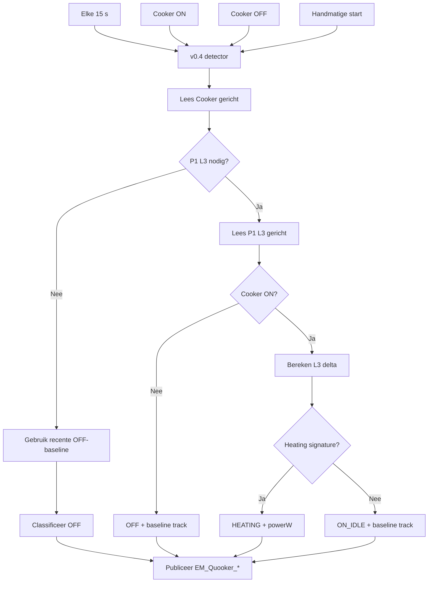
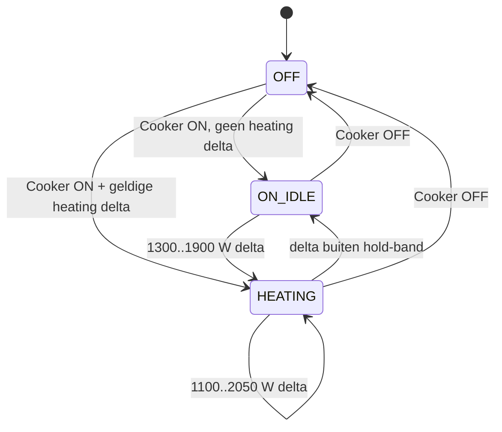

# Quooker Detector Flow

## 1. Runtime

De live detector heeft vier entry-paden naar één HomeyScript:

- handmatige start;
- elke 15 seconden;
- Cooker ON;
- Cooker OFF.

De flow is observe-only en schrijft nooit een device-capability.


```mermaid
flowchart TD
    A[Elke 15 s] --> E[v0.4 detector]
    B[Cooker ON] --> E
    C[Cooker OFF] --> E
    D[Handmatige start] --> E
    E --> F[Lees Cooker gericht]
    F --> G{P1 L3 nodig?}
    G -->|Nee| H[Gebruik recente OFF-baseline]
    G -->|Ja| I[Lees P1 L3 gericht]
    H --> J[Classificeer OFF]
    I --> K{Cooker ON?}
    K -->|Nee| L[OFF + baseline track]
    K -->|Ja| M[Bereken L3 delta]
    M --> N{Heating signature?}
    N -->|Ja| O[HEATING + powerW]
    N -->|Nee| P[ON_IDLE + baseline track]
    J --> Q[Publiceer EM_Quooker_*]
    L --> Q
    O --> Q
    P --> Q
```

## 2. Sampling

P1 wordt niet meer via een aparte heartbeat-flow aangestuurd.

```text
Cooker ON                    -> P1 iedere detectorrun
Cooker switchtransitie       -> P1 direct
baseline ontbreekt           -> P1 direct
Cooker OFF baseline <55 s    -> geen P1-read
Cooker OFF baseline >=55 s   -> P1 baseline refresh
```

Hierdoor is de normale ON-detectielatency maximaal ongeveer 15 seconden.

## 3. Statusmodel


```mermaid
stateDiagram-v2
    [*] --> OFF
    OFF --> ON_IDLE: Cooker ON, geen heating delta
    OFF --> HEATING: Cooker ON + geldige heating delta
    ON_IDLE --> HEATING: 1300..1900 W delta
    HEATING --> HEATING: 1100..2050 W delta
    HEATING --> ON_IDLE: delta buiten hold-band
    ON_IDLE --> OFF: Cooker OFF
    HEATING --> OFF: Cooker OFF
```

De switch blijft autoritatief: bij Cooker OFF kan de detector nooit HEATING publiceren.

## 4. Baseline

De baseline is de actuele niet-Quooker L3-achtergrond.

- OFF: periodiek actualiseren;
- OFF→ON: laatste OFF-baseline behouden;
- ON_IDLE: actuele L3 wordt de nieuwe baseline;
- HEATING: baseline bevriezen;
- HEATING→ON_IDLE: baseline resetten naar actuele L3.

Daarmee kan de detector PV-rampen volgen zonder de circa 1,6 kW Quooker-puls in zijn eigen baseline op te nemen.

## 5. Publicatie naar Core

De detector onderhoudt het bestaande contract:

```text
EM_Quooker_Switch_On
EM_Quooker_Active
EM_Quooker_Power_W
EM_Quooker_Status
EM_Quooker_Last_Sample
EM_Quooker_Baseline_L3_W
EM_Quooker_Last_Transition
EM_Quooker_Transition_History
EM_Quooker_Last_Heating_At
EM_Quooker_Last_Heating_Power_W
EM_Quooker_Diagnostic
```

Core v0.11p accepteert deze detectorstate alleen wanneer `EM_Quooker_Last_Sample` maximaal 150 seconden oud is.

## 6. 2026-10-03 recovery evidence

Voor herstel was de detectorflow niet meer aanwezig in Homey. Adapter en LIVE Actuator werkten wel, waardoor de Cooker fysiek aan kon gaan maar detectorvariabelen stale bleven.

De gemeten P1 L3 testcase:

```text
10:11:05 lokaal   -1290 W
10:11:10 lokaal    +346 W
delta             +1636 W
```

De pure v0.4 classifier reproduceert dit als `HEATING / 1636 W`.

Na livegang van flow `e291cf14-0b92-4cef-ae8b-a699692b6c9a` werd de stale baseline van circa `0,1 W` meteen vervangen door de actuele L3-achtergrond rond `-2383 W`. De Cooker stond toen ON maar verwarmde niet, zodat `EM_Quooker_Power_W=0` correct bleef.

## 7. Invarianten

```text
Cooker switch authoritative for OFF/ON
P1 L3 only classifies heating
no Homey.devices.getDevices()
no physical writes
15 s ON sampling
sparse OFF P1 sampling
baseline frozen during HEATING
Core rejects stale detector state
```
