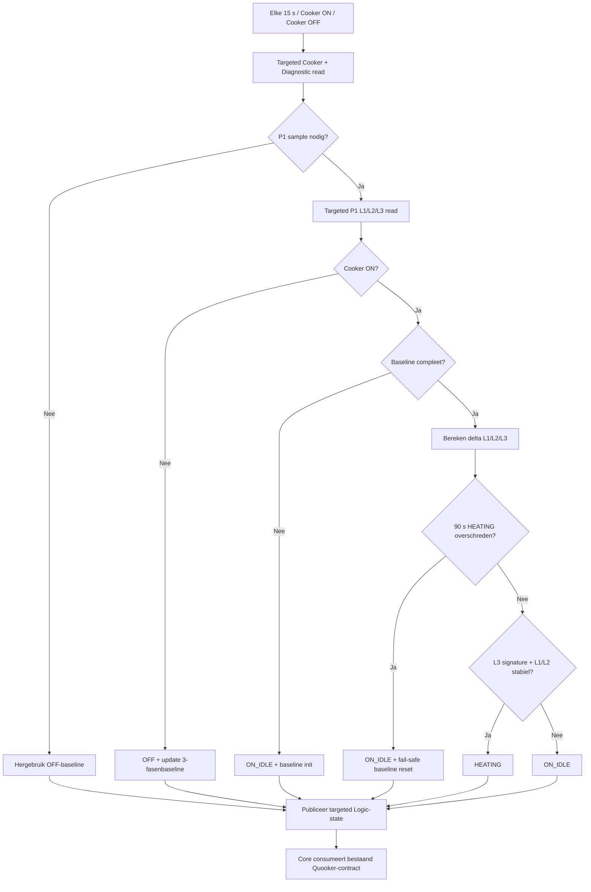

# Quooker Detector Flow

## 1. Actuele runtimeflow

```process-model
{
  "id": "quooker-flow-1",
  "kind": "mermaid-source",
  "declaration": "flowchart TD",
  "lines": [
    "A[Elke 15 s / Cooker ON / Cooker OFF] --> B[Targeted Cooker + Diagnostic read]",
    "B --> C{P1 sample nodig?}",
    "C -->|Ja| D[Targeted P1 L1/L2/L3 read]",
    "C -->|Nee| E[Hergebruik OFF-baseline]",
    "D --> F{Cooker ON?}",
    "F -->|Nee| G[OFF + update 3-fasenbaseline]",
    "F -->|Ja| H{Baseline compleet?}",
    "H -->|Nee| I[ON_IDLE + baseline init]",
    "H -->|Ja| J[Bereken delta L1/L2/L3]",
    "J --> K{90 s HEATING overschreden?}",
    "K -->|Ja| L[ON_IDLE + fail-safe baseline reset]",
    "K -->|Nee| M{L3 signature + L1/L2 stabiel?}",
    "M -->|Ja| N[HEATING]",
    "M -->|Nee| O[ON_IDLE]",
    "E --> P[Publiceer targeted Logic-state]",
    "G --> P",
    "I --> P",
    "L --> P",
    "N --> P",
    "O --> P",
    "P --> Q[Core consumeert bestaand Quooker-contract]"
  ]
}
```

<!-- GENERATED_MERMAID:quooker-flow-1 START -->

```mermaid
flowchart TD
    A[Elke 15 s / Cooker ON / Cooker OFF] --> B[Targeted Cooker + Diagnostic read]
    B --> C{P1 sample nodig?}
    C -->|Ja| D[Targeted P1 L1/L2/L3 read]
    C -->|Nee| E[Hergebruik OFF-baseline]
    D --> F{Cooker ON?}
    F -->|Nee| G[OFF + update 3-fasenbaseline]
    F -->|Ja| H{Baseline compleet?}
    H -->|Nee| I[ON_IDLE + baseline init]
    H -->|Ja| J[Bereken delta L1/L2/L3]
    J --> K{90 s HEATING overschreden?}
    K -->|Ja| L[ON_IDLE + fail-safe baseline reset]
    K -->|Nee| M{L3 signature + L1/L2 stabiel?}
    M -->|Ja| N[HEATING]
    M -->|Nee| O[ON_IDLE]
    E --> P[Publiceer targeted Logic-state]
    G --> P
    I --> P
    L --> P
    N --> P
    O --> P
    P --> Q[Core consumeert bestaand Quooker-contract]
```
<!-- GENERATED_MERMAID:quooker-flow-1 END -->

## 2. Detectieregels

Start: L3 1300..1900 W en absolute L1/L2-delta maximaal 350 W.
Hold: L3 1100..2050 W en absolute L1/L2-delta maximaal 500 W.
Maximum continuous HEATING: 90000 ms.

## 3. Runtime/load

De flow draait iedere 15 seconden en op Cooker ON/OFF. Hij gebruikt targeted reads/writes, geen `getVariables()`, geen `getDevices()` en geen fysieke device write.

## 4. Architectuurinvarianten

```text
Cooker switch authoritative for ON/OFF
isolated L3 signature required for HEATING
L1/L2 side-phase guard
90 s maximum HEATING latch
no broad Homey collection reads
no physical Quooker writes
v0.2 Quooker actuator remains sole physical writer
only one Quooker detector version enabled
```

## 5. Rollback

v0.4 (`e291cf14-0b92-4cef-ae8b-a699692b6c9a`) is disabled retained rollback.
