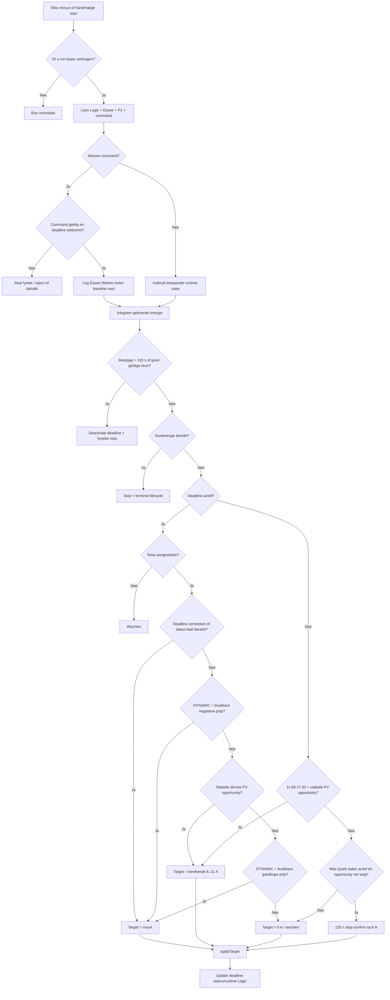
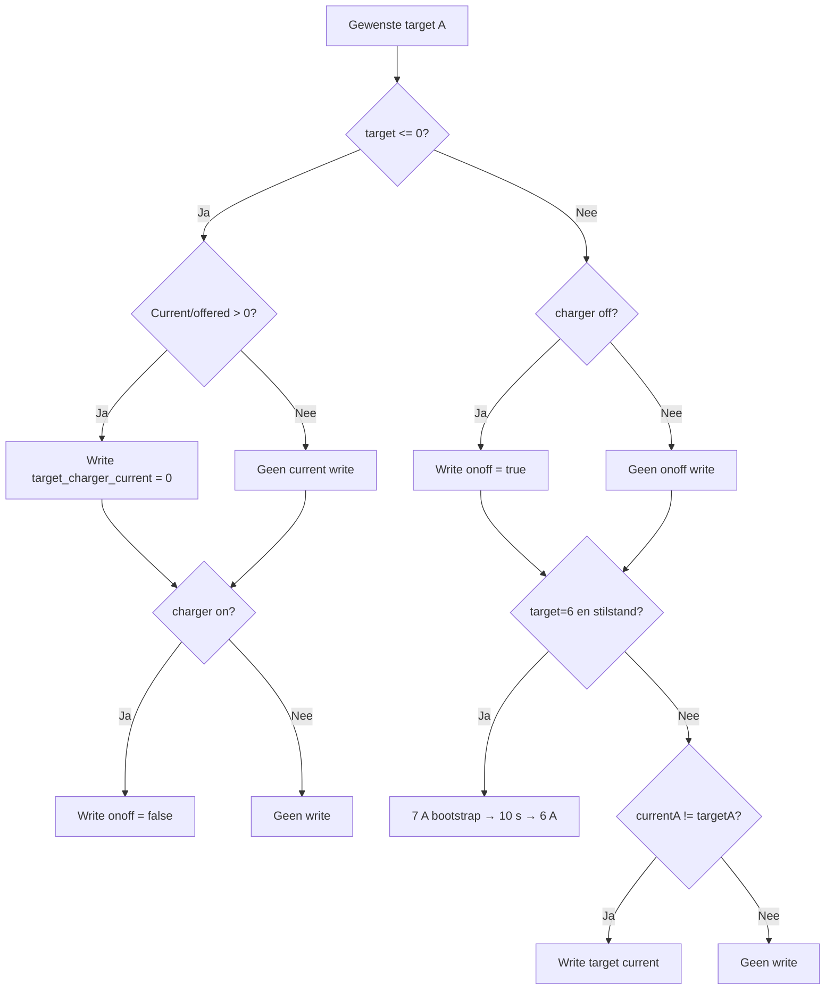
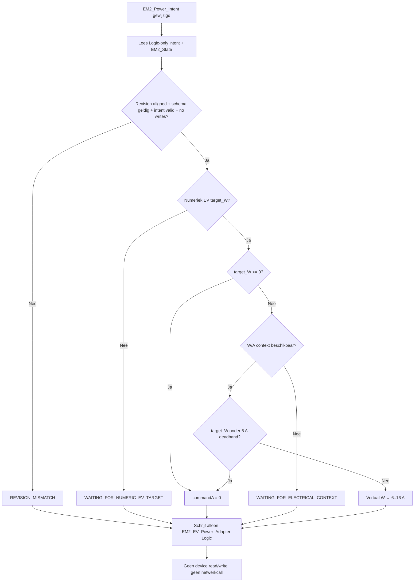

# Tesla procesflows

## Productiecontroller

```process-model
{
  "id": "tesla-flow-1",
  "kind": "mermaid-source",
  "declaration": "flowchart TD",
  "lines": [
    "    A[Elke minuut of handmatige start] --> B{55 s run lease verkregen?}",
    "    B -- Nee --> Z[Run overslaan]",
    "    B -- Ja --> C[Lees Logic + Easee + P1 + command]",
    "    C --> D{Nieuwe command?}",
    "    D -- Ja --> E{Command geldig en deadline toekomst?}",
    "    E -- Nee --> F[Stop fysiek / reject of failsafe]",
    "    E -- Ja --> G[Leg Easee lifetime meter baseline vast]",
    "    D -- Nee --> H[Gebruik bestaande runtime state]",
    "    G --> I[Integreer geleverde energie]",
    "    H --> I",
    "    I --> J{Meetgap > 120 s of geen geldige bron?}",
    "    J -- Ja --> K[Deactivate deadline + fysieke stop]",
    "    J -- Nee --> L{Doelenergie bereikt?}",
    "    L -- Ja --> M[Stop + terminal lifecycle]",
    "    L -- Nee --> N{Deadline actief?}",
    "    N -- Ja --> O{Tesla aangesloten?}",
    "    O -- Nee --> P[Wachten]",
    "    O -- Ja --> Q{Deadline verstreken of latest-start bereikt?}",
    "    Q -- Ja --> R[Target = maxA]",
    "    Q -- Nee --> S{DYNAMIC + bruikbare negatieve prijs?}",
    "    S -- Ja --> R",
    "    S -- Nee --> T{Stabiele directe PV opportunity?}",
    "    T -- Ja --> U[Target = berekende 6..11 A]",
    "    T -- Nee --> V{DYNAMIC + bruikbare goedkope prijs?}",
    "    V -- Ja --> R",
    "    V -- Nee --> W[Target = 0 A / wachten]",
    "    N -- Nee --> X{11:00-17:30 + stabiele PV opportunity?}",
    "    X -- Ja --> U",
    "    X -- Nee --> Y{Was fysiek laden actief en opportunity net weg?}",
    "    Y -- Ja --> AA[120 s stop-confirm op 6 A]",
    "    Y -- Nee --> W",
    "    R --> AB[applyTarget]",
    "    U --> AB",
    "    W --> AB",
    "    AA --> AB",
    "    AB --> AC[Update deadline status/runtime Logic]"
  ]
}
```

<!-- GENERATED_MERMAID:tesla-flow-1 START -->

<!-- GENERATED_MERMAID:tesla-flow-1 END -->

## Fysieke write-policy

```process-model
{
  "id": "tesla-flow-2",
  "kind": "mermaid-source",
  "declaration": "flowchart TD",
  "lines": [
    "    A[Gewenste target A] --> B{target <= 0?}",
    "    B -- Ja --> C{Current/offered > 0?}",
    "    C -- Ja --> D[Write target_charger_current = 0]",
    "    C -- Nee --> E[Geen current write]",
    "    D --> F{charger on?}",
    "    E --> F",
    "    F -- Ja --> G[Write onoff = false]",
    "    F -- Nee --> H[Geen write]",
    "    B -- Nee --> I{charger off?}",
    "    I -- Ja --> J[Write onoff = true]",
    "    I -- Nee --> K[Geen onoff write]",
    "    J --> L{target=6 en stilstand?}",
    "    K --> L",
    "    L -- Ja --> M[7 A bootstrap → 10 s → 6 A]",
    "    L -- Nee --> N{currentA != targetA?}",
    "    N -- Ja --> O[Write target current]",
    "    N -- Nee --> P[Geen write]"
  ]
}
```

<!-- GENERATED_MERMAID:tesla-flow-2 START -->

<!-- GENERATED_MERMAID:tesla-flow-2 END -->

## EV Power Adapter SHADOW

```process-model
{
  "id": "tesla-flow-3",
  "kind": "mermaid-source",
  "declaration": "flowchart TD",
  "lines": [
    "    A[EM2_Power_Intent gewijzigd] --> B[Lees Logic-only intent + EM2_State]",
    "    B --> C{Revision aligned + schema geldig + intent valid + no writes?}",
    "    C -- Nee --> D[REVISION_MISMATCH]",
    "    C -- Ja --> E{Numeriek EV target_W?}",
    "    E -- Nee --> F[WAITING_FOR_NUMERIC_EV_TARGET]",
    "    E -- Ja --> G{target_W <= 0?}",
    "    G -- Ja --> H[commandA = 0]",
    "    G -- Nee --> I{W/A context beschikbaar?}",
    "    I -- Nee --> J[WAITING_FOR_ELECTRICAL_CONTEXT]",
    "    I -- Ja --> K{target_W onder 6 A deadband?}",
    "    K -- Ja --> H",
    "    K -- Nee --> L[Vertaal W → 6..16 A]",
    "    D --> M[Schrijf alleen EM2_EV_Power_Adapter Logic]",
    "    F --> M",
    "    H --> M",
    "    J --> M",
    "    L --> M",
    "    M --> N[Geen device read/write, geen netwerkcall]"
  ]
}
```

<!-- GENERATED_MERMAID:tesla-flow-3 START -->

<!-- GENERATED_MERMAID:tesla-flow-3 END -->

## Architectuurregel

De eerste twee diagrammen beschrijven de actieve productiecontroller. Het derde diagram is uitsluitend SHADOW en mag niet als fysieke control-route worden geïnterpreteerd.
