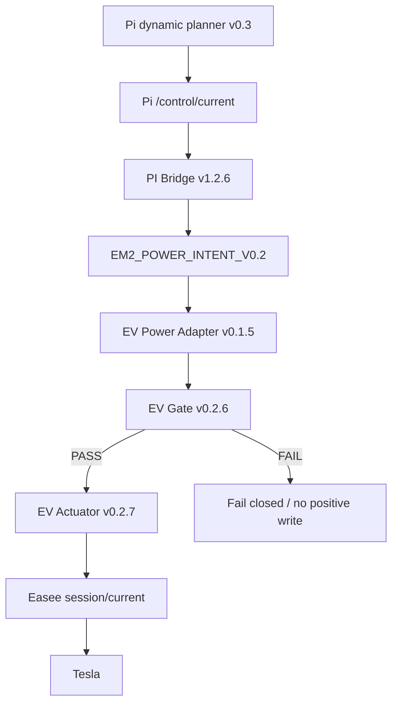
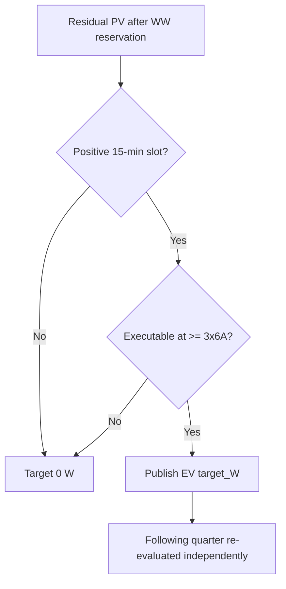
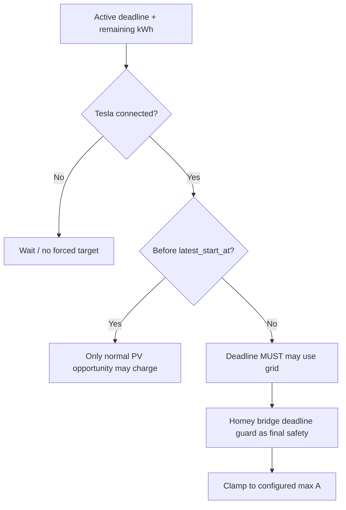
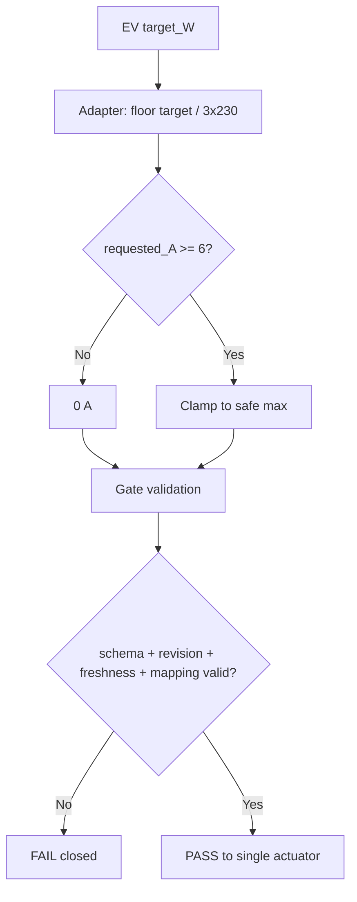
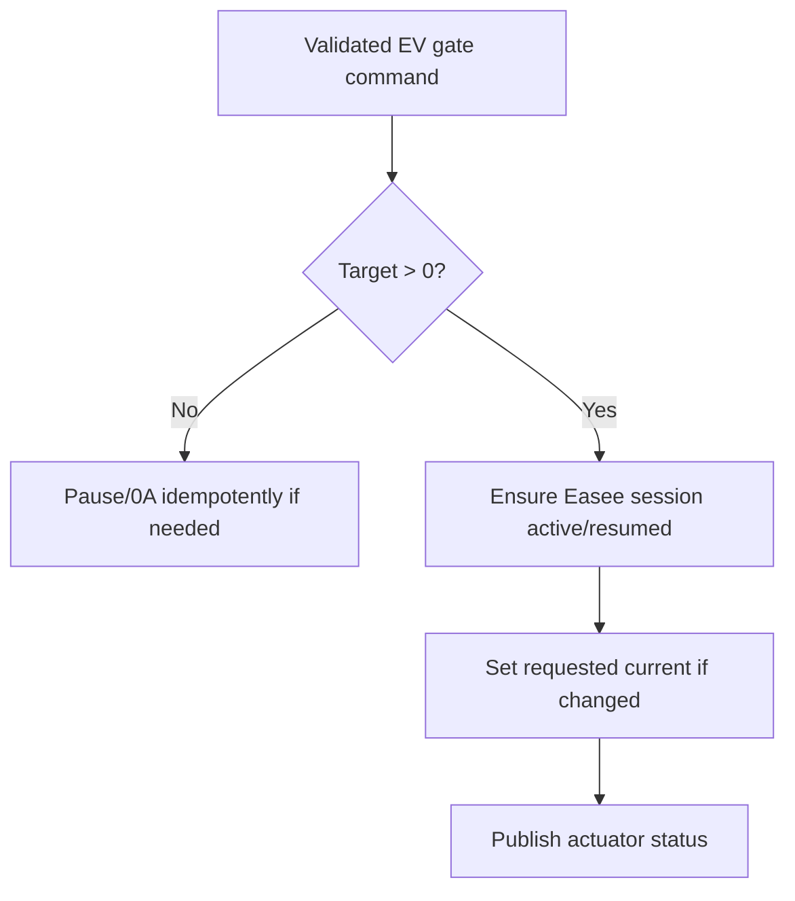

# Tesla procesflows

## Productieketen

```process-model
{
  "id": "tesla-flow-production",
  "kind": "mermaid-source",
  "declaration": "flowchart TD",
  "lines": [
    "    A[Pi dynamic planner v0.3] --> B[Pi /control/current]",
    "    B --> C[PI Bridge v1.2.6]",
    "    C --> D[EM2_POWER_INTENT_V0.2]",
    "    D --> E[EV Power Adapter v0.1.5]",
    "    E --> F[EV Gate v0.2.6]",
    "    F -->|PASS| G[EV Actuator v0.2.7]",
    "    F -->|FAIL| H[Fail closed / no positive write]",
    "    G --> I[Easee session/current]",
    "    I --> J[Tesla]"
  ]
}
```

<!-- GENERATED_MERMAID:tesla-flow-production START -->

<!-- GENERATED_MERMAID:tesla-flow-production END -->

## Opportunity policy

```process-model
{
  "id": "tesla-flow-opportunity",
  "kind": "mermaid-source",
  "declaration": "flowchart TD",
  "lines": [
    "    A[Residual PV after WW reservation] --> B{Positive 15-min slot?}",
    "    B -->|No| C[Target 0 W]",
    "    B -->|Yes| D{Executable at >= 3x6A?}",
    "    D -->|No| C",
    "    D -->|Yes| E[Publish EV target_W]",
    "    E --> F[Following quarter re-evaluated independently]"
  ]
}
```

<!-- GENERATED_MERMAID:tesla-flow-opportunity START -->

<!-- GENERATED_MERMAID:tesla-flow-opportunity END -->

START6/RUN6 is productiegedrag. Nominaal minimum uitvoerbaar vermogen is 4140 W bij 3×230 V. Goedkope of negatieve dynamische prijs is onder FIXED geen opportunity-trigger.

## Deadline policy

```process-model
{
  "id": "tesla-flow-deadline",
  "kind": "mermaid-source",
  "declaration": "flowchart TD",
  "lines": [
    "    A[Active deadline + remaining kWh] --> B{Tesla connected?}",
    "    B -->|No| C[Wait / no forced target]",
    "    B -->|Yes| D{Before latest_start_at?}",
    "    D -->|Yes| E[Only normal PV opportunity may charge]",
    "    D -->|No| F[Deadline MUST may use grid]",
    "    F --> G[Homey bridge deadline guard as final safety]",
    "    G --> H[Clamp to configured max A]"
  ]
}
```

<!-- GENERATED_MERMAID:tesla-flow-deadline START -->

<!-- GENERATED_MERMAID:tesla-flow-deadline END -->

## Adapter en gate

```process-model
{
  "id": "tesla-flow-adapter-gate",
  "kind": "mermaid-source",
  "declaration": "flowchart TD",
  "lines": [
    "    A[EV target_W] --> B[Adapter: floor target / 3x230]",
    "    B --> C{requested_A >= 6?}",
    "    C -->|No| D[0 A]",
    "    C -->|Yes| E[Clamp to safe max]",
    "    D --> F[Gate validation]",
    "    E --> F",
    "    F --> G{schema + revision + freshness + mapping valid?}",
    "    G -->|No| H[FAIL closed]",
    "    G -->|Yes| I[PASS to single actuator]"
  ]
}
```

<!-- GENERATED_MERMAID:tesla-flow-adapter-gate START -->

<!-- GENERATED_MERMAID:tesla-flow-adapter-gate END -->

Mappingcontract: `FLOOR_3P230_START6_RUN6_FAIL_CLOSED`.

## Fysieke writer

```process-model
{
  "id": "tesla-flow-writer",
  "kind": "mermaid-source",
  "declaration": "flowchart TD",
  "lines": [
    "    A[Validated EV gate command] --> B{Target > 0?}",
    "    B -->|No| C[Pause/0A idempotently if needed]",
    "    B -->|Yes| D[Ensure Easee session active/resumed]",
    "    D --> E[Set requested current if changed]",
    "    E --> F[Publish actuator status]"
  ]
}
```

<!-- GENERATED_MERMAID:tesla-flow-writer START -->

<!-- GENERATED_MERMAID:tesla-flow-writer END -->

De EV actuator is de enige automatische physical Easee writer. Het oude `Tesla laden v2.7.15` pad is geen actuele productiearchitectuur meer.