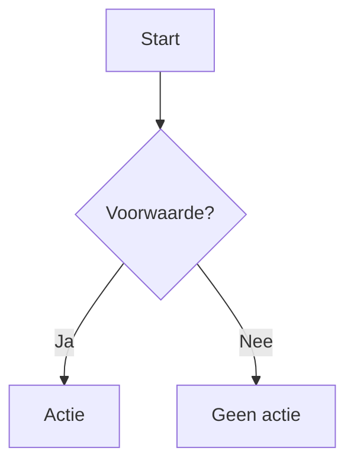

# Component title

## 1. Doel

Beschrijf de verantwoordelijkheid van de component in één compacte paragraaf.

## 2. Scope

Beschrijf wat wel en niet door deze component wordt afgehandeld.

## 3. Inputs

Beschrijf signalen, variabelen, sensoren, API-inputs en hun eenheden.

## 4. Outputs

Beschrijf state-updates, fysieke writes, notificaties en historie/telemetrie.

## 5. State model

Beschrijf states, transities en persistente state.

## 6. Beslislogica

Beschrijf beslisvolgorde, prioriteiten, guards, thresholds en fallbackgedrag.

## 7. Procesflow

**Validatieregel:** dit diagram mag alleen worden aangepast op basis van de actuele implementatie; geen gewenste/toekomstige logica als actuele flow tekenen.

## 8. Foutafhandeling

Beschrijf timeouts, stale data, ontbrekende devices, API-fouten, rate limits en fail-safe gedrag.

## 9. Idempotency

Beschrijf leases, deduplicatie, write suppression en garanties tegen dubbele fysieke acties/notificaties/history-records.

## 10. SHADOW / ACTIVE-status

Beschrijf expliciet welke logica alleen rekent/logt en welke logica fysieke acties mag uitvoeren.

## 11. Validatie

Leg vast welke unit-, integratie-, runtime- en scenario-tests het gedrag onderbouwen. Vermeld PASS/FAIL en datum waar relevant.

## 12. Bekende beperkingen

Beschrijf resterende afwijkingen, open runtime-validaties en technische schuld.

## 13. Bronbestanden

Noem de concrete code-, configuratie- en flowbestanden waartegen dit document is geverifieerd.
